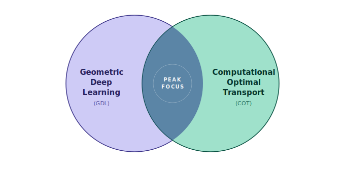

```{=html}
<div style="display: flex; align-items: center; gap: 1.5rem; margin-bottom: 2rem; margin-top: 1rem;">
  
  <div>
    <div style="margin: 0; font-size: 1.8rem; font-weight: 600;">Shreesh Bhattarai</div>
    <div style="margin: 0.25rem 0 0; opacity: 0.7;">Computational Mathematician</div>
  </div>
</div>
```

## Research Interests

- Geometric Deep Learning (GDL)
- Computational Optimal Transport (COT)



This site documents my research journey: projects, paper comprehensions, and concepts I learn along the way.

I am currently exploring the foundations of GDL and COT toward graduate research.

## Background

B.Sc. in Computational Mathematics
