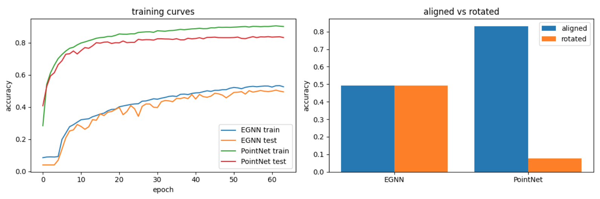
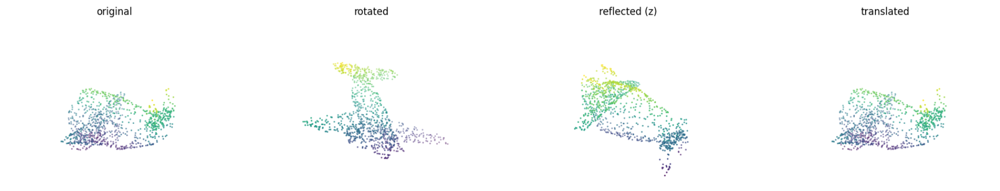
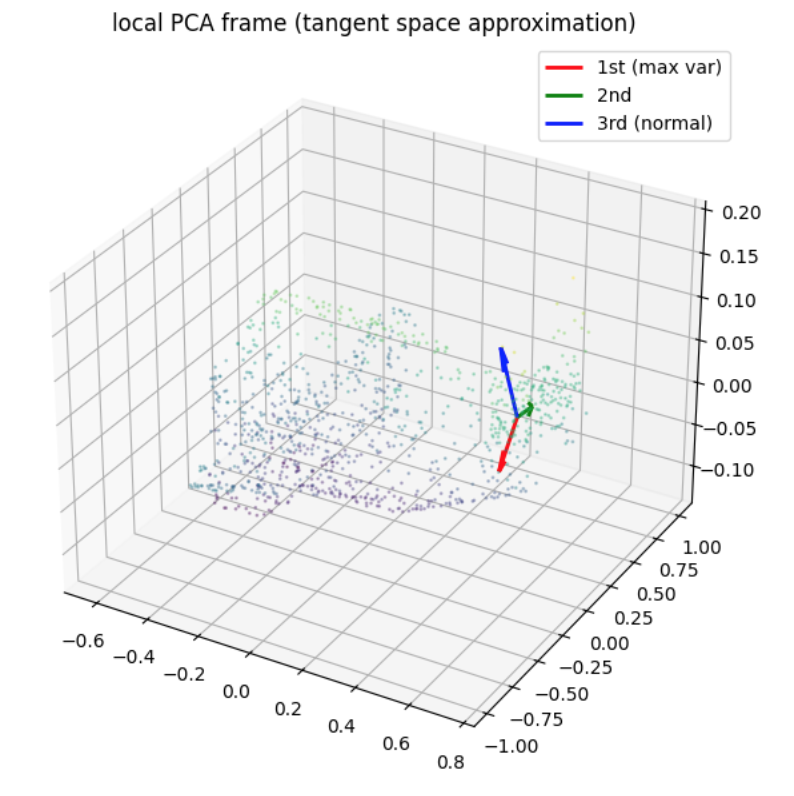

# E(3)-Equivariant Graph Neural Network for 3D Point Cloud Classification


---

## Overview

This project builds an E(3)-Equivariant Graph Neural Network (EGNN) from scratch for 3D object classification on ModelNet40 — 40 classes, 9,843 training point clouds, 1,024 points each — without using any equivariant layer libraries. The EGNN maintains two coupled message-passing streams: an invariant scalar feature stream and an equivariant coordinate stream, with E(3)-equivariance verified numerically at every architectural stage before training. The project's central contribution is a controlled quantitative comparison against a non-equivariant PointNet baseline under random SO(3) rotations at test time, demonstrating that architectural symmetry constraints provide robustness guarantees that no amount of training on aligned data can replicate.

**Core implementations covered:**

- E(3) group primitives (`rotate`, `reflect`, `translate`) with numerical verification
- Formal equivariance and invariance checkers reused as ground-truth tests throughout
- k-NN graph construction with verified rotation-equivariant topology
- EGNN message passing from scratch: coupled scalar stream $h_i$ and coordinate stream $x_i$
- Invariant classification head (global mean-pool over $h_i$) and equivariant vector head (mean-pool over $x_i$)
- Local PCA tangent frame computation and visualization
- PointNet baseline from scratch: shared MLP + global max-pool
- Full training run with 2×2 accuracy table under aligned and rotated test conditions

---

## Intuitive Explanation

**1. What is a Point Cloud?**

Imagine scanning a physical chair with a depth camera. The output is not a photograph — it is a cloud of thousands of (x, y, z) coordinate measurements scattered across the chair's surface, with no edges, no faces, and no ordering. This is a point cloud: an unordered set of 3D positions, sometimes augmented with surface normals or color values at each point.

Formally, a point cloud is $\mathcal{P} = \{(x_i, f_i) \mid x_i \in \mathbb{R}^3, f_i \in \mathbb{R}^D\}$, where $x_i$ are spatial coordinates and $f_i$ are per-point features. Because it is an unordered set, any algorithm processing it must be insensitive to the arbitrary indexing of points — and ideally, to arbitrary rotations and translations of the object in space. Point cloud classification is the task of assigning a semantic label (chair, airplane, table) to such a set, and it is the central task of this project.

---

**2. What is E(3)-Equivariance?**

Consider a coffee mug. Whether it sits upright, lies on its side, or is held upside down, it is still a mug. A human recognizes it instantly regardless of orientation. A naive neural network, trained only on upright mugs, will fail on the rotated ones — because it learned to recognize "mug-shaped coordinates," not "mug-shaped geometry."

E(3)-equivariance is the mathematical property that formalizes this orientation-independence. The group E(3) — the Euclidean group in three dimensions — contains all rotations, reflections, and translations of 3D space. A network is E(3)-equivariant if transforming its input by any element of E(3) produces a predictably transformed output, rather than an arbitrary one. For classification, where the output is a scalar label, this reduces to invariance: rotating the input object must not change the predicted class. This project builds that guarantee directly into the architecture — not by augmenting training data, but by making the violation of symmetry algebraically impossible.

---

**3. Why Does Symmetry Matter in Neural Networks?**

Standard neural networks learn symmetry statistically: show them enough rotated chairs during training, and they will eventually generalize. But statistical symmetry is fragile — it depends on coverage of the training distribution and fails at test-time orientations that were underrepresented. Architectural symmetry is different in kind, not just degree. When equivariance is encoded into the message-passing equations themselves, the network cannot produce a different output for a rotated input, regardless of what orientations it saw during training. This project makes the distinction concrete: PointNet learns symmetry statistically (and collapses under out-of-distribution rotations), while EGNN enforces it algebraically (and degrades by less than 0.1% under the same rotations).

---

## Mathematical Foundations

### 1. The E(3) Group

The Euclidean group $E(3)$ is the group of all distance-preserving transformations of $\mathbb{R}^3$. It is formally the semidirect product:

$$E(3) = \mathbb{R}^3 \rtimes O(3)$$

where $O(3)$ is the orthogonal group (rotations and reflections) and $\mathbb{R}^3$ is the translation group. The semidirect product — not direct product — reflects the fact that translations and rotations do not commute. A general E(3) transformation applied to a point $x \in \mathbb{R}^3$ takes the form:

$$x \mapsto Rx + t, \quad R \in O(3), \quad t \in \mathbb{R}^3$$

The subgroup $SO(3) \subset O(3)$ restricts to orientation-preserving transformations (rotations only), defined by two conditions:

$$R^T R = I \quad \text{(orthogonality)} \qquad \det(R) = +1 \quad \text{(orientation-preserving)}$$

Reflections satisfy $R^T R = I$ but $\det(R) = -1$, placing them in $O(3) \setminus SO(3)$.

---

### 2. Equivariance and Invariance

Let $G$ be a group acting on input space $X$ via $\rho_X$ and on output space $Y$ via $\rho_Y$.
A function $f: X \to Y$ is **$G$-equivariant** if:

$$f(\rho_X(g) \cdot x) = \rho_Y(g) \cdot f(x) \quad \forall\, g \in G,\; x \in X$$

Transforming the input and then applying $f$ yields the same result as applying $f$ and then transforming the output. **Invariance** is the special case where $\rho_Y(g) = \text{id}$ for all $g$:

$$f(\rho_X(g) \cdot x) = f(x) \quad \forall\, g \in G,\; x \in X$$

In this project, the classification head is $E(3)$-**invariant** (rotating a chair must not change its predicted label), while the coordinate stream is $E(3)$-**equivariant** (rotating the input rotates the internal coordinate representations by the same $R$).

---

### 3. EGNN Message Passing

The EGNN maintains two coupled streams per layer: scalar node features $h_i \in \mathbb{R}^{d}$ (invariant) and coordinate embeddings $x_i \in \mathbb{R}^3$ (equivariant). Each layer applies three sequential updates:

**Edge messages** — computed from invariant quantities only:

$$m_{ij} = \phi_e\!\left(h_i,\, h_j,\, \|x_i - x_j\|^2\right)$$

**Coordinate update** — equivariant by construction:

$$x_i \leftarrow x_i + \sum_{j \in \mathcal{N}(i)} (x_i - x_j)\, \phi_x(m_{ij})$$

**Scalar feature update** — invariant aggregation:

$$h_i \leftarrow \phi_h\!\left(h_i,\, \sum_{j \in \mathcal{N}(i)} m_{ij}\right)$$

where $\phi_e$, $\phi_x$, $\phi_h$ are learned MLPs, and $\phi_x(m_{ij}) \in \mathbb{R}$ is a scalar gate. The equivariance of the coordinate update follows from two facts: (1) $\|x_i - x_j\|^2$ is rotation-invariant, so $m_{ij}$ and $\phi_x(m_{ij})$ are unchanged under rotation; (2) $R$ is linear, so it factors out of the sum:

$$Rx_i + \sum_j R(x_i - x_j)\,\phi_x(m_{ij}) = R\!\left(x_i + \sum_j (x_i - x_j)\,\phi_x(m_{ij})\right)$$

---

## Tangent Bundle Interpretation

For a smooth manifold $M$, the tangent bundle $TM = \bigsqcup_{p \in M} T_pM$ assigns to every point $p$ a tangent space $T_pM$ — the flat linear space of all velocity vectors of smooth curves passing through $p$. For a 2D surface embedded in $\mathbb{R}^3$, $T_pM$ is the tangent plane at $p$, spanned by two basis vectors encoding local surface directions, with a third orthogonal axis corresponding to the surface normal.

A point cloud has no smooth structure, but local PCA recovers a discrete approximation. For each point $x_i$, we collect its $k$-nearest neighbors, center them, and compute the $3 \times 3$ covariance matrix. Its three eigenvectors — ordered by ascending eigenvalue — form a local orthonormal frame: the two high-variance axes approximate the tangent plane $T_{x_i}M$, and the minimum-variance axis approximates the surface normal. This frame is verified to be rotation-equivariant: rotating the point cloud rotates each local frame by the same $R$, consistent with $TM$ transforming covariantly under isometries of the ambient space. In the context of EGNN, the equivariant coordinate stream $x_i$ implicitly tracks these local frames across layers — each coordinate update aggregates displacement vectors $(x_i - x_j)$ from the neighborhood, which span precisely this local tangent structure.

---

## Why Symmetry Matters: A Quantitative Comparison

### Accuracy Table

| Model    | Aligned (no rotation) | Rotated (random SO(3)) | Degradation (Δ) |
|----------|----------------------|------------------------|-----------------|
| EGNN     | 0.4935               | 0.4931                 | **0.0004**      |
| PointNet | 0.8310               | 0.0778                 | **0.7532**      |

*Both models trained for 64 epochs, h_dim=64, 4 layers, lr=1e-3, seed=42.*

---

### Training Curves



*Training and test accuracy over 64 epochs for both models on aligned ModelNet40. PointNet converges faster and to a higher ceiling; EGNN converges more slowly, reflecting the cost of enforcing a hard symmetry constraint at h_dim=64.*

---

### Analysis

The table above is not primarily a performance comparison — it is a controlled experiment in what architectural symmetry buys versus what it costs. EGNN's accuracy drops by 0.0004 under arbitrary SO(3) rotations. PointNet's drops by 0.7532, from 83% to 8% — barely above the 2.5% random baseline for 40 classes. The cause is not a difference in training data, optimizer, or capacity: both models share identical hyperparameters. The cause is structural. EGNN's message computation uses only $\|x_i - x_j\|^2$ — a rotation-invariant quantity — so rotating the input leaves every $m_{ij}$ unchanged. PointNet's shared MLP receives raw $(x, y, z)$ coordinates directly; rotating the input replaces every coordinate with a different value, and the network has no mechanism to recognize the transformed geometry as the same object.

PointNet's 83% aligned accuracy is best understood as coordinate memorization, not geometric understanding. Trained on ModelNet40's consistently upright and forward-facing objects, the shared MLP learns axis-aligned decision boundaries: points with high $z$ and centered $x, y$ signal the top of a chair; points near $(0, 0, -0.5)$ signal a table leg. These rules are precise and effective — within the training distribution. Under a random SO(3) rotation, every axis-aligned rule is violated simultaneously. The global max-pool operation, which provides permutation invariance, offers no protection here: it selects the maximum activations across points, but those activations are computed from corrupted absolute coordinates. The result is a feature vector that no longer corresponds to any object the network was trained to recognize.

EGNN's robustness is not statistical — it is algebraic. The proof is in the coordinate update equation: substituting $Rx_k$ for every $x_k$, the rotation matrix $R$ factors out of the sum by linearity and cancels against the input, leaving the update identical to the unrotated case up to the same rotation $R$ applied globally. This holds for any $R \in O(3)$, for any input, after any number of layers, without requiring the network to have seen that rotation during training. The equivariance check passing at $1.19 \times 10^{-7}$ error — float32 noise floor — confirms this is an exact architectural property, not an approximation.

The accuracy gap on aligned data (49% vs 83%) reflects a real cost: enforcing equivariance constrains the function class the network can represent. At h_dim=64 and 4 layers, EGNN cannot exploit coordinate shortcuts that PointNet uses freely. A deeper EGNN with larger hidden dimensions would close this gap while preserving the rotation robustness guarantee — but the gap would never reverse the fundamental tradeoff: PointNet's aligned accuracy is purchased at the price of complete fragility to orientation change.

---

## Results

### Equivariance Verification

All checks performed on a single ModelNet40 point cloud (1,024 points), random SO(3) rotation, float32 precision.

| Test | Expected | Passed | Max Error |
|------|----------|--------|-----------|
| Distance matrix invariant under rotation | invariant | ✓ | 3.45e-04 |
| Identity function equivariant under rotation | equivariant | ✓ | 0.00e+00 |
| `norm-expand` equivariant (deliberate failure) | ✗ | ✗ | 2.09e+00 |
| k-NN topology preserved under rotation | invariant | ✓ | — |
| Edge vectors equivariant under rotation | equivariant | ✓ | 1.27e-07 |
| EGNN coordinate stream equivariant | equivariant | ✓ | 1.19e-07 |
| EGNN classification head invariant | invariant | ✓ | 5.96e-08 |
| Invariant head invariant | invariant | ✓ | 5.96e-08 |
| Equivariant head equivariant | equivariant | ✓ | 4.42e-09 |
| PCA frame equivariant (subspace, \|det\|≈1) | equivariant | ✓ | 1e-06 |
| PointNet permutation invariant | invariant | ✓ | 0.00e+00 |
| PointNet rotation invariant (deliberate failure) | ✗ | ✗ | 1.38e-02 |
| EGNN rotation invariant | invariant | ✓ | 5.96e-08 |

*Errors at ~1e-07 are float32 rounding accumulated over 1,024-point operations — not symmetry violations.*

---

### Figures



*An airplane point cloud under the four E(3) primitives: original, rotated (random SO(3)), reflected (z-axis), translated. Pairwise distances are verified preserved across all transforms.*



*Local PCA frame at one point on an airplane point cloud. Red: first principal axis (max variance). Green: second principal axis. Blue: third axis (min variance) — the surface normal approximation. The two high-variance axes span the discrete tangent plane $T_{x_i}M$.*

---

## Key Insights

**1. What the Equivariant Coordinate Stream Encodes That Scalar MPNNs Cannot**

A standard message-passing network operating only on scalar features $h_i$ can capture distances, angles, and local density — but it cannot track how geometric structure *transforms* across layers. The EGNN coordinate stream $x_i$ carries the full 3D positional embedding of each node through every layer, updated by aggregating displacement vectors $(x_i - x_j)$ weighted by learned scalar gates. This means each layer's coordinate representation encodes not just local neighborhood statistics, but the oriented spatial arrangement of the entire receptive field — information that is strictly inaccessible to scalar-only MPNNs. A scalar MPNN cannot distinguish a left-handed helix from a right-handed one if their distance profiles match; the coordinate stream can, because it preserves directional structure that survives rotation equivariantly rather than collapsing it into invariant scalars prematurely.

---

**2. Why PointNet's Accuracy Is a Shortcut, Not a Capability**

PointNet achieves 83% aligned accuracy with a remarkably simple architecture — shared MLP plus global max-pool. This performance is real, but its source is coordinate memorization: the network partitions absolute 3D space into regions associated with object classes, learned from a consistently oriented training set. The failure is not a bug in PointNet's design; it is a direct consequence of feeding raw $(x, y, z)$ coordinates into a function that has no mechanism to recognize geometric equivalence under rotation. The 83% ceiling is a shortcut available only when the test distribution matches the training orientation. The moment that assumption breaks — a single random SO(3) rotation per test sample — the accuracy collapses to 8%, exposing that the network learned pose-specific texture in coordinate space, not pose-invariant geometric structure.

---

**3. Architectural Symmetry vs. Learned Symmetry**

There are two ways to make a network robust to rotations: train on enough rotated examples (learned symmetry) or build the rotation constraint into the architecture (architectural symmetry). These are not equivalent. Learned symmetry is probabilistic — it improves with more augmentation but can always fail on underrepresented orientations. Architectural symmetry is a hard guarantee: the equivariance proof in Stage 5 holds for *any* $R \in O(3)$, for *any* input, after *any* number of layers, without any training examples at all. The verification checks in this project — all passing at float32 noise floor before a single training step — are the concrete expression of this guarantee. The cost is real: constraining the function class reduces the model's ability to exploit coordinate shortcuts, which is why EGNN's aligned accuracy (49%) sits below PointNet's (83%) at equal capacity. But this cost is predictable and closeable by scaling; PointNet's fragility under rotation is structural and cannot be closed without changing the architecture.

---

## Implementation Notes

- **No equivariant layer libraries.** EGNN message passing, coordinate updates, and output heads are implemented from scratch in pure PyTorch. PyG is used only for data loading and k-NN graph construction via `KNNGraph`.

- **Equivariance tested before training.** `check_equivariance` and `check_invariance` are implemented in Stage 3 and reused at every architectural stage. Every symmetry claim is backed by a passing numerical test visible as a cell output before any model is trained.

- **k-NN graph precomputed via transform.** `KNNGraph(k=20)` is applied as a dataset transform at load time, avoiding repeated graph construction during training. The graph topology is verified rotation-equivariant: rotating the point cloud permutes edges but does not change the neighbor set.

- **Constant node feature initialization.** EGNN node features $h_i$ are initialized as a constant scalar (ones) projected to h_dim via a linear layer. All geometric information enters through the coordinate stream $x_i$, keeping the invariant/equivariant separation clean.

- **float32 tolerances.** Equivariance checks use `atol=1e-4` for single operations and `atol=1e-3` for large aggregations (e.g., 1024×1024 distance matrices). Errors at ~1e-7 to ~1e-4 are float32 rounding, not symmetry violations.

- **Shared hyperparameters across models.** Both EGNN and PointNet use h_dim=64, 4 layers, Adam optimizer, lr=1e-3, CosineAnnealingLR, 64 epochs, seed=42 — ensuring the accuracy comparison is architectural, not hyperparameter-driven.

- **Eigenvector sign ambiguity in PCA frames.** `torch.linalg.eigh` returns eigenvectors defined up to sign flip and column swap when eigenvalues are close. Equivariance of PCA frames is verified via $|\det(A^T B)| \approx 1$ (subspace agreement) rather than elementwise comparison.

---

## Dependencies

```
torch==2.3.1              # core deep learning framework
torch-geometric           # data loading, KNNGraph transform, global pooling
torch-scatter             # scatter_add for EGNN message aggregation
torch-sparse              # sparse graph operations
numpy                     # numerical utilities
matplotlib                # point cloud and training curve visualization
tqdm                      # training progress bars
```
**INSTALL COMMANDS [Kaggle Notebook $\rightarrow$ Add-ons $\rightarrow$ Install Dependencies]**

```bash
pip install torch==2.3.1+cu121 torchvision==0.18.1+cu121 \
    --index-url https://download.pytorch.org/whl/cu121

pip install torch-geometric==2.5.3

pip install pyg_lib==0.4.0 torch_scatter==2.1.2 \
    torch_sparse==0.6.18 torch_cluster==1.6.3 \
    -f https://data.pyg.org/whl/torch-2.3.0+cu121.html
```

---

## Note

| The notebook was developed and tested on a Kaggle environment with a NVIDIA P100 16GB GPU, Python 3.12, and CUDA 12.1. All cells run end-to-end from a clean kernel without any external dependencies beyond those listed above. |
|:--:|

---
