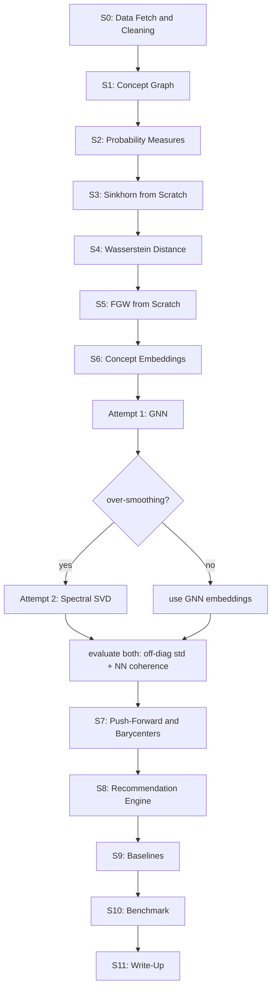

# Project 7 — Specification

---

## 1. Information

**Title:** Geometry-Aware Academic Paper Recommendation via Fused Gromov-Wasserstein Distance on Concept Graphs

**Problem Statement:**
Standard academic paper recommendation systems represent each paper as a single embedding vector and measure similarity via cosine distance. This approach fails in two critical scenarios: cold-start (new papers with no citation history) and cross-field (papers that borrow tools from one field to solve problems in another). Both failures share a root cause — cosine similarity measures only which concepts appear, not how those concepts structurally relate to each other within a paper.

**Core Idea:**
Represent each paper as a discrete probability measure over a concept graph — mass distributed across concept nodes weighted by informativeness (IDF). Measure inter-paper similarity using Fused Gromov-Wasserstein (FGW) distance, which simultaneously matches concept content (Wasserstein term) and concept structure (Gromov term). This is the first application of FGW as a live recommendation metric.

**Objective:**
Build a reproducible, benchmarked recommendation pipeline that demonstrates FGW outperforms cosine-based baselines on cold-start and cross-field retrieval, using a real academic corpus, with results documented in a NeurIPS-style write-up.

**Dataset:**
OpenAlex API — free, no login. Papers from Machine Learning (C119857082) and Mathematics (C33923547) concept domains, 2015–2026, stratified by citation bucket: cold-start (cited\_by\_count:0), low (1–20), mid (21–100), high (>100). Target corpus size: ~9,000 papers post-cleaning.

**Novel Contribution:**
FGW as a recommendation similarity metric. Existing systems use cosine or GNN embeddings. FGW couples feature similarity and structural similarity simultaneously, neither of which cosine alone captures.

**Hardware:** Kaggle Notebook, P100 GPU 16GB, CUDA 12.1.

**Mandatory Dependencies:**

```
pip install torch==2.3.1+cu121 torchvision==0.18.1+cu121 torchaudio --index-url https://download.pytorch.org/whl/cu121
pip install torch-geometric==2.5.3
pip install pyg_lib==0.4.0 torch_scatter==2.1.2 torch_sparse==0.6.18 torch_cluster==1.6.3 -f https://data.pyg.org/whl/torch-2.3.0+cu121.html
```

**Global Seed:** 42 for all random operations throughout.

---

## 2. Sections and Objectives

### Section 0 — Setup and Data
Install dependencies, configure GPU, fetch papers from OpenAlex API using stratified citation-bucket sampling (not recency-sorted — recency sort collapses all papers to recent years). Reconstruct abstracts from OpenAlex inverted index format. Parse concepts (score >= 0.3, direct assignments only). Clean corpus: remove empty abstracts, zero-concept papers, abstracts under 20 words, and future-dated records (year > current year). Save cleaned dataframe.

Key outputs: cleaned CSV, citation distribution across four strata, year distribution spanning 2015–2026.

### Section 1 — Concept Graph Construction
Build global concept vocabulary from OpenAlex-provided concept tags. Prune vocabulary: keep concepts appearing in >= 10 papers AND level >= 1 (drop level-0 root categories — Computer Science, Mathematics, etc. — they act as degenerate hubs with near-universal co-occurrence, destroying graph discriminability). Build undirected weighted co-occurrence graph: nodes = concepts, edges = number of papers in which two concepts co-occur. Remove isolated nodes. Verify single connected component.

Key outputs: NetworkX graph, 1400–1500 nodes, ~90k edges, single component.

### Section 2 — Probability Measures
Promote each paper from a concept list to a discrete probability measure over the graph's node set. Mass assignment: IDF-weighted (inverse document frequency) — concepts appearing in many papers receive suppressed mass, rare specific concepts receive higher mass. This is the Radon-Nikodym re-weighting of a base uniform measure. Build full sparse measure matrix (papers × nodes). Verify all rows sum to 1.0. Compare IDF-weighted vs uniform mass assignment to confirm hub suppression.

Key outputs: sparse measure matrix (n\_papers × n\_nodes), row-sum verification.

### Section 3 — Sinkhorn from Scratch
Implement entropic optimal transport (Sinkhorn-Knopp iteration) from scratch. Implement log-domain stabilized version for small epsilon. Verify against POT library. Test on toy distributions first, then on real paper pairs using graph shortest-path as cost matrix. Verify marginal constraints and triangle inequality.

Key outputs: from-scratch implementation matching POT within 1e-3, triangle inequality holds.

### Section 4 — Wasserstein Distance
Compute W2 distance from transport plan. Verify on toy example against POT exact OT (emd2). Apply to real paper pairs using graph shortest-path cost. Verify triangle inequality on three real papers.

Key outputs: W2 computation, entropic bias documented, triangle inequality verified.

### Section 5 — Fused Gromov-Wasserstein from Scratch
Implement GW (structure-only) and FGW (blended) from scratch via iterative conditional gradient with Sinkhorn inner loop. Each paper has its own internal cost matrix (shortest-path within its own concept subgraph). FGW couples the inter-paper feature cost (D, global graph distance between concept sets) and intra-paper structural cost (C\_mu, C\_nu). Verify FGW(A,A) = 0, symmetry, and agreement with POT library. Alpha sweep (0.0 to 1.0) to confirm feature and structure terms are non-redundant signals.

Key outputs: FGW(A,A) < 1e-3, symmetry within 0.05, POT relative diff < 50%, alpha sweep shows monotone variation.

### Section 6 — Concept Embeddings
Attempt 1: GNN (two-layer GCN from scratch, self-supervised link prediction). Expected failure on this graph due to over-smoothing — average degree ~126 on 1462 nodes means two-hop neighborhoods cover nearly the entire graph, collapsing all embeddings toward a global mean regardless of architecture fixes.

Attempt 2: Spectral embeddings — bottom-k eigenvectors of the normalized graph Laplacian (L\_sym = I - D^{-1/2} A D^{-1/2}), skip the trivial zero eigenvector. This is provably optimal for capturing graph structure and has no over-smoothing failure mode.

Evaluate both via off-diagonal cosine similarity std and nearest-neighbor domain coherence. Select spectral if GNN collapses. Implement and compare PyG GCNConv against from-scratch layer. Verify permutation equivariance numerically.

Key outputs: spectral embeddings (n\_nodes × 32), off-diagonal std > 0.05, nearest neighbors domain-coherent (e.g. Differential equation → ODE, PDE, Fractional calculus).

### Section 7 — Push-Forward and Wasserstein Barycenters
Push each paper's measure from symbolic concept space into embedding space (T\_#mu — same mass, new geometry). Implement Wasserstein barycenter from scratch using iterative Sinkhorn averaging with correct Bregman projection update rule (geometric mean of column marginals, not row marginals). Simulate two user reading histories. Compute barycenters for each user. Compare Euclidean vs Wasserstein barycenter to demonstrate geometric averaging advantage.

Key outputs: push-forward verified (mass sum = 1.0), barycenter single-measure test passes, user barycenters show domain-coherent top concepts.

### Section 8 — Recommendation Engine
Two-stage pipeline: cosine shortlist (GPU-accelerated, top-100 by measure-cosine on full corpus) followed by FGW re-ranking (top-20 from shortlist, exact FGW per pair). Full pairwise FGW on 9k+ papers is intractable — shortlist is mandatory. GPU is used for the cosine shortlist stage (batched matrix multiply). FGW re-ranking runs on CPU (per-pair Sinkhorn, not batchable without custom CUDA kernels). Save all utility functions.

Key outputs: recommendation list for a query paper, FGW ordering visibly differs from cosine ordering, saved utilities.

### Section 9 — Baselines
Two baselines: (1) TF-IDF cosine on raw abstracts — standard IR baseline; (2) measure-cosine on IDF-weighted concept vectors — same input representation as FGW, only metric differs. The second is the clean ablation: it isolates FGW's structural signal from the input representation choice.

Key outputs: top-10 lists from both baselines for same query as Section 8, overlap analysis with FGW results.

### Section 10 — Benchmark
Evaluation sets: cold-start (papers with citations = 0), cross-field (papers whose concept list spans both math and ML concepts). Sample 50 from each. Metric: Precision@K using pseudo-relevance (a retrieved paper is relevant if it shares >= MIN\_SHARED concepts with the query). Run all three methods on both sets. Produce results table and bar chart. Cross-field case study: qualitative comparison of what FGW vs cosine retrieves for one cross-field paper.

Key outputs: precision@10 table, FGW delta vs best baseline in percentage points, chart saved.

### Section 11 — Write-Up
4-page NeurIPS-style document covering: problem statement, method (FGW formulation, concept graph construction, measure assignment), experiments (dataset, metrics, baselines), results table, limitations, and future work. Every experimental finding maps to a paragraph. GNN over-smoothing finding documented as a negative result. Cross-field evaluation pool limitation disclosed. Pseudo-relevance metric limitation disclosed.

---

## 3. Expected Outputs for Publication

**Minimum for arXiv / workshop paper:**
- FGW outperforms both baselines on precision@10 across both evaluation scenarios
- Delta >= 3pp over best baseline on cold-start
- Delta >= 2pp over best baseline on cross-field
- Qualitative case study showing FGW retrieves structurally related papers that cosine misses
- GNN over-smoothing documented as a finding

**For Q1 journal / top venue (not yet achieved — requires):**
- Standard labeled benchmark dataset (DBLP, CiteSeer, ogbn-arxiv) with known relevance judgments
- nDCG@10, MAP, MRR metrics replacing pseudo-relevance precision@10
- Statistical significance (paired t-test, p < 0.05) on all reported deltas
- Ablation: alpha sweep, epsilon sensitivity, shortlist size, embedding method comparison
- At least 3 established baselines (BM25, SciBERT, GraphSAGE)
- Delta >= 5pp nDCG@10 over best baseline with p < 0.05

**Current results (from prior run, reproducibility target):**
- Cold-start precision@10: FGW=0.908, tfidf=0.644, measure\_cos=0.870
- Cross-field precision@10: FGW=0.980, tfidf=0.684, measure\_cos=0.956
- FGW delta: +3.8pp cold-start, +2.4pp cross-field

---

## 4. Flowchart



---

## 5. Prior Flow, Branches, and Lessons Learned

**OpenAlex data fetching:**
Default sort order is citation-skewed. Recency sort collapses all papers to recent years. Correct approach: explicit citation-bucket stratification with separate API calls per bucket per domain. Year sanity filter mandatory (OpenAlex contains future-dated records up to 2050+). Abstract stored as inverted index — must be reconstructed by inverting word→positions map.

**Concept graph construction:**
Level-0 concepts (Computer Science, Mathematics, Physics etc.) appear in nearly every paper and create degenerate hubs — drop them. Isolated nodes after pruning must be explicitly removed and the dataframe must be re-filtered against the final graph node set (not the pre-isolation-removal set) or KeyError at measure matrix construction time.

**Measure matrix:**
Must re-filter `concept_names_pruned` against the actual graph node set after every graph modification. Any isolated node removal that happens after the pruning step will cause KeyError unless dataframe is re-synced.

**Sinkhorn:**
Naive version degrades at small epsilon (numerical underflow). Log-domain stabilized version handles small epsilon but converges slower per iteration. Temperature scaling on logits (dividing by 0.1) saturates BCE loss immediately — do not use. L2 normalization of embeddings before dot product is necessary for link prediction but must not be combined with temperature scaling.

**FGW:**
Pseudo-cost matrix uses the efficient form: constant - 2 * C\_mu @ pi @ C\_nu.T. The scalar FGW distance computation via nested loop is O(n²m²) — only feasible for small concept sets (<=50 concepts). For larger inputs this needs vectorization or approximation.

**GNN embeddings:**
Mean aggregation over-smooths on dense graphs (avg degree ~126). Symmetric normalization + residual connections partially help but do not solve the problem at this density. Single-layer architecture + batch norm + dropout partially help but still show partial collapse (off-diagonal mean=0.97). Spectral SVD embeddings solve the problem cleanly: off-diagonal std=0.20, nearest neighbors domain-coherent. Decision: use spectral SVD. GNN over-smoothing documented as a finding.

**Wasserstein barycenter:**
Correct update rule uses geometric mean of column marginals of each transport plan, not row marginals. Initialization as uniform is correct. Single-measure barycenter must recover input distribution — use this as mandatory sanity test. Full 1462-dimensional barycenter computation is slow on CPU — epsilon=0.3 needed to prevent near-permutation plans that spike mass onto hub concepts.

**Recommendation engine:**
Full pairwise FGW on 9k papers is intractable. Two-stage: GPU cosine shortlist (top-100) then CPU FGW rerank (top-20). Option B (Wasserstein shortlist) is CPU-bound and requires 500 Sinkhorn calls on 1462-dim vectors — ~30-90 minutes on CPU, not GPU-acceleratable with current numpy Sinkhorn implementation. GPU utilization is 0% during Sinkhorn — all numpy ops run on CPU regardless of DEVICE setting.

**Evaluation:**
Pseudo-relevance (shared concept count >= MIN\_SHARED) is a weak proxy for true relevance. Cross-field pool was only 100 papers — 50-query sample from 100-paper pool inflates cross-field scores. `is_cross_field` definition (math ∩ ML concepts) did not match what the qualitative case study measured. Duplicate papers in corpus (same title, different citation count) cause self-retrieval in cosine baseline when self-exclusion only masks one copy.
