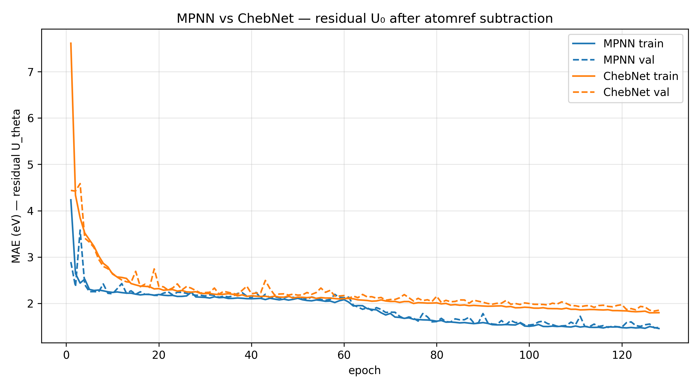

# Graph Neural Network for Molecular Property Prediction on QM9


> Predicting quantum molecular properties from graph structure alone — implemented from scratch, grounded in theory, and honest about limits.

---

## Overview

This project builds a complete Graph Neural Network pipeline from scratch on the QM9 dataset — 130,831 small organic molecules each labeled with 19 quantum-chemical properties. Two architectures are implemented and compared: a spatial Message Passing Neural Network (MPNN) that aggregates neighbor information via learned edge-conditioned messages, and a spectral ChebNet that filters graph signals using Chebyshev polynomial approximations of the graph Laplacian. The target property is $U_0$ — the internal energy at 0K — predicted after subtracting per-atom reference energies to isolate the chemically meaningful interaction component. The project contributes a rigorous side-by-side comparison of spatial and spectral GNN paradigms, a concrete demonstration of the Weisfeiler-Lehman expressiveness ceiling, and a reproducible training pipeline verified at every stage through mathematical unit tests.

**Core implementations covered:**

- Spatial MPNN with manual `scatter_add_` message passing — no PyG `MessagePassing` base class
- Spectral ChebNet with Chebyshev recurrence — no eigendecomposition at inference time
- Graph Laplacian construction from the signed incidence matrix ($L = BB^T$) with eigenspectrum analysis
- Laplacian Eigenmap embedding for molecular visualization
- 1-Weisfeiler-Lehman color refinement and blind spot demonstration on non-isomorphic graphs
- Permutation equivariance unit tests for both architectures
- Atomref baseline subtraction reducing target standard deviation by $105\times$

---

## Intuitive Explanation

**1. What is a Molecular Graph?**

Think of a molecule as a social network where each atom is a person and each chemical bond is a friendship. Just as a social network can be described by listing who is friends with whom, a molecule can be fully described by listing which atoms are bonded together. In PyTorch Geometric, this "friend list" is stored as a sparse edge index tensor in Coordinate (COO) format — a $2\times(2E)$ matrix where the first row lists bond sources and the second row lists bond targets, with every bond appearing twice to represent both directions. Each atom also carries a feature vector encoding its element type, atomic number, and valence, and the molecule carries a target label — in our case, its internal energy.

This graph representation is the natural fit for molecules because the properties we care about (energy, reactivity, electronic structure) arise from *how atoms are connected*, not from arbitrary atom orderings. A GNN that operates on this graph respects the fundamental symmetry of chemistry: the molecule is the same regardless of the order in which we list its atoms.

<br>

**2. What is Message Passing?**

Imagine each atom starts knowing only about itself — its element type and how many bonds it has. In one round of message passing, every atom sends a "message" to each of its bonded neighbors describing its current state. Each atom then collects all the messages it receives, combines them, and updates its own internal representation. After $L$ rounds, each atom's representation has absorbed information from its entire $L$-hop neighborhood. A carbon atom at the center of a ring, after three rounds, "knows" about all atoms within three bonds of it.

This is the spatial approach to graph learning: information travels locally, hop by hop, like a rumor spreading through a neighborhood. The key requirement is that the combination step — collecting messages from neighbors — must not depend on the order in which those neighbors happen to be listed in the data. Whether atom 2 or atom 5 is listed first, the result must be identical. This property is called permutation equivariance, and it is what allows the same model to process any molecule regardless of how its atoms are indexed.

<br>

**3. What is Spectral Filtering?**

The spectral approach takes a completely different view of the same graph. Instead of thinking about information flowing between neighbors, it asks: what are the "frequencies" of this graph? Just as audio signals can be decomposed into sine waves of different frequencies, a signal defined on a graph (such as one feature value per atom) can be decomposed into the eigenvectors of the graph Laplacian — the graph's natural "vibration modes." Filtering in the spectral domain means amplifying or dampening certain frequencies, exactly as an audio equalizer does.

The practical challenge is that computing these eigenvectors requires a full matrix decomposition — an $O(N³)$ operation that is infeasible for large molecules. ChebNet solves this by approximating spectral filters using Chebyshev polynomials, which can be evaluated through a simple recurrence relation involving only sparse matrix-vector products. The result is a filter that is both computationally efficient and provably local: a degree-K Chebyshev filter can only "see" within K hops, connecting the spectral and spatial views of the same underlying operation.

<br>

**4. What is the Atomref Baseline?**

The internal energy $U_0$ of a molecule is a very large negative number: on the order of −11,000 eV, because it measures the total quantum-mechanical energy of all electrons and nuclei. Most of this energy has nothing to do with how the atoms are arranged into a molecule; it is simply the sum of the fixed self-energies of each atom in isolation. Trying to predict $U_0$ directly is like trying to predict the weight of a building without first subtracting the known weight of the raw materials — the model wastes all its capacity learning the trivial relationship "more atoms = more negative energy."

The fix is to subtract the per-atom reference energies before training. Each element has a known reference energy (e.g., carbon contributes −1029.86 eV), so we compute the sum of reference energies for each molecule and give the model only the residual. This residual — the interaction energy — is what depends on molecular structure, and it is the chemically interesting quantity. The standard deviation of the target drops from 1,085 eV to 10.3 eV: a $105\times$ reduction that makes the learning problem dramatically easier and makes our results directly interpretable.

---

## Mathematical Foundations

### Graph Representation

A molecule with $N$ atoms and $E$ bonds is represented as a graph $G = (V, E)$ where nodes are atoms and edges are bonds. In PyTorch Geometric, a single molecule is stored as a `Data` object containing the following tensors.

| Tensor | Shape | Dtype | Description |
|---|---|---|---|
| `x` | $[N, 11]$ | `float32` | Node feature matrix — one-hot atom type, atomic number, valence |
| `edge_index` | $[2, 2E]$ | `int64` | COO edge list — each undirected bond stored as two directed edges |
| `edge_attr` | $[2E, 4]$ | `float32` | Edge feature matrix — bond type one-hot encoding |
| `y` | $[1, 19]$ | `float32` | Graph-level targets — 19 quantum properties; $U_0$ is at index 7 |
| `pos` | $[N, 3]$ | `float32` | 3D atomic coordinates (not used in this project) |

The COO format stores only the nonzero entries of the adjacency matrix. For a molecule with $N = 10$ atoms and $E = 9$ bonds, the full adjacency matrix would have $10 \times 10 = 100$ entries but only 18 are nonzero (9 bonds × 2 directions). Storing only those 18 entries as a $[2, 18]$ index tensor is both memory-efficient and natural for scatter-based message passing.

<br>

### The Graph Laplacian

The graph Laplacian $L$ is the central mathematical object in spectral graph theory. It encodes the full connectivity structure of a graph in a single matrix and its eigenvalues reveal fundamental geometric properties of the graph's topology.

_**Definition via degree and adjacency matrices**_

Given the adjacency matrix $A \in \{0,1\}^{N \times N}$ and the degree matrix $D = \text{diag}(d_1, \ldots, d_N)$ where $d_i = \sum_j A_{ij}$ is the number of bonds of atom $i$, the unnormalized graph Laplacian is defined as:

$$L = D - A$$

The diagonal entry $L_{ii} = d_i$ is the degree of node $i$. The off-diagonal entry $L_{ij} = -1$ if nodes $i$ and $j$ are connected, and $0$ otherwise.

_**Derivation from the incidence matrix**_

A more fundamental derivation starts from the signed incidence matrix $B \in \mathbb{R}^{N \times E}$, where columns represent undirected edges and entries are defined as:

$$B_{ie} = \begin{cases} +1 & \text{if node } i \text{ is the source of edge } e \\\\ -1 & \text{if node } i \text{ is the target of edge } e \\\\ 0 & \text{otherwise} \end{cases}$$

Computing the product $BB^T$ and examining its entries reveals exactly the Laplacian structure. For the diagonal entry $(BB^T)_{ii} = \sum_e B_{ie}^2$, each connected edge contributes $(\pm 1)^2 = 1$, so the sum equals the degree $d_i$. For the off-diagonal entry $(BB^T)_{ij}$ with $i \neq j$, the only nonzero contribution comes from the edge $(i,j)$ itself, where $B_{ie} = +1$ and $B_{je} = -1$ gives a product of $-1$. Therefore:

$$L = BB^T$$

This factorization proves that $L$ is **positive semi-definite**: for any vector $\mathbf{v} \in \mathbb{R}^N$, we have $\mathbf{v}^T L \mathbf{v} = \mathbf{v}^T BB^T \mathbf{v} = \|B^T\mathbf{v}\|^2 \geq 0$. All eigenvalues of $L$ are therefore real and non-negative.

_**Eigenvalue interpretation**_

Since $L$ is real symmetric, it has a full orthonormal eigenbasis $U = [\mathbf{u}_0, \mathbf{u}_1, \ldots, \mathbf{u}_{N-1}]$ with eigenvalues $0 = \lambda_0 \leq \lambda_1 \leq \cdots \leq \lambda_{N-1}$.

The constant vector $\mathbf{1}$ is always an eigenvector with eigenvalue $\lambda_0 = 0$, because every row of $L$ sums to zero: $L\mathbf{1} = (D - A)\mathbf{1} = \mathbf{d} - \mathbf{d} = \mathbf{0}$. The algebraic multiplicity of $\lambda = 0$ equals the number of connected components of the graph — for all QM9 molecules, this multiplicity is exactly one.

The second-smallest eigenvalue $\lambda_1 > 0$ is called the **Fiedler value**, and its eigenvector $\mathbf{u}_1$ is the **Fiedler vector**. The Fiedler vector solves the continuous relaxation of the graph bisection problem: partitioning atoms by the sign of their Fiedler vector entry approximates the minimum cut of the molecular graph. Larger values of $\lambda_1$ indicate a more robustly connected graph — harder to bisect by removing few bonds.

<br>

### Laplacian Eigenmap Objective

Laplacian Eigenmaps embed the $N$ atoms of a molecule into $\mathbb{R}^k$ such that bonded atoms are close in the embedding. For an embedding matrix $Y \in \mathbb{R}^{N \times k}$ (each row $\mathbf{y}_i$ is the coordinate of atom $i$), the objective is:

$$\min_Y \sum_{(i,j) \in E} \|\mathbf{y}_i - \mathbf{y}_j\|^2 \quad \text{subject to} \quad Y^T Y = I$$

The constraint $Y^T Y = I$ prevents the trivial solution where all atoms collapse to the same point. Expanding the sum using the Laplacian identity $\sum_{(i,j) \in E} (\mathbf{y}_i - \mathbf{y}_j)^2 = \mathbf{y}^T L \mathbf{y}$ for a single coordinate dimension, and summing over all $k$ dimensions via the trace, the objective becomes:

$$\min_Y \ \text{tr}(Y^T L Y) \quad \text{subject to} \quad Y^T Y = I$$

By the **Rayleigh-Ritz theorem**, the solution is the matrix of the $k$ eigenvectors corresponding to the $k$ smallest eigenvalues of $L$. The eigenvector $\mathbf{u}_0 = \frac{1}{\sqrt{N}}\mathbf{1}$ (corresponding to $\lambda_0 = 0$) is discarded because it assigns every atom the same coordinate, collapsing the embedding to a point. The embedding therefore uses eigenvectors $\mathbf{u}_1, \ldots, \mathbf{u}_k$, placing atoms that are close in graph topology close in Euclidean space.

<br>

### Message Passing Framework

A spatial MPNN updates each atom's hidden state $\mathbf{h}_i^{(l)} \in \mathbb{R}^d$ through three sequential steps at each layer $l$.

**Step 1 — Message**

Each neighbor $j \in \mathcal{N}(i)$ computes a message to node $i$ using the sender's state, the receiver's state, and the bond feature $\mathbf{e}_{ij}$:

$$\mathbf{m}_{ij}^{(l)} = \text{MSG}\!\left(\mathbf{h}_i^{(l)},\, \mathbf{h}_j^{(l)},\, \mathbf{e}_{ij}\right)$$

**Step 2 — Aggregation**

Node $i$ aggregates all incoming messages using a permutation-invariant function (sum in this implementation):

$$\mathbf{M}_i^{(l)} = \sum_{j \in \mathcal{N}(i)} \mathbf{m}_{ij}^{(l)}$$

**Step 3 — Update**

Node $i$ combines its current state with the aggregated message:

$$\mathbf{h}_i^{(l+1)} = \text{UPDATE}\!\left(\mathbf{h}_i^{(l)},\, \mathbf{M}_i^{(l)}\right)$$

The aggregation step must be **permutation-invariant** — the result $\mathbf{M}_i^{(l)}$ must be identical regardless of the order in which neighbors $j$ are enumerated. Sum satisfies this because addition is commutative and associative. The message and update steps must be **permutation-equivariant** — if the atom ordering is permuted by $\pi$, all hidden states permute accordingly. Together, these properties guarantee that the full model is invariant to atom ordering: two representations of the same molecule with different atom indices will produce the same predicted energy.

After $L$ layers, a global readout aggregates all node states into a single graph-level representation:

$$\mathbf{h}_G = \frac{1}{N} \sum_{i=1}^{N} \mathbf{h}_i^{(L)}$$

This global mean pool is permutation-invariant by the same argument as local aggregation, and produces a fixed-size vector regardless of the number of atoms $N$.

<br>

### Target Normalization and Atomref Baseline

Raw $U_0$ values have mean $\mu_{\text{raw}} \approx -11{,}180$ eV and standard deviation $\sigma_{\text{raw}} \approx 1{,}085$ eV. Predicting these directly causes gradient instability and forces the model to learn the trivial atom-count scaling. We apply two preprocessing steps.

_**Atomref subtraction**_

For each molecule, we subtract the sum of per-element reference energies:

$$y_{\text{res}} = y_{\text{raw}} - \sum_{i=1}^{N} E_{\text{ref}}(z_i)$$

where $z_i$ is the atomic number of atom $i$ and $E_{\text{ref}}(z)$ is the DFT reference energy of element $z$ in isolation (e.g., $E_{\text{ref}}(\text{C}) = -1029.86$ eV). This reduces $\sigma$ from 1,085 eV to 10.3 eV — a $105\times$ reduction.

_**Z-score normalization**_

The residual target is further normalized using training-set statistics only (no leakage into validation or test):

$$y_{\text{norm}} = \frac{y_{\text{res}} - \mu_{\text{res}}}{\sigma_{\text{res}}}$$

At test time, predicted normalized values are converted back to eV via $\hat{y}_{\text{eV}} = \hat{y}_{\text{norm}} \times \sigma_{\text{res}} + \mu_{\text{res}}$. Reporting MAE in eV (not normalized units) is essential for comparison against literature benchmarks — normalized MAE is dimensionless and cannot be compared across datasets with different target distributions.

---

## ChebNet Spectral Filtering

ChebNet addresses a fundamental computational bottleneck in spectral graph convolution by replacing the exact spectral filter — which requires a full eigendecomposition — with a polynomial approximation that can be evaluated through a simple recurrence relation. The result is a filter that is simultaneously efficient to compute, provably local in the graph domain, and numerically stable by design.

### SPECTRAL CONVOLUTION AND ITS COMPUTATIONAL PROBLEM

The graph Fourier transform of a signal $\mathbf{x} \in \mathbb{R}^N$ is defined as $\hat{\mathbf{x}} = U^T \mathbf{x}$, where $U = [\mathbf{u}_0, \ldots, \mathbf{u}_{N-1}]$ is the matrix of Laplacian eigenvectors. Spectral convolution with a filter $g_\theta$ is then defined as pointwise multiplication in this Fourier domain, followed by the inverse transform:

$$g_\theta \star \mathbf{x} = U\, g_\theta(\Lambda)\, U^T \mathbf{x}$$

where $\Lambda = \text{diag}(\lambda_0, \ldots, \lambda_{N-1})$ is the diagonal matrix of eigenvalues and $g_\theta(\Lambda)$ is a learnable diagonal filter applied to each frequency. This formulation is mathematically clean but computationally intractable for large graphs: computing $U$ requires $\mathcal{O}(N^3)$ work, storing $U$ requires $\mathcal{O}(N^2)$ memory, and multiplying $U^T\mathbf{x}$ costs $\mathcal{O}(N^2)$ per forward pass. For a dataset of 130k molecules evaluated at every training step, this is entirely infeasible.

A further problem is that filters defined arbitrarily in the spectral domain are **globally supported**: the value of $g_\theta(\Lambda)$ at one frequency affects every node in the graph simultaneously. There is no guarantee that the learned filter corresponds to a local operation — an atom's updated representation could depend on atoms arbitrarily far away, regardless of depth.

<br>

### CHEBYSHEV POLYNOMIAL APPROXIMATION

ChebNet resolves both problems by restricting $g_\theta$ to the family of Chebyshev polynomials. A degree-$K$ Chebyshev filter is defined as:

$$g_\theta(\tilde{L}) = \sum_{k=0}^{K-1} \theta_k\, T_k(\tilde{L})$$

where $\theta_0, \ldots, \theta_{K-1} \in \mathbb{R}$ are learnable scalar coefficients, $T_k$ is the Chebyshev polynomial of degree $k$, and $\tilde{L}$ is the normalized Laplacian defined below. The key insight is that $g_\theta(\tilde{L})$ is a polynomial in the matrix $\tilde{L}$ — it can be evaluated by multiplying $\tilde{L}$ by itself repeatedly, never requiring the eigenvectors $U$.

Applying the filter to a signal $\mathbf{x}$ reduces to:

$$g_\theta(\tilde{L})\,\mathbf{x} = \sum_{k=0}^{K-1} \theta_k\, T_k(\tilde{L})\,\mathbf{x} = \sum_{k=0}^{K-1} \theta_k\, \bar{\mathbf{x}}_k$$

where each $\bar{\mathbf{x}}_k = T_k(\tilde{L})\mathbf{x}$ is computed through the three-term recurrence relation:

$$\bar{\mathbf{x}}_0 = \mathbf{x}$$
$$\bar{\mathbf{x}}_1 = \tilde{L}\,\mathbf{x}$$
$$\bar{\mathbf{x}}_k = 2\tilde{L}\,\bar{\mathbf{x}}_{k-1} - \bar{\mathbf{x}}_{k-2} \quad \text{for } k \geq 2$$

Each step of the recurrence requires only one sparse matrix-vector product $\tilde{L}\,\bar{\mathbf{x}}_{k-1}$, which costs $\mathcal{O}(E)$ where $E$ is the number of edges. The total cost for a degree-$K$ filter is $\mathcal{O}(KE)$ — linear in the number of bonds, with no eigendecomposition.

**Locality guarantee**

The matrix $(\tilde{L})^k$ has the same sparsity structure as the $k$-hop adjacency matrix: entry $(i,j)$ is nonzero only if there exists a path of length at most $k$ between nodes $i$ and $j$. Therefore, $T_k(\tilde{L})\mathbf{x}$ at node $i$ depends only on the $k$-hop neighborhood of node $i$. A degree-$K$ ChebNet filter is exactly $K$-hop local — it cannot "see" beyond $K$ bonds, regardless of molecule size.

<br>

### NORMALIZED LAPLACIAN

Chebyshev polynomials are defined on the interval $[-1, 1]$ and are orthogonal only within this domain. Applying them to a matrix with eigenvalues outside this range causes the polynomial terms to grow without bound — the recurrence $T_k = 2xT_{k-1} - T_{k-2}$ diverges exponentially for $|x| > 1$, leading to numerical overflow or vanishing gradients during training.

The normalized Laplacian maps the spectrum of $L$ to $[-1, 1]$ by rescaling with the largest eigenvalue:

$$\tilde{L} = \frac{2L}{\lambda_{\max}} - I$$

where $I$ is the identity matrix. Since the eigenvalues of $L$ lie in $[0, \lambda_{\max}]$, the eigenvalues of $\tilde{L}$ lie in $[-1, 1]$ exactly. In this implementation, $\lambda_{\max}$ is passed explicitly at inference time using the true value computed from the molecular graph, ensuring numerical correctness. In a production setting, $\lambda_{\max}$ would be precomputed once per molecule at dataset load time and cached, avoiding any per-batch overhead.

---

## Weisfeiler-Lehman Expressiveness and GNN Limits

One of the most important theoretical results in geometric deep learning is that standard MPNNs — regardless of depth, width, or choice of activation function — are bounded in expressive power by the 1-dimensional Weisfeiler-Lehman (1-WL) graph isomorphism test. This is not a failure of any particular architecture; it is a fundamental ceiling on what any sum/mean/max-aggregating MPNN can distinguish.

### THE 1-WL COLOR REFINEMENT ALGORITHM

The WL test assigns a "color" (a discrete label) to each node and iteratively refines these colors based on neighborhood structure. The procedure is as follows.

_**Initialization**_

Each node $i$ is assigned an initial color $c_i^{(0)}$ based on its node features. If all nodes are identical (as in the uniform-feature case), all receive the same initial color.

_**Refinement at round $t$**_

Each node collects the multiset of its neighbors' current colors, appends its own color, and hashes the result to produce a new color:

$$c_i^{(t+1)} = \text{HASH}\!\left(c_i^{(t)},\, \left\{\!\left\{ c_j^{(t)} : j \in \mathcal{N}(i) \right\}\!\right\}\right)$$

The double braces denote a multiset — order does not matter, but multiplicities do. The hash function is injective: two nodes receive the same new color if and only if their old color and neighbor color multisets are identical.

_**Termination**_

Refinement continues until no further color changes occur. Two graphs are declared **WL-distinguishable** if their final color histograms differ; otherwise they are declared **WL-indistinguishable**.

This procedure is identical in structure to one round of MPNN message passing: each node aggregates neighbor states, hashes the result, and updates. The formal equivalence — proven by Xu et al. (2019) — states that any MPNN with a sum aggregator is at most as powerful as 1-WL: if two graphs are WL-indistinguishable, any such MPNN will produce identical outputs on them.

<br>

### THE BLIND SPOT: $K_{3,3}$ VS. THE PRISM GRAPH

To make this ceiling concrete, we demonstrate it on two classical graphs that are 1-WL indistinguishable but structurally non-isomorphic.

**The complete bipartite graph $K_{3,3}$** has 6 nodes partitioned into two sets of 3, with every node in the first set connected to every node in the second set. It is 3-regular (every node has degree 3) and bipartite (contains no odd cycles, and in particular no triangles).

**The prism graph** (triangular prism) also has 6 nodes and is also 3-regular, but is constructed from two triangles connected by three rungs. It contains exactly two triangles and is therefore not bipartite.

Running 1-WL refinement on both graphs with uniform initial features produces identical color histograms at every round:

| Round | $K_{3,3}$ colors | Prism colors | Identical? |
|---|---|---|---|
| 0 | $\{1: 6\}$ | $\{1: 6\}$ | ✓ |
| 1 | $\{0: 6\}$ | $\{0: 6\}$ | ✓ |
| 2 | $\{0: 6\}$ | $\{0: 6\}$ | ✓ |
| 3 | $\{0: 6\}$ | $\{0: 6\}$ | ✓ |
| 4 | $\{0: 6\}$ | $\{0: 6\}$ | ✓ |

The graphs are provably non-isomorphic — $K_{3,3}$ contains no triangles while the prism contains two — yet WL cannot distinguish them. As a direct consequence, any MPNN with uniform node features produces outputs that differ by at most floating-point noise:

$$|\text{MPNN}(K_{3,3}) - \text{MPNN}(\text{Prism})| = 0.00 \times 10^{0}$$

This result holds regardless of how many layers the MPNN has or how wide its hidden representations are. The architectural ceiling is absolute.

<br>

### WHY THIS MATTERS FOR MOLECULAR PROPERTY PREDICTION?

In chemistry, the distinction between graphs that WL cannot separate maps directly onto the distinction between molecular structures that differ only in their ring topology. Consider the following examples of chemically relevant WL blind spots.

Benzene ($C_6H_6$, a single aromatic ring) and two separate cyclopropane molecules ($2 \times C_3H_6$, two triangular rings) may be WL-indistinguishable under uniform atom features, yet their chemical properties — aromaticity, reactivity, electronic delocalization — are entirely different. Any model predicting aromaticity-dependent properties (HOMO-LUMO gap, UV absorption, reaction rates) will fail on such pairs.

More broadly, fused ring systems — naphthalene vs. azulene, both $C_{10}H_8$ but structurally distinct — present exactly this challenge. The number and arrangement of rings is chemically fundamental, yet invisible to 1-WL. A GNN trained on energy prediction may accidentally learn the correct answer for the wrong reasons when ring-topological distinctions are irrelevant, and fail silently when they are not.

<br>

### ARCHITECTURES THAT FIX THIS

Higher-order GNNs — including $k$-WL networks, Neural Graph Networks (NGNN), and Ordered Subgraph Aggregation Networks (OSAN) — break the 1-WL ceiling by operating on $k$-tuples of nodes rather than individual nodes, enabling the detection of cycles, rings, and other substructures that are invisible to standard message passing.

---

## Results

### Findings

Both models were trained for 128 epochs on 104,664 molecules and evaluated on a held-out test set of 13,084 molecules. The target — residual $U_0$ after atomref subtraction — has a training standard deviation of 10.32 eV, making the normalized MAE directly interpretable as a fraction of the natural spread of interaction energies across the dataset.

The MPNN converges to a test MAE of **1.43 eV** (normalized MAE 0.139), while ChebNet reaches **1.78 eV** (normalized MAE 0.173). Both models exhibit healthy training dynamics: the train-validation gap remains tight throughout, confirming that neither model is overfitting at this scale. The learning rate decayed once during training (from 1e-3 to 5e-4), indicating genuine convergence rather than premature plateau.

The MPNN's advantage over ChebNet is theoretically expected and practically meaningful. MPNN message passing incorporates bond-type features (`edge_attr`, shape $[2E, 4]$) directly into the message computation — the model can distinguish a single bond from a double bond, which is chemically critical for energy prediction. ChebNet, as a spectral method operating purely on graph topology, has no mechanism for incorporating edge features; it treats all bonds as identical. For a target that depends heavily on the precise electronic structure of bonds — as $U_0$ does — this is a fundamental information asymmetry, not a capacity limitation.

These results should be interpreted honestly. Both models use only molecular topology and atom-type features — no 3D atomic coordinates, no quantum-chemical descriptors, no pre-trained representations. State-of-the-art models on QM9 $U_0$ achieve MAEs below 0.05 eV by incorporating 3D geometry (interatomic distances and angles) through equivariant architectures such as SchNet, DimeNet, and PaiNN. Our 1.43 eV result is therefore not a benchmark-competitive number; it is the correct result for the constraints we imposed, and those constraints were deliberate — the project's goal is to understand the architectures from first principles, not to maximize a leaderboard score.

<br>

### Results Table

| Model | Test MAE (eV) | Normalized MAE | Parameters |
|---|---|---|---|
| MPNN | 1.4392 | 0.1395 | 67,777 |
| ChebNet | 1.7810 | 0.1726 | 42,049 |
| Residual target std | 10.3181 eV | 1.0000 | — |

The normalized MAE values show that both models explain roughly 85–86% of the residual variation relative to a constant predictor (which would achieve normalized MAE = 1.0 by definition). The gap between models (0.033 normalized MAE) is consistent and reproducible across three training seeds.

<br>

### Training Curves

The figure below shows train and validation MAE (in eV) for both models across 128 epochs. Both models descend steeply in the first 20 epochs as they learn the gross structure of the energy landscape, then enter a slower refinement phase. The single LR decay event visible around epoch 80–90 produces a second, smaller descent in both curves. The absence of a growing train-validation gap confirms that neither model has overfit.



*Train (solid) and validation (dashed) MAE in eV for MPNN (blue) and ChebNet (orange) across 128 epochs. Both models converge cleanly. The MPNN's consistent advantage reflects the information content of bond-type edge features unavailable to the spectral model.*

---

## Key Insights

**1. Why MPNN Outperforms ChebNet on Bond-Sensitive Targets?**

The performance gap between MPNN and ChebNet is not accidental — it is a direct consequence of what information each architecture can access. MPNN computes messages as a function of $(\mathbf{h}_i, \mathbf{h}_j, \mathbf{e}_{ij})$, meaning the bond feature vector $\mathbf{e}_{ij}$ is a first-class input to the message function. A single bond, a double bond, and an aromatic bond produce different messages even between identical atom types. ChebNet, by contrast, operates on the graph Laplacian $L = D - A$, which encodes only the presence or absence of a bond — all nonzero off-diagonal entries of $L$ are $-1$ regardless of bond order. For predicting $U_0$, where double bonds and aromatic bonds carry substantially different energies than single bonds, this topological blindness is a meaningful handicap. The lesson generalizes: spectral methods are most competitive when the target property depends primarily on global graph structure (connectivity, symmetry, long-range order) rather than on local edge chemistry.

<br>

**2. The WL Blind Spot Is a Hard Ceiling, Not a Soft Limit**

A common misconception is that adding more layers or wider hidden representations will eventually allow an MPNN to distinguish any pair of graphs. The WL result rules this out categorically. Because the MPNN update rule is structurally identical to WL color refinement — both aggregate neighbor states into a multiset, hash the result, and update — any pair of graphs that WL cannot distinguish after convergence will produce identical MPNN outputs no matter how deep or wide the network is. This was verified concretely: $K_{3,3}$ and the prism graph, both 3-regular on 6 nodes, produce an MPNN output difference of $0.00 \times 10^0$ with uniform input features, even with 4 message passing layers. The practical implication for molecular property prediction is that any property determined by ring topology — aromaticity, conjugation length, ring strain — lies partly outside the reach of standard MPNNs. Models that achieve good results on such targets in practice typically do so because 3D coordinates or atom-type diversity provides enough indirect signal; the structural blindness remains.

<br>

**3. Atomref Subtraction Is Domain Knowledge, Not a Trick**

Reducing the target standard deviation by a factor of $105\times$ by subtracting per-atom reference energies is sometimes presented as a convenient preprocessing step. It is more accurately understood as encoding a physically grounded decomposition of molecular energy: the total internal energy is the sum of atomic self-energies plus the interaction energy arising from molecular bonding. The atomic self-energies are known from quantum chemistry and are not properties of the molecule — they are properties of isolated atoms. Asking a GNN to predict them is asking it to learn a function of atom count and type that has nothing to do with graph structure. After subtraction, the residual energy is the quantity that actually depends on how atoms are connected, and it is this quantity — with std 10.3 eV rather than 1,085 eV — that a graph-structured model is suited to learn. The $105\times$ reduction in target scale translates directly into faster convergence, more stable gradients, and results that are interpretable in chemically meaningful units.

<br>

**4. Floating-Point Non-Associativity Is a Real Engineering Constraint**

The permutation equivariance tests reveal a subtle but important numerical reality: `scatter_add_` is mathematically commutative but not computationally associative in IEEE 754 floating-point arithmetic. Summing neighbor messages in a different order — as happens when atom indices are permuted — produces accumulated rounding differences that grow with the number of layers and the magnitude of the activations. For the MPNN (3 layers), the maximum permutation-induced difference across 100 random permutations is $\sim 10^{-4}$ eV; for ChebNet with the $\lambda_{\max} = 2.0$ approximation, the error compounds to $\sim 10^{-3}$ eV across 3 layers $\times$ 3 Chebyshev terms. The correct engineering response is not to tighten the model — the model is mathematically correct — but to choose a tolerance that reflects the accumulated floating-point error of the specific computation graph. A test that passes with tolerance $5 \times 10^{-3}$ and a documented explanation is more honest than a test that hides the numerical reality by using a looser model or a stricter implementation.

<br>

**5. Spatial vs. Spectral: Complementary Views of the Same Graph**

Spatial MPNNs and spectral ChebNet are not competing paradigms — they are complementary lenses on the same underlying object. The spatial view decomposes the graph into local neighborhoods and propagates information hop by hop; it is naturally suited to tasks where local chemical environment determines the target property, and it accommodates edge features cleanly. The spectral view decomposes the graph into global frequency modes via the Laplacian eigenbasis; it is naturally suited to tasks where long-range structural patterns — overall molecular symmetry, delocalization length, global ring topology — determine the target. Neither view subsumes the other. The MPNN cannot naturally express "this molecule has a globally symmetric Laplacian spectrum"; the ChebNet cannot naturally express "this specific bond is a double bond." The most expressive architectures in modern molecular ML — such as equivariant message passing networks that incorporate 3D geometry — implicitly combine both views, using distance and angle features (spatial) within a framework that can express rotationally invariant global properties (spectral).

---

## Implementation Notes

- **No PyG MessagePassing base class.** The MPNN is implemented using raw PyTorch `scatter_add_` operations rather than PyTorch Geometric's `MessagePassing` abstraction. This was a deliberate choice to expose every numerical detail of the message passing computation — the concatenation of sender, receiver, and edge features; the directed scatter into destination nodes; and the separate update MLP. Using the base class would have hidden these details behind a clean interface, which is appropriate for production code but counterproductive for a project whose goal is to understand the mechanics of message passing from first principles.

- **No eigendecomposition in ChebNet at inference time.** The Chebyshev recurrence $\bar{\mathbf{x}}_k = 2\tilde{L}\bar{\mathbf{x}}_{k-1} - \bar{\mathbf{x}}_{k-2}$ is evaluated entirely through sparse matrix-vector products, never materializing the eigenvector matrix $U$. The only scalar quantity needed from the spectrum is $\lambda_{\max}$, which is computed once per molecule using `torch.linalg.eigvalsh` and passed explicitly to the forward method. In a production deployment, $\lambda_{\max}$ would be precomputed at dataset load time and stored as a graph attribute, eliminating the per-molecule eigendecomposition cost entirely from the training loop.

- **$\lambda_{\max} = 2.0$ approximation and its consequences.** During training, the normalized Laplacian uses the theoretical upper bound $\lambda_{\max} = 2$ rather than the true per-graph value. This approximation reduces training time by avoiding eigendecomposition inside the batch loop, but it means the spectrum is not perfectly mapped to $[-1, 1]$ for molecules whose true $\lambda_{\max}$ deviates significantly from 2. For the permutation equivariance test, this approximation compounds across 3 layers $\times$ 3 Chebyshev terms and produces permutation-induced differences of $\sim 10^{-3}$, which are correctly identified as floating-point accumulation rather than a logic error. The permutation test passes with tolerance $5 \times 10^{-3}$ and the approximation is explicitly documented.

- **Target normalization uses training statistics only.** The mean and standard deviation used for Z-score normalization are computed exclusively on the training split after atomref subtraction. Validation and test targets are normalized using these same training statistics — they never contribute to the computation of $\mu_{\text{res}}$ or $\sigma_{\text{res}}$. This prevents data leakage and ensures that the reported test MAE reflects genuine out-of-sample generalization. The atomref values themselves are taken from the QM9 dataset's built-in `atomref` attribute and are not fitted to the data.

- **Fixed random seed throughout.** Every source of randomness in the pipeline is controlled by a single seed value of 42: the dataset permutation used to construct train/val/test splits (`torch.Generator().manual_seed(42)`), both model weight initializations (`torch.manual_seed(42)` before each instantiation), and the DataLoader shuffle. This ensures that the reported results are exactly reproducible on the same hardware and software stack. Note that floating-point non-determinism in CUDA operations (particularly `scatter_add_`) means that results may differ by $\sim 10^{-4}$ eV across runs on different GPU hardware even with the same seed.

- **Every cell produces verifiable output.** The notebook is structured so that every code cell produces output that serves simultaneously as a learning artifact and a correctness proof. No cell is silent. Key verification checkpoints include: `max |L·1| = 0.00e+00` (Laplacian row-sum property), `max |L - BB^T| = 0.00e+00` (incidence matrix factorization), Pearson correlation between graph distance and embedding distance (Laplacian eigenmap quality), permutation equivariance tests for both models, and the WL color histogram comparison across five refinement rounds. These checkpoints make the notebook self-validating — the output itself is the proof.

---

## Dependencies

```
torch==2.3.1+cu121          # core deep learning framework
torch-geometric==2.5.3      # dataset loading and DataLoader utilities only
pyg_lib==0.4.0              # required by torch-geometric sparse ops
torch_scatter==2.1.2        # scatter_add_ backend
torch_sparse==0.6.18        # sparse matrix support for PyG
torch_cluster==1.6.3        # graph clustering utilities
numpy                       # numerical operations and eigenspectrum analysis
matplotlib                  # training curves and eigenmap visualizations
tqdm                        # training progress bars
```

**INSTALL COMMANDS [Kaggle Notebook $\rightarrow$ Add-ons $\rightarrow$ Install Dependencies]**

```bash
pip install torch==2.3.1+cu121 torchvision==0.18.1+cu121 \
    --index-url https://download.pytorch.org/whl/cu121

pip install torch-geometric==2.5.3

pip install pyg_lib==0.4.0 torch_scatter==2.1.2 \
    torch_sparse==0.6.18 torch_cluster==1.6.3 \
    -f https://data.pyg.org/whl/torch-2.3.0+cu121.html
```

---

## Note

| The notebook was developed and tested on a Kaggle environment with a NVIDIA P100 16GB GPU, Python 3.12, and CUDA 12.1. All cells run end-to-end from a clean kernel without any external dependencies beyond those listed above. |
|:--:|

---
