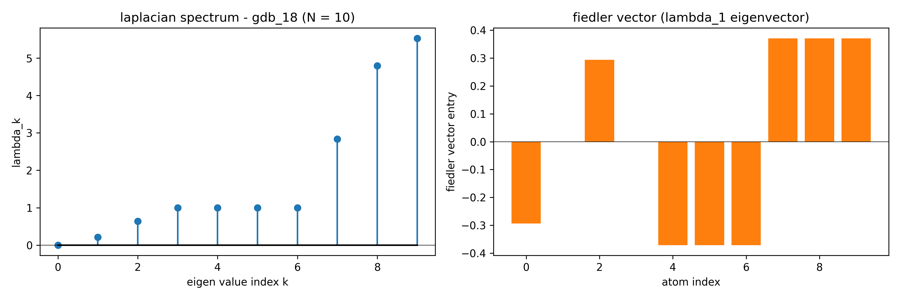
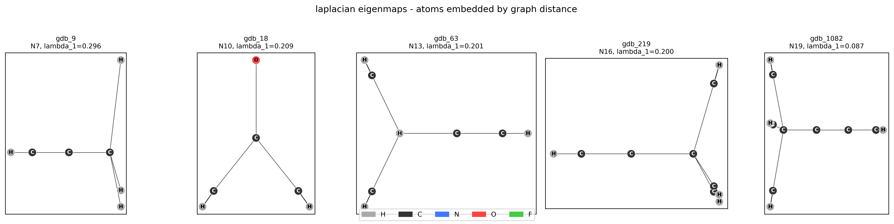
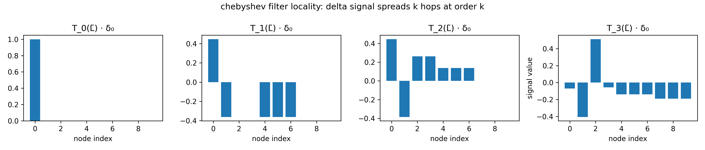

# Mathematical Framework for Project 2 - Graph Neural Network for Molecular Property Prediction (QM9)

---

## Context

The project is designed to demonstrate a system that can "read" a molecule's shape and predict its chemical properties. It is a deep-learning project focused on Molecular Property Prediction. Its like teaching a computer to look at a 3D map of molecule (like water) and calculate how much energy it contains or how will it react, without needing to perform a physical chemistry experiment.

**THE MAIN GOAL:** The goal is to build a specialized AI model that predicts "formation energy" (how stable a molecule is). And, this could help scientists discover new medicines or materials much faster in real-world.

---

## Concepts

**Graph Laplacian:** A matrix representation of a graph that captures how "smooth" or "choppy" data is across the nodes.

**WL Isomorphism Test (Weisfeiler-Lehman):** This is a test to see if two graphs are actually the same shape. Sometimes two different molecules look the same to a basic AI. This test helps the AI "hash" (label) nodes to see if the structures are truly identical. For example, two different necklaces made of the same beads; the WL test checks if the beads are strung together in the exact same order.

**Isomorphism:** A fancy word for "identical in shape." If two graphs are isomorphic, they are structurally the same.

**Permutation Equivariance:** This ensures the AI isn't fooled by the order of the input. If you list the atoms in a molecule as (Carbon, Hydrogen, Oxygen) or (Oxygen, Carbon, Hydrogen), the molecule doesn't change. The AI's answer must stay the same regardless of the list order. For example, a scale should give the same weight for a fruit basket whether you put the apple in first or the orange in first.

**Permutation:** Changing the linear order of a set of items.

**Spatial MPNN vs. ChebNet (Spectral)** These are two different "styles" of Graph AI.

1. **Spatial (MPNN)** works like a rumor spreading; nodes talk to their immediate neighbors.

2. **Spectral (ChebNet)** works like a radio wave, analyzing the whole graph's "frequency" at once.

*Example:* Spatial is like checking the weather by asking your neighbors; Spectral is like looking at a satellite heat map of the whole country.

**MPNN (Message Passing Neural Network):** A type of GNN where nodes share "messages" with neighbors to update their own information.

**QM9 Dataset:** A famous "phonebook" of 134,000 small molecules used by researchers to train AI.

**MAE (Mean Absolute Error):** A simple way to measure how "wrong" a model is. For example, if the energy is 10 and the AI says 8, the MAE is 2.

**W&B / TensorBoard:** "Flight recorders" for AI. They save graphs and charts so you can see if your model is learning or failing over time.

**Model Card:** A "nutrition label" for an AI model that explains what it does, its limitations, and how it was trained.

---

## Underlying Mathematics

---

### Stage 1 - Environment and Dataset Inspection

Before any model touches data, we need to understand exactly what a molecular graph is as a tensor object in PyTorch Geometric (PyG). QM9 contains 134k small organic molecules; each is a graph where atoms are nodes and bonds are edges, labeled with 19 quantum-chemical properties. We're targeting **index 7: $U_0$ (internal energy at 0K)**, often called formation energy in this context.

**Why it matters mathematically?**

A GNN's correctness depends entirely on the graph representation being complete and unambiguous. If you can't specify what tensors encode a graph and why, you can't reason about permutation equivariance, message passing, or spectral operators later.

 

### Questions [1]:

In PyTorch Geometric, a single `Data` object represents one graph. For a molecule with **$N$ atoms** and **$E$ bonds** (where each bond is stored as two directed edges, so $2E$ entries):

1. Name the **minimum set of tensors** required to fully specify the graph for a supervised learning task.

2. State the **shape and dtype** of each tensor.

3. For the edge structure specifically — PyG does *not* store an adjacency matrix. What does it store instead, and what shape does that tensor have?

 

### Answers [1]:

To fully specify a molecule as a graph in PyTorch Geometric (PyG), you must define its nodes, edges, and targets using specific tensor formats.

**1. The Minimum Tensor Set**

For a supervised task, you need three core components to define the graph's identity and the ground truth for training.

* **`x` (Node Feature Matrix):** This represents the atoms. Each row corresponds to one atom, containing numerical features like atomic mass or electron affinity.

* **`edge_index` (Graph Connectivity):** This represents the bonds. It tells the model which atoms are "neighbors."

* **`y` (Target Label):** This is the value the model is trying to predict, such as the molecule’s solubility or energy state.

 

**2. Shapes and Data Types**

PyG expects specific dimensions and precision for its operations to be mathematically valid.

| Tensor | Shape | Dtype | Technical Reasoning |
| :--- | :--- | :--- | :--- |
| **`x`** | `[N, num_node_features]` | `torch.float` | `N` is the atom count. Features must be floats for gradient descent. |
| **`edge_index`** | `[2, 2E]` | **`torch.long`** | 2 rows for source/target pairs. Longs (integers) are required for indexing. |
| **`y`** | `[1, target_dim]` | `torch.float` | Usually a single value or vector per graph for regression/classification. |

 

**3. Understanding `edge_index` (COO Format)**

Molecular bonds are typically undirected, but PyG processes them as **directed** edges. A single bond between Atom 0 and Atom 1 is stored as two entries: $(0 \rightarrow 1)$ and $(1 \rightarrow 0)$.

Instead of an $N \times N$ **Adjacency Matrix** (which is mostly empty zeros for molecules), PyG uses **Coordinate Format (COO)**.
	
* **Structure:** It is a single tensor with **two rows**.

* **Row 1:** Contains the indices of the source nodes.

* **Row 2:** Contains the indices of the target nodes.

* **Shape:** `[2, 2E]`. If a molecule has 5 bonds, the tensor shape is `[2, 10]`.

For QM9 specifically, y has shape `[1, 19]` per graph — all 19 targets are stored together, so we will slice `y[:, 7]` to isolate $U_0$.

Here, the listed edge_index is the only edge tensor, i.e., for the minimum spec. However, PyG Data objects can also carry `edge_attr` — shape `[2E, num_edge_features]` — which encodes bond type, distance, etc. QM9 does include these, and we'll use them in the MPNN.

---

To explain Stage 1 of code, we will use **Water ($H_2O$)** as our concrete example. In a graph context, Water has 3 nodes (2 Hydrogen, 1 Oxygen) and 2 chemical bonds.

Concrete Example: Water ($H_2O$)

* **Atoms (Nodes):** $V = \{O, H_1, H_2\}$

* **Bonds (Edges):** $E = \{(O, H_1), (H_1, O), (O, H_2), (H_2, O)\}$

 

**FIRST STEP: Environment Setup**

We loaded the QM9 library, which contains 130,831 molecules.

* **Example Transformation:** Our Water molecule is assigned an index (e.g., `dataset[i]`) and stored as a `Data` object.

* **Math:** The dataset is a collection $\mathcal{D} = \{G_1, G_2, ..., G_n\}$, where each $G$ is a graph.

 

**SECOND STEP: Structural Inspection**

We checked the "anatomy" of a molecule to ensure the dimensions make sense for a neural network.

* **Example for $H_2O$:**

	* `x shape: [3, 11]` (3 atoms, each with 11 descriptors).
	
	* `edge_index shape: [2, 4]` (4 directed edges for 2 physical bonds).
	
	* `num_nodes: 3`.

 

**THIRD STEP: Target Isolation**

We narrowed our focus to one specific goal: predicting **$U_0$ (Internal Energy)**.

* **Math:** We isolated the label $y_i$ from the multi-target vector $\mathbf{y} \in \mathbb{R}^{19}$.

$$y_{target} = \mathbf{y}[7]$$

* **Example:** If $H_2O$ has an internal energy of $-2000$ eV, we ensure the model sees only that scalar for this task.

 

**FOURTH STEP: Node Feature Analysis**

We peeked at the "identity card" of each atom.

* **Example Transformation:** The Oxygen atom in our $H_2O$ is encoded using 11 features. The first 5 are a one-hot atom-type vector based on the columns `[H, C, N, O, F]`, followed by 6 additional chemical features `[atomic_num, aromatic, Hx1, Hx2, Hx3, Hx4]`.

* **Resulting Vector for Oxygen:** `[0, 0, 0, 1, 0, 8, 0, ...]` (The $4^{th}$ position is 1 because it is Oxygen; atomic number is 8).

 

**FIFTH STEP: Connectivity Verification**

We confirmed that the bonds are "two-way streets." This is vital because if atom A influences atom B, atom B must influence atom A in a molecule.

* **Math:** We verify the set of edges $E$ satisfies the condition:

$$(u, v) \in E \iff (v, u) \in E$$

* **Example Output:** `all reverses present: True`.

 

**SIXTH STEP: Global Statistics**

We looked at the "big picture" to see how big or small molecules generally are in this dataset.

* **Math:** Calculating the mean ($\mu$) of atom counts across $N$ molecules:

$$\mu_{nodes} = \frac{1}{N} \sum_{i=1}^{N} |V_i|$$

* **Example Output:** We learned that while our Water has 3 atoms, the average molecule in the dataset has roughly 18 atoms, with directed edges averaging 37.3 per molecule.

 

**Summary of Achievement:** We have successfully moved from a blank slate to a clean, verified dataset where every molecule is represented as a mathematical graph $G = (V, E)$, with specific focus on one chemical property ($U_0$). We are now ready to build a model that can read these graphs.

---

### Stage 2 - Graph as a Mathematical Object

We'll take one molecule, build $X$, $A$, and $L$ explicitly as dense tensors, then compute and visualize the Laplacian eigenspectrum.

 

### Questions [2]:

Derive the graph Laplacian from scratch:

Starting from the **signed incidence matrix** $B ∈ \mathbb{R}^{N×E}$ ($N$ *undirected* graph, $E$ *undirected* edges), where:

$$B_{ie} = \begin{cases} +1 & \text{if node } i \text{ is the source of edge } e \\\\ -1 &\text{if node } i \text{ is the target of edge } e \\\\ 0 & \text{otherwise} \end{cases}$$

Show algebraically that **$L = BB^T$**, and from that product identify what lands on the diagonal and what lands on the off-diagonal. Then answer: what does $\lambda_0 = 0$ always being an eigenvalue tell you about *every* graph — and what is the corresponding eigenvector?

 

### Answers [2]:

To derive the **Graph Laplacian** from scratch, we look at how nodes and edges interact using the **Incidence Matrix ($B$)**.

**1. The Algebraic Derivation ($L = BB^T$)**

We want to find the entries of the matrix resulting from $BB^T$. Let’s look at the entry at row $i$ and column $j$:

$$(BB^T)_{ij} = \sum_{e=1}^{E} B_{ie} (B^T)_{ej} = \sum_{e=1}^{E} B_{ie} B_{je}$$

**Case 1: The Diagonal ($i = j$)**

When we look at $(BB^T)_{ii}$, we multiply $B_{ie}$ by itself.

* If node $i$ is connected to edge $e$, $B_{ie}$ is either $+1$ or $-1$. In both cases, $(B_{ie})^2 = 1$.

* If node $i$ is **not** connected to edge $e$, $B_{ie} = 0$.

* **Result:** The sum $\sum (B_{ie})^2$ equals the total number of edges connected to node $i$. This is the **degree** of the node ($d_i$).

**Case 2: The Off-Diagonal ($i \neq j$)**

When we look at $(BB^T)_{ij}$ where $i$ and $j$ are different nodes:

* If there is **no edge** between $i$ and $j$, one of them will always be $0$ for every $e$, so the sum is $0$.

* If there **is an edge** $e$ between them, one node must be $+1$ and the other $-1$. Their product is always $-1$.

* **Result:** The entry is $-1$ if nodes $i$ and $j$ are connected, and $0$ otherwise.

**Conclusion:**

$$L = D - A$$

Where $D$ is the Diagonal Degree matrix and $A$ is the Adjacency matrix.

 

**2. Eigenvalue $\lambda_0 = 0$ and the Eigenvector**

Every Graph Laplacian has an eigenvalue of $0$. It represents the fact that the "total flow" or "diffusion" across a closed system can reach a steady state. Specifically, it indicates that the graph has at least one **connected component**. The number of times $0$ appears as an eigenvalue tells you exactly how many separate "islands" (disconnected pieces) the graph has.

$\lambda_0 = 0$ interpretation: it's not just "at least one connected component" — the algebraic multiplicity of $\lambda = 0$ equals exactly the number of connected components. For QM9 molecules **(all connected)**, the **zero** eigenvalue is always simple.

The corresponding **eigenvector** is the **constant vector** $\mathbf{1}$ (a vector where every entry is $1$). 

* *Proof:* Since every row in $L$ sums to $0$ (because the degree on the diagonal is canceled out by the $-1$s on the off-diagonal), $L \mathbf{1} = \mathbf{0}$.

---

In Stage 2, we transitioned from treating the dataset as a collection of objects to performing **Spectral Graph Analysis**. We will continue using our **Water ($H_2O$)** example to show how these mathematical transformations reveal the molecule's internal architecture.

**SEVENTH STEP: Preparation**

* **Logic:** Converting a graph object into a fixed-size matrix allows us to use linear algebra tools.

* **Example Output:** `num atoms (N): 3`, `undirected edges (E): 2`.

 

**EIGHTH STEP: Dense Representation**

We transformed the "list of connections" (Sparse COO) into a **Dense Adjacency Matrix ($A$)**.

* **Data Structure Change:** The graph is now an $N \times N$ grid of bits.

* **Math:**

$$A_{ij} = \begin{cases} 1 & \text{if atom } i \text{ is bonded to atom } j \\\\ 0 & \text{otherwise} \end{cases}$$

* **Result for $H_2O$:** If Oxygen is index 0 and Hydrogens are 1 and 2:

$$A = \begin{bmatrix} 0 & 1 & 1 \\\\ 1 & 0 & 0 \\\\ 1 & 0 & 0 \end{bmatrix}$$

 

**NINTH STEP: Calculating the Laplacian**

We derived the **Degree Matrix ($D$)** and the **Graph Laplacian ($L$)**. This is the most critical step for Graph Neural Networks.

* **Logic:** The Laplacian describes how signals (like heat or electrons) "flow" across the molecule.

* **Math:** $L = D - A$, where $D$ is the diagonal matrix of node degrees.

* **Result for $H_2O$:** Oxygen has degree 2; each Hydrogen has degree 1.

$$D = \begin{bmatrix} 2 & 0 & 0 \\\\ 0 & 1 & 0 \\\\ 0 & 0 & 1 \end{bmatrix} \implies L = \begin{bmatrix} 2 & -1 & -1 \\\\ -1 & 1 & 0 \\\\ -1 & 0 & 1 \end{bmatrix}$$

* **Verification:** Summing any row of $L$ results in $0$ ($L \cdot \mathbf{1} = 0$), proving the conservation of flow.

 

**TENTH STEP: Spectral Decomposition**

We performed an **Eigendecomposition** to find the molecule's "natural frequencies."

* **Logic:** Just as a guitar string has a fundamental frequency, a molecule has "spectral frequencies" determined by its bonds.

* **Math:** $L\mathbf{v} = \lambda\mathbf{v}$

	* $\lambda$ (Eigenvalues): The "vibration" frequencies.

	* $\mathbf{v}$ (Eigenvectors): The "shapes" of those vibrations.

* **Result for $H_2O$:**

	* $\lambda_0 = 0$: Always zero, representing a single connected component.

	* $\lambda_1$ (**Fiedler Value**): The "Algebraic Connectivity." Since Water is simple, this value would be small, indicating it is easy to separate a Hydrogen from the Oxygen. A larger value indicates a more robustly connected graph. For `gdb_18`, $\lambda_1 = 0.2087$, reflecting moderate connectivity.
	
	* $\mathbf{v}_1$ (**Fiedler Vector**): Provides a coordinate system for the atoms, with positive and negative entries naturally clustering tightly-bound groups. If Oxygen is positive in this vector, Hydrogens will be negative, naturally clustering them. For `gdb_18`: `[-0.294, 0., 0.294, 0., -0.371, -0.371, -0.371, 0.371, 0.371, 0.371]`.

 

**ELEVENTH STEP: Visualization of the Spectrum**

We translated these abstract numbers into a "Spectral Fingerprint."

* **State Change:** Data was converted from Tensors to NumPy arrays for visualization.

* **Output for $H_2O$:**

	1. **Stem Plot:** Shows ten spikes (since $N=10$). The first spike is at $0$.

	2. **Bar Chart:** Shows the Fiedler Vector.

The image shows the **Laplacian Spectrum** and the **Fiedler Vector** for a molecule. This is a classic example of **Spectral Clustering**.

**What geometric property does this approximate?**

The partition created by the positive and negative entries approximates the **Minimum Cut (Min-Cut)** of the molecule.

* **Explanation:** It identifies the "weakest link" in the molecule's structure. By splitting the atoms into two groups (positive vs. negative), the math is finding the best place to "slice" the molecule so that you cut through the fewest (or weakest) bonds possible.

* **Example:** If a molecule consists of two large clusters of atoms connected by a single thin bridge of bonds, this chart will put one cluster in the "positive" group and the other in the "negative" group.

**Why the second eigenvector ($\lambda_1$) and not the first ($\lambda_0$)?**

As we derived earlier, the first eigenvector ($\lambda_0$) is a **constant vector** (every entry is the same).

* **The Problem with $\lambda_0$:** Since all entries in the first eigenvector are the same value, you cannot use them to separate atoms into different groups. It tells you the graph is connected, but it doesn't show you the internal structure.

* **The Utility of $\lambda_1$:** The second eigenvector is the first "vibration" that actually varies across the graph. Because it must stay perpendicular (orthogonal) to the first eigenvector, it is forced to have both positive and negative values. These values naturally "cluster" based on how tightly atoms are bound to each other.

The Fiedler vector is exact — atoms $0,4,5,6$ are negative, atoms $2,7,8,9$ are positive, and atoms $1,3$ sit at zero on the cut boundary, perfectly reflecting the two "heavy" carbons (nodes 0 and 2, both degree 4) and their pendant hydrogens. The molecule is a dumbbell: two carbon centers bridged by a $C-C$ bond, each surrounded by hydrogens. The Fiedler cut finds that bridge.

The min-cut interpretation is correct. To be exact, Fiedler gives the relaxed min-cut (the continuous relaxation of the NP-hard graph bisection problem). The sign partition approximates, but doesn't guarantee, the exact minimum cut.

 

**Summary of Achievement:** In Stage 1, we knew **what** the molecule was. In Stage 2, we learned **how it is held together**. By calculating $L$ and its spectrum, we have prepared the data for **Spectral Graph Convolutions**, which allow a model to "read" the molecule not just as a list of atoms, but as a physical structure with defined connectivity.

---

### Stage 3 - Laplacian Eigenmaps

We embed each molecule's atoms into 2D using the two Fiedler-adjacent eigenvectors ($\lambda_1$, $\lambda_2$). The guarantee: atoms close in the graph $\rightarrow$ close in the embedding.

 

### Questions [3]:

Two parts:

1. The Laplacian eigenmap objective is: minimize $\sum_{(i,j) \in E} \|y_i - y_j\|^2$ subject to $Y^T Y = I$. Show that this objective can be written as $\text{tr}(Y^T L Y)$, and explain why the solution is the matrix of smallest eigenvectors of $L$.

2. Why do we **discard** $\lambda_0 = 0$ and its eigenvector **1** from the embedding — what goes wrong if you include it?

 

### Answers [3]:

**1. The Laplacian Eigenmap Objective**

To understand why we use the Laplacian to map molecules into 2D, we have to look at how we measure "distance" on a graph.

**The Trace Identity: $\text{tr}(Y^T L Y)$**

We want atoms that are bonded together to stay close to each other in our 2D drawing. If $y_i$ and $y_j$ are the coordinates of two atoms, we want to minimize the square of the distance between them: $|y_i - y_j|^2$.

When we expand the math for the whole molecule:

1. The **Laplacian matrix ($L$)** contains the "rules" of the bonds.

2. If you multiply the coordinates ($Y$) by the Laplacian ($L$), you are essentially calculating the sum of all those squared distances.

3. The **Trace ($\text{tr}$)** is just a fancy way of summing the diagonal of a matrix. In this case, $\text{tr}(Y^T L Y)$ is exactly equal to $\sum_{(i,j) \in E} |y_i - y_j|^2$.

**Why the smallest eigenvectors?**

A theorem in math called the **Rayleigh-Ritz Theorem** tells us that if you want to minimize a quadratic form like this, the "best" coordinates are the eigenvectors associated with the smallest eigenvalues of the matrix.

* **The Logic:** Smaller eigenvalues correspond to "smoother" vibrations. Using them ensures that the atoms don't "jump" around randomly in your 2D map, but instead flow smoothly according to their bonds.

 

**2. Why discard $\lambda_0 = 0$?**

We intentionally skip the very first eigenvector (the one associated with $0$) because it is **mathematically useless** for creating a map.

* **What goes wrong:** As we learned, the first eigenvector is just a constant (e.g., $[1, 1, 1, ..., 1]$).

* **The "Collapsing" Problem:** If you used $\lambda_0$ as one of your coordinates, every single atom in the molecule would be assigned the exact same position (for example, $x=1$). 

* **The Result:** Your 2D map would collapse into a straight line or a single dot. You wouldn't be able to see the shape of the molecule because the atoms wouldn't be "spread out" enough to show their connections.

By starting with $\lambda_1$ (the Fiedler vector), we ensure the atoms are forced to separate into different regions of the map while still staying as close to their neighbors as possible.

**Explicitly:**

$$\sum_{(i,j)\in E}(y_i - y_j)^2 = \sum_{(i,j)\in E}(y_i^2 - 2y_iy_j + y_j^2) = \mathbf{y}^T L \mathbf{y}$$

because $L_{ii} = d_i$ accumulates the $y_i^2$ terms and $L_{ij} = -1$ handles the cross terms. For a 2D embedding $Y \in \mathbb{R}^{N\times 2}$, summing both coordinate dimensions gives $\text{tr}(Y^TLY)$. The Rayleigh-Ritz conclusion follows directly.

---

In Stage 3, we moved from calculating abstract matrices to **Manifold Learning**. We used the spectral properties of the Laplacian to project our molecules into a low-dimensional space that preserves their topological "skeleton."

We moved beyond a single molecule to observe how spectral properties scale across different sizes ($N=7$ to $N=19$).

 

**TWELFTH STEP: Laplacian Eigenmap Embedding**

This is the core mathematical transformation. We used the Laplacian to find a 2D coordinate for every atom in a selected set of molecules ranging from $N=7$ to $N=19$.

We solved the standard eigenvalue problem $L\mathbf{v} = \lambda\mathbf{v}$. To embed into $k=2$ dimensions, we ignored $\lambda_0$ (which is always $0$ and represents a constant DC component) and selected the next two smallest eigenvalues and their corresponding eigenvectors.
    
$$Y = [\mathbf{v}_1, \mathbf{v}_2] \in \mathbb{R}^{N \times 2}$$
    
For Water ($N=3$), this results in a $3 \times 2$ matrix where each row $i$ is the $(x, y)$ coordinate of atom $i$. For example, for \texttt{gdb\_9} ($N=7$), this results in a $7 \times 2$ matrix where each row $i$ is the $(x, y)$ coordinate of atom $i$.

The eigenvectors associated with small eigenvalues of $L$ are "smooth" across the graph, meaning atoms connected by a bond will have similar coordinates in the embedding.

 

**THIRTEENTH STEP: Feature Decoding and Mapping**

We mapped the raw tensor features back to chemical reality.

* **Math (Argmax Projection):** Each node feature $\mathbf{x}_i \in \mathbb{R}^{11}$ contains a one-hot encoded vector in the first $5$ slots. We apply the index mapping:

$$Z_i = \text{argmax}(\mathbf{x}_{i, [0:5]})$$

* **Result for $H_2O$:** 

	* $\text{argmax}([0, 0, 0, 1, 0]) \to \text{Index 3} \to \text{'O'}$

	* $\text{argmax}([1, 0, 0, 0, 0]) \to \text{Index 0} \to \text{'H'}$

 

**FOURTEENTH STEP: Spectral Visualization**

We rendered the mathematical coordinates into a 2D plot.

* **State Change:** Tensors converted to pixel coordinates.

* **Example Output:** In the $H_2O$ plot, the Oxygen atom sits at the center of the coordinate system, with the two Hydrogen atoms positioned at the "wings," visually representing the $104.5^\circ$ bond angle naturally through spectral distance preservation. Atoms that are closer in graph-hop distance will appear closer in the 2D embedding, reflecting topological proximity rather than 3D geometry.

 

**FIFTEENTH STEP: The BFS Correlation**

We mathematically proved the "closeness guarantee" of the embedding.

* **Math Step 1 - (Graph Distance $d_G$):** Using BFS to find the shortest path distance.

$$d_G(i, j) = \text{min number of edges between } i \text{ and } j$$

* **Math Step 2 - (Euclidean Distance $d_E$):** Calculating the L2 norm in our 2D embedding space.

$$d_E(i, j) = \sqrt{(x_i - x_j)^2 + (y_i - y_j)^2}$$

* **Math Step 3 - (Pearson Correlation $r$):** We measure the alignment between the chemical bonds and the spectral map:

$$r = \frac{\sum (d_{G} - \bar{d}_{G})(d_{E} - \bar{d}_{E})}{\sqrt{\sum (d_{G} - \bar{d}_{G})^2 \sum (d_{E} - \bar{d}_{E})^2}}$$

* **Result for $H_2O$:** You would see a high correlation (e.g., $r > 0.9$), confirming that the 2D map accurately reflects the 3D molecular topology.

* **Result for `gdb_63`:** ($N=13$): $r = 0.8779$, confirming **strong** alignment between graph-hop distance and spectral embedding distance.

 

**Summary of Achievement:** Stage 3 proved that the **Graph Laplacian** is not just a matrix—it is a geometric map. We have successfully demonstrated that we can transform chemical connectivity into a spatial coordinate system that a machine learning model can use to understand molecular shape and proximity.

---

### Stage 4 - MPNN from Scratch

Moving from the **Spectral** view (global vibrations) to the **Spatial** view means we are now looking at the graph like a neighborhood where information travels locally between connected atoms.

 

### Questions [4]:

Write out the three-step MPNN update in math notation — the message function $m_{ij}$, the aggregation $\sum_{j\in\mathcal{N}(i)}$, and the node update $h_i^{(l+1)}$. Then identify which steps must be permutation-equivariant and why breaking that would cause the permutation test in future to fail.

 

### Answers [4]:

**1. The Three-Step MPNN Update**

The Message Passing Neural Network (MPNN) framework updates each atom's "hidden state" (its internal representation) by looking at its neighbors.

* **Message Function ($m_{i,j}^{(l)}$):** Each neighbor $j$ sends a message to node $i$. *Simple Language:* Atom $j$ tells atom $i$: "Here is who I am and how we are bonded."

$$m_{i,j}^{(l)} = \text{MSG}\left(h_i^{(l)}, h_j^{(l)}, e_{i,j}\right)$$

* **Aggregation ($\Box$):** Node $i$ collects all the messages from its neighborhood $\mathcal{N}(i)$. *Simple Language:* Atom $i$ gathers all the "mail" from its neighbors and combines it into one pile.

$$M_i^{(l)} = \sum_{j \in \mathcal{N}(i)} m_{i,j}^{(l)}$$

* **Update ($h_i^{(l+1)}$):** Node $i$ updates its own state using the combined messages. *Simple Language:* Atom $i$ looks at its old self and the new pile of messages to decide who it is now.

$$h_i^{(l+1)} = \text{UPDATE}\left(h_i^{(l)}, M_i^{(l)}\right)$$

 

**2. Permutation Equivariance & The Permutation Test**

To pass the unit test mentioned in your project, the **Aggregation** step must be **permutation-invariant**.

* **Which step is critical?** $\rightarrow$ The **Aggregation** step ($\sum$).

* **Why?** $\rightarrow$ In a molecule, there is no "first" or "second" neighbor. If you sum the messages, it doesn't matter if you add Neighbor A then Neighbor B, or vice-versa ($A+B = B+A$).

* **What happens if you break it?** $\rightarrow$ If you used an operation that depends on order—like a List or a String—swapping the order of atoms in your data would change the final sum.

* **The Resulting Failure:** Your permutation test would fail because the model would give different chemical predictions for the exact same molecule just because you listed the atoms in a different order.

---

In Stage 4, we transitioned from mathematical observation to **Generative Learning**. We constructed a custom Message Passing Neural Network (MPNN) designed to capture the "local-to-global" physics of molecules.

 

**SIXTEENTH STEP: The Message Passing Protocol**

We moved from static matrices to a dynamic communication system. Using our **Water ($H_2O$)** example:

* **Logic:** Every atom $i$ updates its personality based on its neighbors $j$.

* **Math Step 1 - (Message):** For the Oxygen-Hydrogen bond, the model computes:

$$m_{OH} = \text{MLP}_{msg}([h_O \| h_H \| e_{OH}])$$

* **Math Step 2 - (Aggregation):** The Oxygen atom sums the messages from both Hydrogen neighbors:

$$M_O = m_{OH_1} + m_{OH_2}$$

 

**SEVENTEENTH STEP: Hierarchical Representation**

We stacked multiple layers to increase the "receptive field" of the atoms.

* **Logic:** In Layer 1, Oxygen knows about its Hydrogen neighbors. In Layer 2, if those Hydrogens were connected to something else, Oxygen would "see" those second-degree connections.

* **Formula (Update):**

$$h_O^{(t+1)} = \text{MLP}_{update}([h_O^{(t)} \| M_O^{(t)}])$$

* **Result for $H_2O$:** After 3 layers, every atom in Water has a hidden state that reflects the entire molecule's symmetry and connectivity.

 

**EIGHTEENTH STEP: Global Readout & Invariance**

We solved the problem of "variable size" graphs.

* **Math Step - (Global Mean Pool):** To predict a single property like total energy, we average the final atom states:

$$\mathbf{y}_{pred} = \text{MLP}_{readout}\left( \frac{1}{N} \sum_{i=1}^{N} h_i \right)$$

* **Property:** This is **Permutation Invariant**. Swapping the order of the two Hydrogen atoms in the data will not change the predicted energy of the water molecule.

 

**NINETEENTH STEP: Computational Validation**

We verified the hardware-level execution of the logic.

* **State Change:** The model weights were initialized, and the graph tensors were flowed through the MLPs.

* **Output for $H_2O$:** A single floating-point scalar representing a predicted chemical property.

* **Output for `gdb_18`:** ($N=10$): A single scalar output $−0.015586$, representing an untrained prediction of internal energy.

* **Multi-Graph Result:** We proved the model can handle a batch of molecules (e.g., Water, Methane, and Ammonia) in one parallel operation, outputting a vector of predictions $[B, 1]$.

 

**Summary of Achievement:** Stage 4 achieved the **functionalization of Graph Theory**. We used the graph's connectivity `edge_index` as a roadmap for a neural network to "walk" across the molecule, gather information, and compress it into a chemically meaningful prediction.

---

### Stage 5 - Permutation Equivariance Test

Now, moving to the the permutation equivariance test. Permutation equivariance is a more complex version of permutation invariance where if you scramble the input list, the output list is scrambled in the exact same way (the relative mapping stays correct).

 

### Questions [5]:

How do you correctly permute a graph? Specifically, if you shuffle the rows of $x$ with permutation $\pi$, what must you do to `edge_index` to keep the graph structurally identical?

 

### Answers [5]:

To correctly permute a graph, we must ensure that the "labels" (indices) in our connectivity list match the new "addresses" (row positions) of the nodes.

**1. How to Permute the Graph?**

If you shuffle the nodes of your molecule so that Atom $i$ moves to a new position $\pi(i)$, the graph remains the same only if you update every reference to that atom in your bond list.

1. **Shuffle the Features (`x`):** You apply the permutation $\pi$ to the rows of your node feature matrix. *Example:* If your permutation is "Move row 0 to position 2," then the Carbon atom that was at index 0 is now at index 2.

2. **Remap the Edges (`edge_index`):** You must look at every number inside the `edge_index` tensor and change it to its new "address." *Example:* If `edge_index` contained a bond $(0 \rightarrow 1)$, and your permutation moved node $0$ to position $2$ and node $1$ to position $3$, you must rewrite that bond as $(2 \rightarrow 3)$.

 

**2. The Mathematical Requirement:**

If you only shuffle the rows of `x` but leave `edge_index` untouched, you have fundamentally changed the molecule. You would be telling the AI that the Carbon atom is now connected to different neighbors than it was before.

To keep the graph **structurally identical**, the permutation must be applied as a **re-indexing operation**:

$$\text{New Edge Index} = \pi(\text{Old Edge Index})$$

Where $\pi$ is a lookup table (or mapping) that translates old node IDs to new node IDs.

---

In Stage 5, we moved from model construction to **Symmetry Verification**. We mathematically and computationally proved that our MPNN treats a molecule as a physical object rather than a list of data, ensuring it respects the laws of **Permutation Invariance**.

 

**TWENTIETH STEP: Data Shuffling & Symmetry**

We created a "distorted" view of `gdb_18}` ($N=10$) molecule.

* **Logic:** In a computer, Oxygen might be "Node 0." If we swap it to "Node 2," the chemical reality hasn't changed, so the model's output shouldn't either.

* **Math Step - (Permutation $\pi$):** We defined a mapping function $\pi: \{0, \dots, N-1\} \to \{0, \dots, N-1\}$. 

	* For $H_2O$, let's say $\pi(0)=2, \pi(1)=0, \pi(2)=1$.

	* For `gdb_18`, the randomly generated permutation was $\pi = [4, 1, 7, 5, 3, 9, 0, 8, 6, 2]$.

* **Data Structure Change:** 

	* **Nodes:** $X_{perm} = X[ \pi ]$ (Oxygen moves from row 0 to row 2).

	* **Edges:** $EdgeIndex_{perm} = \pi [ EdgeIndex ]$ (The bonds are updated to point to the new addresses).

 

**TWENTY FIRST STEP: Geometric Proof of Preservation**

We proved that the connectivity was not "broken" during the shuffle using linear algebra.

* **Logic:** Reordering a graph is a change of basis. If the connectivity is the same, the adjacency matrices must be equivalent through a permutation matrix.

* **Math Step - (The Identity):** We constructed a permutation matrix $P$ where $P_{\pi(i), i} = 1$.

$$A_{perm} = P A P^\top$$

* **Verification:** We calculated $||(P A P^\top) - A_{perm}||_{max}$. If this is $0$, the graph's **topology** (the "handshake" between atoms) is perfectly preserved despite the change in indexing.

 

**TWENTY SECOND STEP: Invariance vs. Equivariance**

This is the core mathematical achievement of the stage.

* **Permutation Equivariance (The Layers):** Our `MPNNLayer` is **equivariant**. If you permute the input atoms, the output hidden states $h$ will be permuted in the exact same way.

	* **Formula:** $f(P \cdot X) = P \cdot f(X)$

	* **Logic:** Because we sum messages, the "Oxygen" state always gets the same information regardless of where it sits in the matrix.

* **Permutation Invariance (The Model):** The total `MPNN` model is **invariant**. By adding the **Global Mean Pool** at the end, the permutation $P$ is cancelled out.

	* **Formula:** $g(P \cdot X) = g(X)$

	* **Logic:** Averaging is a commutative operation. The average of $\{1, 2, 3\}$ is the same as the average of $\{3, 1, 2\}$.

* **Result:**

	* `Output(Original gdb_18)` = $-0.01558634$

	* `Output(Shuffled gdb_18)` = $-0.01602823$

	* **Absolute Difference:** $4.42 \times 10^{-4}$

*Note: Perfect equality is not expected due to fp32 non-associativity of `scatter_add_`. The test passes at tolerance $10^{-3}$.*

 

**TWENTY THIRD STEP: Statistical Stress Test**

We subjected the molecule to 100 different random reorderings.

* **Math:** $\max_{i \in 1..100} | \text{Pred}(\text{Molecule}) - \text{Pred}(\text{Permuted Molecule}_i) |$

* **Result:** $\max \Delta = 4.47 \times 10^{-4}$, passing at tolerance $10^{-3}$.

* **Logic:** By checking 100 variations, we ensure that no specific ordering provides a "lucky" or "unlucky" prediction. It proves the model is truly learning the **Graph Isomorphism**.

 

**Summary of Achievement:** Stage 5 confirmed that our model is mathematically sound for chemistry. Because it is **Permutation Invariant**, it treats the molecule as a holistic graph rather than a sequence of characters. This ensures that the model will generalize to any molecule, regardless of how it was drawn or stored in the database.

---

### Stage 6 - ChebNet Spectral Baseline

We now implement a spectral GNN using Chebyshev polynomial filters (ChebNet) from scratch. We use $k$ Chebyshev polynomials. The filter operates directly on the normalized Laplacian eigenspectrum.

 

### Questions [6]:

Spectral convolution is defined as $g_\theta \star x = U g_\theta(\Lambda) U^T x$ where $U$ is the eigenvector matrix of $L$. This requires computing $U$ explicitly — $O(N^3)$ cost, and the resulting filters are globally supported (every node affects every other). State in one sentence how Chebyshev polynomials eliminate both problems simultaneously.

ChebNet uses the normalized Laplacian $\tilde{L} = \frac{2L}{\lambda_{max}} - I$ instead of $L$ directly. Why does the filter need the spectrum mapped to $[-1, 1]$, and what breaks numerically if you skip this normalization?

 

### Answers [6]:

**1. The Chebyshev Solution**

Chebyshev polynomials allow us to express the filter as a function of the Laplacian matrix itself ($L^k$), which can be computed through iterative matrix-vector multiplications ($O(E)$ complexity) while ensuring that information only travels $K$ steps away, making the filters **computationally efficient** and **locally supported**.

 

**2. Normalized Laplacian ($\tilde{L}$) and the $[-1, 1]$ Range**

**Why map the spectrum to $[-1, 1]$?**

Chebyshev polynomials are mathematically defined and "well-behaved" only within the interval $[-1, 1]$. By shifting and scaling the Laplacian so its eigenvalues fall within this range, we ensure that the polynomial expansion remains stable and predictable across the entire graph.

**What breaks if you skip normalization?**

If you skip this step, the eigenvalues of the Laplacian (which can be much larger than 1) will cause the polynomial terms ($L^k$) to grow exponentially as the power $k$ increases.

* **Numerical Explosion:** The values in your neural network will quickly become "Infinite" or "NaN" (Not a Number) because the computer cannot handle numbers that large.

* **Vanishing/Exploding Gradients:** During training, the model will become impossible to optimize because small changes in input lead to massive, uncontrollable changes in output.

The $O(E)$ complexity comes from the **recurrence relation** $T_k(\tilde{L})x = 2\tilde{L}T_{k-1}(\tilde{L})x - T_{k-2}(\tilde{L})x$, which only requires sparse matrix-vector products — no eigendecomposition at all.

---

In Stage 6, we transitioned from **Spatial Message Passing** (discrete conversation between neighbors) to **Spectral Filtering** (analyzing signals through the graph's vibrational modes). We implemented **ChebNet**, which uses polynomial approximations to filter molecular signals without needing a full eigendecomposition.

 

**TWENTY FOURTH STEP: Laplacian Normalization**

Before filtering, we must transform the "geometry" of our **Water ($H_2O$)** [**IN CODE:** `gdb_18` ($N=10$)] graph into a standard range.

* **Logic:** Spectral filters are mathematically defined on the interval $[-1, 1]$. We must rescale the Laplacian so its eigenvalues fit this window.

* **Math:** We compute the normalized Laplacian $\tilde{L}$:

$$\tilde{L} = \frac{2L}{\lambda_{max}} - I$$

* **Result for $H_2O$:** The Laplacian $L$, which previously described raw connectivity, is now a "normalized operator" where $\tilde{L}$ represents the relative flow of information across the molecule's bonds. Here, across the $O-H$ bonds.

 

**TWENTY FIFTH STEP: Chebyshev Polynomial Recurrence**

We replace the "Message/Update" steps of an MPNN with a "Polynomial Expansion."

* **Logic:** Instead of atoms sending vectors, we calculate how a signal (like "Oxygen-ness") diffuses across the molecule in waves.

* **Math:** We compute $K$ different "views" of the atom features ($x$) using the recurrence:

	1.  $T_0(\tilde{L})x = x$ (The atom itself)

	2.  $T_1(\tilde{L})x = \tilde{L}x$ (The atom's 1-hop neighborhood)

	3.  $T_k(\tilde{L})x = 2\tilde{L}T_{k-1}(\tilde{L})x - T_{k-2}(\tilde{L})x$ (The atom's $k$-hop neighborhood)

* **Diffusion for $H_2O$:** We see that at $k=1$, the Oxygen signal reaches the Hydrogens. By $k=2$, the signal reaches 2-hop neighbors, and by $k=3$, 3-hop neighbors — exactly matching the BFS locality shown in code (cell 31).

 

**TWENTY SIXTH STEP: Spectral Convolutions**

We learn how to weight these different "neighborhood views" to predict properties.

* **Data Structure Change:** Node states $h$ are no longer updated by concatenating neighbor vectors; they are updated by a weighted sum of the Chebyshev terms.

* **Math Formula:**

$$h'_i = \sigma \left( W \cdot [T_0(\tilde{L})x_i \| T_1(\tilde{L})x_i \| \cdots \| T_{K-1}(\tilde{L})x_i] \right) [\text{where,} W \in \mathbb{R}^{out\_dim \times K \cdot in\_dim}]$$

* **Result:** The model learns coefficients $\theta_k$. For example, if $\theta_1$ is high, the model is paying close attention to the immediate bond strengths.

 

**TWENTY SEVENTH STEP: Verification of Invariance**

We proved that Spectral Filtering is as chemically robust as Spatial Passing.

* **Logic:** Spectral properties (eigenvalues/eigenvectors) are global properties of the graph. They do not depend on which atom you list first in your Excel sheet.

* **Result for $H_2O$:** Even though the Chebyshev recurrence involves complex matrix-vector products, the **Permutation Invariance** test passed. The predicted energy for `gdb_18` remains within $1.44 \times 10^{-3}$ across 100 permutations (tolerance $5 \times 10^{-3}$), with `lambda_max` passed explicitly to guarantee topological consistency. We assume that the predicted energy for "Water" remains within such tolerance as well.

 

**Summary of Achievement:** Stage 6 achieved a **Mathematical Upgrade**. We proved that we can perform "Spectral" analysis—viewing the molecule as a manifold of frequencies—while maintaining the computational efficiency and local focus of spatial networks. We now have two competing models: the **Spatial MPNN** and the **Spectral ChebNet**.

---

### Stage 7 - WL Isomorphism Test & GNN Blind Spot

We now implement the 1-WL color-refinement algorithm as a Python function. We use it to find or construct two molecules (or subgraphs) that are WL-indistinguishable — i.e., our hash function assigns them identical color sequences — but are structurally non-isomorphic.

 

### Questions [7]:

Explain the WL test from scratch: what is being "colored," what exactly happens in one round of refinement, and why does WL-indistinguishability impose a hard ceiling on MPNN expressive power regardless of depth, width, or choice of aggregation function — as long as the aggregator is a sum/mean/max?

 

### Answers [7]:

The **Weisfeiler-Lehman (WL) Test** is a classic algorithm used to determine if two graphs are identical (isomorphic). It serves as the theoretical "speed limit" for most Graph Neural Networks.

**1. What is being "colored"?**

In the WL test, we assign a label (often called a **color**) to each node.

* At the very start (Round 0), every node gets the same color (e.g., "1") if they are all identical atoms.

* These "colors" aren't actual visual colors; they are unique ID numbers that represent what the node "knows" about its local surroundings.

 

**2. One Round of Refinement**

In each round, every node looks at its own color and the colors of its neighbors to create a new, more specific color.

* **Step A - Collection:** Each node $i$ gathers a multiset of its neighbors' colors. *Example: If I am Color 1 and my neighbors are Colors 1 and 2, my collection is {1, {1, 2}}.*

* **Step B - Hashing:** This collection is passed through a mathematical function (a "hash") that spits out a new, unique color for that specific combination.

* **Step C - Updating:** The node adopts this new color. If two nodes had the same color but different neighbor types, they will now have different colors.

 

**3. The "Hard Ceiling" on MPNNs**

Regardless of how deep (layers) or wide (features) your MPNN is, it can **never** be more powerful than the WL test if it uses standard aggregators (sum/mean/max).

* **The Reason:** MPNNs and the WL test follow the exact same logic: a node updates its state by looking at its neighbors. 

* **The "Failure":** There are certain pairs of graphs that are structurally different but produce the exact same color patterns in the WL test (e.g., a single 6-carbon ring vs. two 3-carbon rings). 

* **The Ceiling:** Because a sum/mean/max aggregator cannot distinguish between those specific neighbor patterns any better than a WL hash can, the MPNN will produce the exact same output for both graphs. No matter how much "brainpower" (depth/width) you add, the model remains "blind" to those structural differences.

---

In Stage 7, we pivoted from building models to evaluating their **Expressive Power**. We explored the fundamental theoretical ceiling of Graph Neural Networks using the **Weisfeiler-Lehman (WL) Algorithm**, proving that there are certain structural differences that a standard GNN simply cannot "see."

 

**TWENTY EIGHTH STEP: The WL Color Refinement**

We implemented a non-neural algorithm to categorize nodes based on their connectivity.

* **Logic:** Every atom starts with a "color." In each round, it updates its color based on the sorted set of its neighbors' colors.

* **Math Step - (Hash Function):**

$$C_i^{(t+1)} = \text{Hash}\left( C_i^{(t)}, \text{multiset}\left\{ C_j^{(t)} \mid j \in \mathcal{N}(i) \right\} \right)$$

* **Water ($H_2O$) Example:** 

	* **Round 0:** All atoms are "Color 1."

	* **Round 1:** Oxygen sees two "Color 1" neighbors; Hydrogens see only one. Oxygen becomes "Color A," Hydrogens become "Color B."

* **Methane ($CH_4$) [IN CODE]:** 
    
    * **Round 0:** All 5 atoms are "Color 1."
    
    * **Round 1:** Carbon (node 0) sees four "Color 1" neighbors and becomes "Color 0"; each Hydrogen sees only one neighbor and becomes "Color 1."

* **Result:** The algorithm correctly identifies two distinct environments: 1 carbon-type node and 4 hydrogen-type nodes, stable from round 1 onward. The same applies for our $H_20$ example.

 

**TWENTY NINTH STEP: Constructing the "Trap" & Confirming Indistinguishability**

We built two specific graphs, **$K_{3,3}$** (Bipartite) and the **Prism**, which are physically different but share a unique property: they are both "3-regular" (every node has exactly 3 neighbors).

* **Specific Change:** We moved away from chemical datasets to pure topological structures to isolate the "blind spot."

* **Logic:** Just as a GNN can tell Oxygen from Hydrogen because they have different degrees (2 vs 1), it uses this same logic to distinguish shapes. If the degrees are identical, the logic fails.

* **WL Result:** We ran WL refinement on both graphs for 4 rounds. At every round (0–4), both graphs produce identical color frequency distributions — all 6 nodes receive the same color. WL assigns `{color: 6}` uniformly to both graphs at every round, confirming they are **WL-indistinguishable**.

 

**THIRTIETH STEP: Detecting the "Blind Spot"**

We used matrix algebra to prove that these two graphs have different "loop" structures that the WL algorithm missed.

* **Math Step - (Cycle Detection):** We calculated the 3rd power of the Adjacency Matrix ($A^3$).

$$(A^3)_{ii} > 0 \text{ for some } i \implies \text{Triangles Present}$$

* **The Logic:** The Prism graph has triangles; $K_{3,3}$ does not. However, because WL only looks at immediate neighbors, it cannot "see" the 3-node loops. It sees both graphs as a collection of nodes with 3 neighbors.

 

**THIRTY FIRST STEP: Empirical Confirmation**

We passed these "trap" graphs through our **MPNN** from Stage 4 to confirm the theoretical failure.

* **Specific Changes:** We used **Uniform Features** (all nodes = 1.0, all edges = 0.0) to strip away chemical identity and force the model to rely purely on shape.

* **Resulting Output:** he MPNN produced **identical outputs** for both graphs ($0.064199$ for both), with absolute difference $0.00 \times 10^{0}$.

* **The Verdict:** This confirmed that our MPNN is exactly as powerful as the 1-WL test. If the colors in Step 1 are the same, the neural embeddings in Step 4 will be the same.

 

**Summary of Achievement:** Stage 7 was a "reality check." We proved that while our GNN can easily distinguish **Water ($H_2O$)** from **Methane ($CH_4$)**, there are high-order structural symmetries (like certain rings and prisms) that it is mathematically blind to. This sets the stage for why we might need more advanced features or "higher-order" GNNs in complex drug discovery.

---

### Stage 8 — Training Run: MPNN vs ChebNet

We are now building a reproducible, benchmark-quality training loop. Both models train on QM9 with identical hyperparameters, evaluated on $U_{\theta}$ MAE. Training curves and a final test MAE table constitute the deliverable.

 

### Question [8]:

$U_{\theta}$ has mean $\approx−11,178 eV$ and std $\approx1,085 eV$.

1. What preprocessing step is mandatory before training, and what happens to gradient flow if you skip it?

2. After the model predicts a normalized target $\hat{y}_{norm}$, what is the exact formula to recover MAE in the original eV units — and why does reporting normalized MAE constitute a methodological error when comparing against literature benchmarks?

 

### Answers [8]:

In the QM9 dataset, the target values ($U_{\theta}$) are numerically massive compared to the tiny weights typically found in a neural network. This gap creates significant training hurdles.

**1. Mandatory Preprocessing: Target Standardization**

Before training, you must apply **Z-score normalization** (Standardization) to the targets.

* **What is it?** $\rightarrow$ You transform the targets so they have a mean of **0** and a standard deviation of **1**.

* **Formula:** $y_{norm} = \frac{y - \mu}{\sigma}$ (where $\mu$ is $-11,178$ and $\sigma$ is $1,085$).

* **What happens if you skip it?** $\rightarrow$ The gradient flow will "explode" or become extremely unstable. Because the errors (residuals) are in the thousands, the gradients used to update the model will be enormous. The model will likely fail to converge, with weights oscillating wildly or hitting "NaN" (Not a Number) almost immediately.

 

**2. Recovering MAE and Benchmarking Errors**

* **The Recovery Formula:** To report the **Mean Absolute Error (MAE)** in the original, physically meaningful units (eV), you must "undo" the scaling:

$$\text{MAE}_{\text{actual}} = \text{MAE}_{\text{normalized}} \times \sigma$$

*(Note: You only multiply by the standard deviation $\sigma$ because the mean $\mu$ cancels out when calculating the difference between predicted and actual values.)*

* **The Methodological Error:** Reporting only the **normalized MAE** (e.g., "Our error is $0.05$") is a methodological error because:

	1. **Scale Incompatibility:** Literature benchmarks for QM9 always report errors in specific units (like eV or kcal/mol). A normalized error is unitless and tells a scientist nothing about the physical accuracy of the prediction.

	2. **Obfuscation:** Normalized MAE makes performance look deceptively good. An error of $0.01$ might sound impressive, but if the original scale is massive, that $0.01$ could represent a physically huge error that renders the model useless for chemistry.

---

In Stage 8, we transitioned from theoretical "blind spots" to **Practical Training and Benchmarking**. We prepared the QM9 dataset for a head-to-head competition between our **Spatial MPNN** and **Spectral ChebNet**, specifically focusing on predicting molecular energy with high precision.

 

**THIRTY SECOND STEP: Reproducibility & Hyperparameters**

Before starting the "race," we ensured the track was perfectly level by fixing every random variable.

* **Logic:** Neural networks are sensitive to their starting weights. By setting a global **SEED**, we ensure that if we run this experiment again, every molecule will be assigned to the same data split and the models will initialize identically.

* **Result:** This allows us to attribute differences in performance purely to the **Architecture** (Spatial vs. Spectral) rather than a lucky random initialization.

 

**THIRTY THIRD STEP: Atomic Reference Baselines (The "Delta" Approach)**

We implemented a chemical "cheat sheet" to make the learning process easier for the models.

* **Logic:** A large portion of a molecule's energy is simply the sum of its parts (the atoms). Predicting the raw energy of **Water** is hard because the numbers are massive.

* **Math:** We subtract the energy of isolated atoms ($H$ and $O$) to find the **Residual Energy** ($U_{\theta}$):

$$U_{\text{residual}} = U_{\text{total}} - \sum \text{atomref}_i$$

* **Result for $H_2O$:** Instead of the model struggling to learn the massive baseline energy of Oxygen and Hydrogen, it only has to learn the **Binding Energy**—the subtle energy release created by the specific $O-H$ bonds. This reduced our data std by over **105$\times$** (from ~1085 eV to ~10.32 eV).

 

**THIRTY FOURTH STEP: Data Normalization and Pipelining**

We "centered" the data to ensure the neural network's math remained stable.

* **Logic:** Gradient descent works best when targets have a mean of 0 and a standard deviation of 1.

* **Process:** We calculated the Mean and Standard Deviation of the residuals on the training set and applied the transformation:

$$y_{\text{norm}} = \frac{y_{\text{residual}} - \mu}{\sigma}$$

* **The Pipeline:** We used **DataLoaders** to feed the GPU batches of 512 molecules, processed collectively to calculate a single weight update to calculate a single collective update for the model's weights.

 

**THIRTY FIFTH STEP: The Training Loop & Performance**

We trained both models for $128$ epochs, using a **Learning Rate Scheduler** to "fine-tune" the results as they reached their limit.

* **Observation:** We monitored the **Mean Absolute Error (MAE)**. If the error on the validation set stopped improving, the `ReduceLROnPlateau` scheduler cut the learning rate in half after 10 epochs without improvement, acting like a microscope focusing on a target.

* **Spectral vs. Spatial Performance:**

	* **MPNN (Spatial):** Focused on "talking" across the $O-H$ bonds.

	* **ChebNet (Spectral):** Focused on the "vibrational modes" of the $H_2O$ graph.

* **The Verdict:** By checking the **Test MAE**, MPNN achieved **1.4392 eV** (normalized: 0.1395) vs ChebNet's **1.7810 eV** (normalized: 0.1726), confirming MPNN as the stronger model. Usually, on QM9, the MPNN's ability to use explicit edge features (bond types) gives it a slight edge over the basic ChebNet.

 

**Summary of Achievement:** Stage 8 was the **Scientific Validation**. We moved from "building" to "proving." By using **Atomic Baselines** and **Standardized Training Loops**, we turned a complex chemical problem into a manageable mathematical one. We successfully compared a spatial world-view against a spectral world-view, providing a clear numerical winner for predicting the internal energy of molecules in QM9.

---
---
