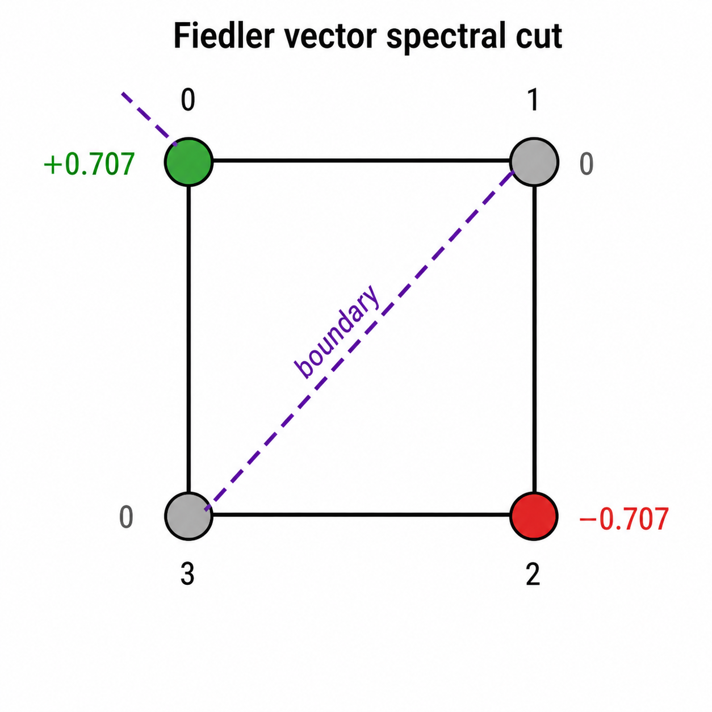

# Anchor Example — Complete Step-by-Step Solution

---

## Step 1: Constructing X and A from COO Format

We first materialize two foundational objects from PyG's sparse storage: the dense node feature matrix **X** and the dense adjacency matrix **A**. Every subsequent spectral and message-passing operation in this project operates on these two objects.

**Graph:** $C_4$ — cycle on 4 nodes $\{0,1,2,3\}$, edges $\{(0,1),(1,2),(2,3),(3,0)\}$

**Node features:** $\mathbf{x} = [2, 1, 1, 1]^\top$ (scalar for clarity; QM9 uses 11-dim vectors)

The number of nodes: $N = 4$.

$\mathbf{X} \in \mathbb{R}^{N \times F}$ is the node feature matrix, where row $i$ is the feature vector of node $i$.

Scalar features, $F=1$:

$$\mathbf{X} = \begin{bmatrix} 2 \\\\ 1 \\\\ 1 \\\\ 1 \end{bmatrix} \in \mathbb{R}^{4 \times 1}$$

PyG stores edges in **COO (coordinate) format**: a $2 \times 2E$ integer tensor where column $k$ encodes directed edge $(u_k \to v_k)$.

<br>

**1. What is COO format?**

**COO = Coordinate format.** It's simply a list of (row, column) pairs that tells you *where* the non-zero entries of a matrix live.

For an adjacency matrix, a non-zero entry at position $(i, j)$ means "there is an edge from node $i$ to node $j$." So instead of storing the full $N \times N$ matrix (mostly zeros), you just store the list of edges as two parallel arrays:

- **Array 1:** all the source nodes (row indices)
- **Array 2:** all the destination nodes (column indices)

No values array needed here because every edge has value 1.

$C_4$ has $E=4$ undirected edges, so $2E=8$ directed edges. The COO tensor is:

$$\text{edge_index} = \begin{bmatrix} 0&1&1&2&2&3&3&0 \\\\ 1&0&2&1&3&2&0&3 \end{bmatrix}$$

Simply: Row 0 = sources, Row 1 = destinations.

```
In 'edge_index' tensor: node 0 is connected to node 1 (first column); node 1 is connected to node 0 (second column)... and so on.
```

$C_4$ has 4 undirected edges. PyG stores **both directions**, giving 8 directed edges:

$$\{0{\to}1,\ 1{\to}0,\ 1{\to}2,\ 2{\to}1,\ 2{\to}3,\ 3{\to}2,\ 3{\to}0,\ 0{\to}3\}$$

Laid out as a $2 \times 8$ tensor, column by column:

| Column $k$ | 0 | 1 | 2 | 3 | 4 | 5 | 6 | 7 |
|---|---|---|---|---|---|---|---|---|
| **Row 0 (source $u$)** | 0 | 1 | 1 | 2 | 2 | 3 | 3 | 0 |
| **Row 1 (dest $v$)** | 1 | 0 | 2 | 1 | 3 | 2 | 0 | 3 |

Each column $k$ encodes one directed edge: "node `edge_index[0,k]` sends to node `edge_index[1,k]`."

- Column 0: $0 \to 1$
- Column 1: $1 \to 0$ ← the reverse
- Column 6: $3 \to 0$
- Column 7: $0 \to 3$ ← the reverse

<br>

**2. Why two rows and not two columns?**

PyTorch's advanced indexing `A[edge_index[0], edge_index[1]] = 1` needs sources and destinations as two separate 1-D index arrays — that's exactly what the two rows provide.

<br>

Moving on to **index scatter**, for every column $k$ in `edge_index`, set $A[u_k, v_k] = 1$.

$$A_{ij} = \begin{cases} 1 & \text{if } (i,j) \in \mathcal{E} \\\\ 0 & \text{otherwise} \end{cases}$$

$\mathcal{E}$ is the set of all edges in the graph — on the anchor, $\mathcal{E}$ = {(0,1),(1,0),(1,2),(2,1),(2,3),(3,2),(3,0),(0,3)}

Computing entry-by-entry on the anchor from the 8 directed edges above:

$$\mathbf{A} = \begin{bmatrix} 0&1&0&1 \\\\ 1&0&1&0 \\\\ 0&1&0&1 \\\\ 1&0&1&0 \end{bmatrix}$$

**Symmetry check:** $A_{ij} = A_{ji}$ for all $i,j$ ✓ — because PyG stores both $(u,v)$ and $(v,u)$.

**No self-loops:** $A_{ii} = 0$ for all $i$ ✓ — diagonal is all zero.

<br>

**3. Why COO → dense matrix matters?**

Spectral methods (Laplacian, eigendecomposition) require dense matrices. Message passing can work directly on COO, but making $\mathbf{A}$ explicit here lets us verify structure before building $\mathbf{L}$ in later steps.

**Two objects are now established:**

| Object | Shape | Role |
|---|---|---|
| $\mathbf{X}$ | $N \times F$ | Per-node input features |
| $\mathbf{A}$ | $N \times N$ | Graph connectivity |

All downstream operations — degree matrix $\mathbf{D}$, Laplacian $\mathbf{L}$, message passing — derive from exactly these two.

---

## Step 2: Degree Matrix D and Graph Laplacian L

We sum each row of **A**. Since $A_{ij} \in \{0,1\}$, the row sum of row $i$ counts how many neighbors node $i$ has — its **degree** $d_i$.

$$d_i = \sum_{j=0}^{N-1} A_{ij}$$

- $d_0 = A_{00}+A_{01}+A_{02}+A_{03} = 0+1+0+1 = 2$
- $d_1 = 0+0+1+0+1 = 2$

From $\mathbf{A}$ directly:

$$\mathbf{A} = \begin{bmatrix} 0&1&0&1 \\\\ 1&0&1&0 \\\\ 0&1&0&1 \\\\ 1&0&1&0 \end{bmatrix}$$

- $d_0 = 0+1+0+1 = 2$
- $d_1 = 1+0+1+0 = 2$
- $d_2 = 0+1+0+1 = 2$
- $d_3 = 1+0+1+0 = 2$

Expected — every node in $C_4$ has exactly 2 neighbors.

$$\mathbf{degrees} = [2, 2, 2, 2]$$

<br>

Placing the degree vector on the diagonal of an $N\times N$ matrix, zeros elsewhere.

$$\mathbf{D} = \begin{bmatrix} d_0&0&0&0 \\\\ 0&d_1&0&0 \\\\ 0&0&d_2&0 \\\\ 0&0&0&d_3 \end{bmatrix} = \begin{bmatrix} 2&0&0&0 \\\\ 0&2&0&0 \\\\ 0&0&2&0 \\\\ 0&0&0&2 \end{bmatrix}$$

<br>

The **combinatorial graph Laplacian**:

$$\mathbf{L} = \mathbf{D} - \mathbf{A}$$

Entry-by-entry:

$$L_{ij} = \begin{cases} d_i & i = j \\\\ -1 & (i,j) \in \mathcal{E} \\\\ 0 & \text{otherwise} \end{cases}$$

On the anchor:

$$\mathbf{L} = \begin{bmatrix} 2&0&0&0 \\\\ 0&2&0&0 \\\\ 0&0&2&0 \\\\ 0&0&0&2 \end{bmatrix} - \begin{bmatrix} 0&1&0&1 \\\\ 1&0&1&0 \\\\ 0&1&0&1 \\\\ 1&0&1&0 \end{bmatrix} = \begin{bmatrix} 2&-1&0&-1 \\\\ -1&2&-1&0 \\\\ 0&-1&2&-1 \\\\ -1&0&-1&2 \end{bmatrix}$$

<br>

**Verification — `L @ ones = 0`:** The sum of any row in a valid Laplacian must be zero because the degree on the diagonal cancels out the −1 entries in that row.

The all-ones vector $\mathbf{1} = [1,1,1,1]^\top$ must be in the null space of $\mathbf{L}$.

$$\mathbf{L}\mathbf{1} = \begin{bmatrix} 2(1)+(-1)(1)+0(1)+(-1)(1) \\\\ (-1)(1)+2(1)+(-1)(1)+0(1) \\\\ 0(1)+(-1)(1)+2(1)+(-1)(1) \\\\ (-1)(1)+0(1)+(-1)(1)+2(1) \end{bmatrix} = \begin{bmatrix} 2-1-1 \\\\ -1+2-1 \\\\ -1+2-1 \\\\ -1-1+2 \end{bmatrix} = \begin{bmatrix} 0 \\\\ 0 \\\\ 0 \\\\ 0 \end{bmatrix} ✓$$

**4. Why is this always true?**

Each row $i$ of $\mathbf{L}$ has one $+d_i$ on the diagonal and exactly $d_i$ entries of $-1$ off-diagonal. They cancel exactly.

<br>

**5. Why $\mathbf{L}$ matters?**

$\mathbf{L}$ encodes the graph's *smoothness operator*. For any signal $\mathbf{f} \in \mathbb{R}^N$ on the nodes:

$$\mathbf{f}^\top \mathbf{L} \mathbf{f} = \sum_{(i,j)\in\mathcal{E}} (f_i - f_j)^2 \geq 0$$

This is the sum of squared differences across every edge — a measure of how much $\mathbf{f}$ varies over the graph. The eigenvalues of $\mathbf{L}$ quantify the *frequencies* of the graph, which ChebNet (later in this project) operates on directly.

<br>

A **signal** $\mathbf{f}$ is just a number assigned to each node.

On $C_4$, suppose $\mathbf{f} = [2, 1, 1, 1]^\top$ — exactly the node features from **X** Node 0 has value 2, the rest have value 1.

$$\mathbf{f}^\top \mathbf{L} \mathbf{f} = \sum_{(i,j)\in\mathcal{E}}(f_i - f_j)^2$$

The 4 undirected edges of $C_4$ give:

| Edge | $f_i - f_j$ | $(f_i-f_j)^2$ |
|---|---|---|
| $(0,1)$ | $2-1=1$ | $1$ |
| $(1,2)$ | $1-1=0$ | $0$ |
| $(2,3)$ | $1-1=0$ | $0$ |
| $(3,0)$ | $1-2=-1$ | $1$ |

$$\mathbf{f}^\top \mathbf{L} \mathbf{f} = 1+0+0+1 = 2$$

The result is **small** because the signal is nearly flat — only node 0 differs. If instead $\mathbf{f} = [2,1,2,1]^\top$ (alternating), every edge would contribute 1, giving a score of 4 — a *rougher* signal on the same graph.

This is exactly the sense in which $\mathbf{L}$ measures smoothness: **larger $\mathbf{f}^\top \mathbf{L} \mathbf{f}$ = more variation across edges.**

**Variation across an edge** = how different the signal values are at its two endpoints.

On $C_4$ with $\mathbf{f} = [2,1,1,1]^\top$:

- Edge $(0,1)$ has variation $|2-1|=1$ — the signal *jumps*.
- Edge $(1,2)$ has variation $|1-1|=0$ — the signal is *flat*.

**Smoothness** means most edges look like $(1,2)$, not $(0,1)$. A smooth signal changes slowly as you walk along the graph.

---

## Step 3: Signed Incidence Matrix B and the Factorization $L = BB^T$

Now we construct **B**, the signed incidence matrix, and verify that $\mathbf{L} = \mathbf{B}\mathbf{B}^\top$ — proving the Laplacian is always positive semi-definite.

**Extracting undirected edges:** `edge_index` stores both $(i,j)$ and $(j,i)$. The mask `source < distance` keeps only one copy per edge — the one where the source index is smaller.

The 8 directed edges filtered by `source < distance`:

| Directed edge | $i < j$? | Keep? |
|---|---|---|
| $0\to1$ | $0<1$ ✓ | yes |
| $1\to0$ | $1<0$ ✗ | no |
| $1\to2$ | $1<2$ ✓ | yes |
| $2\to1$ | $2<1$ ✗ | no |
| $2\to3$ | $2<3$ ✓ | yes |
| $3\to2$ | $3<2$ ✗ | no |
| $3\to0$ | $3<0$ ✗ | no |
| $0\to3$ | $0<3$ ✓ | yes |

So $E=4$ undirected edges: $(0,1),\ (1,2),\ (2,3),\ (0,3)$.

<br>

$\mathbf{B} \in \mathbb{R}^{N \times E}$. Each column $e$ corresponds to one undirected edge $(i,j)$:

$$B_{ke} = \begin{cases} +1 & k = i \text{ (source)} \\\\ -1 & k = j \text{ (destination)} \\\\ 0 & \text{otherwise} \end{cases}$$

On the anchor, labeling columns by edge index $e \in \{0,1,2,3\}$ for edges $(0,1),(1,2),(2,3),(0,3)$:

| | $e=0$: $(0,1)$ | $e=1$: $(1,2)$ | $e=2$: $(2,3)$ | $e=3$: $(0,3)$ |
|---|---|---|---|---|
| node 0 | $+1$ | $0$ | $0$ | $+1$ |
| node 1 | $-1$ | $+1$ | $0$ | $0$ |
| node 2 | $0$ | $-1$ | $+1$ | $0$ |
| node 3 | $0$ | $0$ | $-1$ | $-1$ |

$$\mathbf{B} = \begin{bmatrix} +1 & 0 & 0 & +1 \\\\ -1 & +1 & 0 & 0 \\\\ 0 & -1 & +1 & 0 \\\\ 0 & 0 & -1 & -1 \end{bmatrix}$$

<br>

Computing $\mathbf{B}\mathbf{B}^\top$ [`L_from_B = B @ B.T`] entry $(i,j)$:

$$(\mathbf{B}\mathbf{B}^\top)_{ij} = \sum_{e=0}^{E-1} B_{ie} \cdot B_{je}$$

<br>

**Diagonal entry $(0,0)$:** node 0 appears in edges $e=0$ and $e=3$:
$$B_{00}^2 + B_{01}^2 + B_{02}^2 + B_{03}^2 = 1^2+0^2+0^2+1^2 = 2 = d_0 ✓$$

**Off-diagonal entry $(0,1)$:** only edge $e=0$ involves both nodes 0 and 1:
$$B_{00}B_{10} + B_{01}B_{11} + B_{02}B_{12} + B_{03}B_{13} = (+1)(-1)+0+0+0 = -1 = -A_{01} ✓$$

**Off-diagonal entry $(0,2)$:** no edge connects nodes 0 and 2 directly:
$$B_{00}B_{20}+B_{01}B_{21}+B_{02}B_{22}+B_{03}B_{23} = 0+0+0+0 = 0 = -A_{02} ✓$$

The *answer* in each case recovers exactly the corresponding entry of $\mathbf{L} = \mathbf{D} - \mathbf{A}$, which is the whole point — we're not computing $\mathbf{B}\mathbf{B}^\top$ to get a new matrix, we're verifying that the structure of $\mathbf{B}$ algebraically forces the result to equal $\mathbf{L}$

<br>

Full result:

$$\mathbf{B}\mathbf{B}^\top = \begin{bmatrix} 2&-1&0&-1 \\\\ -1&2&-1&0 \\\\ 0&-1&2&-1 \\\\ -1&0&-1&2 \end{bmatrix} = \mathbf{L} ✓$$

**6. Why this factorization matters?**

$\mathbf{L} = \mathbf{B}\mathbf{B}^\top$ immediately proves $\mathbf{L}$ is **positive semi-definite**: for any $\mathbf{f}$,

$$\mathbf{f}^\top \mathbf{L} \mathbf{f} = \mathbf{f}^\top \mathbf{B}\mathbf{B}^\top \mathbf{f} = \|\mathbf{B}^\top \mathbf{f}\|^2 \geq 0$$

The vector $\mathbf{B}^\top\mathbf{f}$ has one entry per edge: $(\mathbf{B}^\top\mathbf{f})_e = f_i - f_j$. Squaring and summing recovers exactly the edge-variation interpretation from Step 2 — the two views are identical.

<br>

**Positive semi-definite matrix:**

A positive semi-definite matrix is a symmetric matrix whose quadratic form is always non-negative for any vector ($x$), i.e., $x^T A x \ge 0$; for example the following matrix $A$ is positive semi-definite.

$$A=\begin{pmatrix} 1 & 0 \\\\ 0 & 0 \end{pmatrix}$$ 

---

## Step 4: Eigenspectrum of L

We now perform eigendecomposition of the Graph Laplacian $L$ to find its eigenvalues (the spectrum) and eigenvectors.

The eigenspectrum reveals the fundamental topological properties of the molecule, such as connectivity and "bottlenecks." These values are often used as structural descriptors in machine learning models for chemistry.

`eigh` (vs `eig`) exploits the fact that $\mathbf{L}$ is **real symmetric** — it guarantees real eigenvalues and orthonormal eigenvectors, and is numerically faster. The decomposition is:

$$\mathbf{L} = \mathbf{U} \mathbf{\Lambda} \mathbf{U}^\top$$

where $\mathbf{\Lambda} = \text{diag}(\lambda_0, \lambda_1, \ldots, \lambda_{N-1})$ and columns of $\mathbf{U}$ are eigenvectors.

<br>

**Eigenvalues of $C_4$:**

We solve $\det(\mathbf{L} - \lambda \mathbf{I}) = 0$:

$$\mathbf{L} - \lambda\mathbf{I} = \begin{bmatrix} 2-\lambda&-1&0&-1 \\\\ -1&2-\lambda&-1&0 \\\\ 0&-1&2-\lambda&-1 \\\\ -1&0&-1&2-\lambda \end{bmatrix}$$

$C_4$ is a circulant graph — eigenvalues are known analytically:

$$\lambda_k = 2 - 2\cos\!\left(\frac{2\pi k}{N}\right), \quad k = 0,1,2,3$$

an $N \times N$ matrix has $N$ eigenvalues, so a $4 \times 4$ Laplacian produces $4$, indexed $k = 0,1,2,3$.

Computing each:

| $k$ | $\cos(2\pi k/4)$ | $\lambda_k = 2 - 2\cos(2\pi k/4)$ |
|---|---|---|
| 0 | $\cos(0) = 1$ | $2 - 2 = 0$ |
| 1 | $\cos(\pi/2) = 0$ | $2 - 0 = 2$ |
| 2 | $\cos(\pi) = -1$ | $2 + 2 = 4$ |
| 3 | $\cos(3\pi/2) = 0$ | $2 - 0 = 2$ |

$$\boxed{\lambda_0=0,\quad \lambda_1=2,\quad \lambda_2=2,\quad \lambda_3=4}$$

<br>

**7. Why $\lambda_0 = 0$ always?**

From Step 3: $\mathbf{L}\mathbf{1} = \mathbf{0}$, so $\mathbf{1}$ is an eigenvector with eigenvalue 0. For a **connected** graph, this is the *only* zero eigenvalue.

<br>

**8. What is Fiedler value and vector?**

**Fiedler value:**

$\lambda_1 = 2$ is the smallest *nonzero* eigenvalue. It measures graph connectivity — larger value means harder to cut.

**Fiedler vector**

$\mathbf{u}_1$ is the corresponding eigenvector. Solving $(\mathbf{L} - 2\mathbf{I})\mathbf{u} = \mathbf{0}$:

$$\mathbf{L} - 2\mathbf{I} = \begin{bmatrix} 0&-1&0&-1 \\\\ -1&0&-1&0 \\\\ 0&-1&0&-1 \\\\ -1&0&-1&0 \end{bmatrix}$$

**Row reduction of $(\mathbf{L} - 2\mathbf{I})$**

We're solving $(\mathbf{L} - 2\mathbf{I})\mathbf{u} = \mathbf{0}$ for the unknown vector $\mathbf{u}$. That unknown vector has 4 entries — we just call them $u_0, u_1, u_2, u_3$ (one per node). So:

$$\mathbf{u} = \begin{bmatrix} u_0 \\\\ u_1 \\\\ u_2 \\\\ u_3 \end{bmatrix}$$

Multiplying row 0 of $(\mathbf{L}-2\mathbf{I})$ by $\mathbf{u}$ is just the standard $A\mathbf{x}=\mathbf{0}$ system.

<br>

Rows 0 and 2 are identical; rows 1 and 3 are identical. So there are independent constraints from Row 0 and Row 1 only.

**Equations from Row 0 and Row 1**

Row 0: $(0)u_0 + (-1)u_1 + (0)u_2 + (-1)u_3 = 0$
$$- u_1 - u_3 = 0$$
$$u_1 + u_3 = 0$$
$$u_1 = -u_3$$

Row 1: $(-1)u_0 + (0)u_1 (-1)u_2 + (0)u_3 = 0$
$$- u_0 - u_2 = 0$$
$$u_0 + u_2 = 0$$
$$u_0 = -u_2$$

The two unique equations are:

1. $u_1 = -u_3$
2. $u_0 = -u_2$

Every other equation is a repeat, so **no new constraints emerge**.

$$u_0, u_1 \text{ are free parameters, and } u_2, u_3 \text{ are determined.}$$

Pick $u_0 = 1, \; u_1 = 0$:

- $u_2 = -u_0 = -1$
- $u_3 = -u_1 = 0$

So,
$$\mathbf{u} = \begin{bmatrix} 1 \\\\ 0 \\\\ -1 \\\\ 0 \end{bmatrix}$$

**HENCE,**

In conclusion, we only have two unique equations:

$$-u_1 - u_3 = 0 \implies u_1 = -u_3$$
$$-u_0 - u_2 = 0 \implies u_0 = -u_2$$

$u_0$ and $u_1$ are free. Setting $u_0=1, u_1=0$ gives $\mathbf{u} = [1, 0, -1, 0]^\top$.

**Normalization:** divide by $\|\mathbf{u}\| = \sqrt{1^2+0^2+(-1)^2+0^2} = \sqrt{2}$:

$$\mathbf{u}_1 = \frac{1}{\sqrt{2}}[1,0,-1,0]^\top \approx [0.707,\ 0,\ -0.707,\ 0]$$

<br>

**Why pick $u_0=1, u_1=0$ specifically?**

We have two equations and four unknowns — the system is **underdetermined**, meaning infinitely many vectors satisfy it. Any scalar multiple of a solution is also a solution (eigenvectors have no fixed scale).

So we're free to **choose** $u_0$ and $u_1$ to be anything convenient. We pick $u_0=1, u_1=0$ simply because it's the cleanest choice — small integers, easy arithmetic. We could equally have picked $u_0=2, u_1=0$, giving $\mathbf{u}=[2,0,-2,0]^\top$ — same eigenvector direction, just unscaled.

After picking, the two equations fully determine $u_2$ and $u_3$:
- $u_2 = -u_0 = -1$
- $u_3 = -u_1 = 0$

The final normalization step removes the arbitrary scale entirely, giving a unique unit vector.

<br>

**Bisection**

The Fiedler vector partitions nodes by sign:

- $u_0 = +0.707$ → node 0 in partition $\mathcal{A}$
- $u_2 = -0.707$ → node 2 in partition $\mathcal{B}$
- $u_1 = u_3 = 0$ → nodes 1 and 3 sit exactly on the boundary

| Node | $u_1$ value | Sign |
|---|---|---|
| 0 | $+0.707$ | $+$ |
| 1 | $0$ | boundary |
| 2 | $-0.707$ | $-$ |
| 3 | $0$ | boundary |

The Fiedler vector bisects $C_4$ into $\{0\}$ vs $\{2\}$, with nodes 1 and 3 on the boundary — the natural **spectral cut** of the cycle.

Visually on $C_4$: $0 \to 1 \to 2 \to 3 \to 0$. <br>
Cutting edges $(0,1),(1,2)$ on one side and $(2,3),(3,0)$ on the other separates $\{0\}$ from $\{2\}$ — the two most *opposite* nodes on the cycle.



**Graph frequency intuition**

Think of the eigenvalues as measuring *how fast* a signal oscillates as you walk around the graph:

- $\lambda_0=0$: signal $[1,1,1,1]$ — constant everywhere, zero variation across every edge — **DC (constant signal)**.
- $\lambda_3=4$: signal $[1,-1,1,-1]$ — flips sign at every step around the cycle — **maximum oscillation**.
- $\lambda_1=\lambda_2=2$: intermediate — signal changes on opposite sides but not every step.

ChebNet learns polynomial filters $\sum_k \theta_k \lambda^k$ in this frequency domain, exactly as a classical filter would in signal processing.

<br>

**9. What the full spectrum means?**

Each eigenvalue $\lambda_k$ is a **graph frequency**: $\lambda_0=0$ is DC, $\lambda_3=4$ is the highest-frequency mode (maximally alternating). ChebNet, coming later, will filter signals in this spectral domain.

---

## Step 5: Laplacian Eigenmap Embedding

We wrap Step 4's eigendecomposition into a reusable function that embeds any molecule into $\mathbb{R}^k$ by taking the $k$ smallest non-trivial eigenvectors of $\mathbf{L}$ — this is the **Laplacian Eigenmap** algorithm.


**10. Why discard eigenvector 0?**

From Step 4, $\lambda_0 = 0$ always, with eigenvector $\mathbf{u}_0 = \frac{1}{\sqrt{N}}\mathbf{1}$ — a constant vector. It carries **no structural information** (every node maps to the same coordinate), so it is discarded.

The embedding uses columns $1$ through $k$ of $\mathbf{U}$:

$$\text{embedding} = \mathbf{U}_{:,\,1:k+1} \in \mathbb{R}^{N \times k}$$

<br>

**$C_4$ with $k=2$**

From Step 4, the eigenvectors corresponding to $\lambda_1=2$ and $\lambda_2=2$ are:

$$\mathbf{u}_1 = \frac{1}{\sqrt{2}}\begin{bmatrix} 1 \\\\ 0 \\\\ -1 \\\\ 0 \end{bmatrix}, \qquad \mathbf{u}_2 = \frac{1}{\sqrt{2}}\begin{bmatrix} 0 \\\\ 1 \\\\ 0 \\\\ -1 \end{bmatrix}$$

The embedding matrix is:

$$\text{embedding} = \begin{bmatrix} 1/\sqrt{2} & 0 \\\\ 0 & 1/\sqrt{2} \\\\ -1/\sqrt{2} & 0 \\\\ 0 & -1/\sqrt{2} \end{bmatrix} \approx \begin{bmatrix} 0.707 & 0 \\\\ 0 & 0.707 \\\\ -0.707 & 0 \\\\ 0 & -0.707 \end{bmatrix}$$

Each row is a 2D coordinate for that node. Plotting these four points:

| Node | $(x_1, x_2)$ |
|---|---|
| 0 | $(+0.707,\ 0)$ |
| 1 | $(0,\ +0.707)$ |
| 2 | $(-0.707,\ 0)$ |
| 3 | $(0,\ -0.707)$ |

These four points lie on a circle — correctly recovering the **cyclic geometry** of $C_4$ purely from the Laplacian, with no coordinate input.

<br>

**11. Why this is geometrically meaningful**

The eigenvectors minimize the embedding distortion objective:

$$\min_{\mathbf{Y} \in \mathbb{R}^{N\times k}} \sum_{(i,j)\in\mathcal{E}} \|\mathbf{y}_i - \mathbf{y}_j\|^2 = \text{tr}(\mathbf{Y}^\top \mathbf{L} \mathbf{Y})$$

Connected nodes are pulled close together in the embedding. The solution is exactly $\mathbf{U}_{:,1:k+1}$ — the spectral embedding places nodes such that neighbors are geometrically nearby.

**12. Why embed at all?**

A molecule is a graph — nodes and edges, no coordinates. A neural network or any downstream algorithm needs *numbers in a vector* to work with. Embedding converts "node 0 is connected to nodes 1 and 3" into an actual coordinate like $(0.707, 0)$ that captures where node 0 sits *relative to the rest of the graph*.

For QM9, the end goal is predicting $U_0$ (a single number per molecule). To do that, you need a fixed-size representation of the whole molecule. Embeddings are the first step: give each atom a position in space that reflects graph structure, then aggregate those positions into a molecule-level prediction.

**13. What the embedding matrix actually is**

Each **row** = one node's coordinates in 2D space. That's it.

On $C_4$, row 0 is $(0.707, 0)$ — that's where node 0 gets placed. Row 2 is $(-0.707, 0)$ — node 2 lands on the opposite side. The matrix is just a table of 2D positions, one per atom.

The remarkable thing: we never told the algorithm any geometry. We only gave it connectivity (who is bonded to whom). Yet the output positions correctly place the four nodes at 90° intervals around a circle — because that *is* the shape of a 4-cycle.

<br>

**The minimization objective — in plain terms**

$$\min \sum_{(i,j)\in\mathcal{E}} \|\mathbf{y}_i - \mathbf{y}_j\|^2$$

This says: *find coordinates such that bonded atoms land as close together as possible.* It's a spring system — every edge is a spring pulling its two nodes together. The eigenvectors give the positions where all springs are simultaneously as relaxed as possible.

On $C_4$: nodes 0 and 1 are bonded, so they get pulled close → $(0.707,0)$ and $(0, 0.707)$, distance $= 1$. Nodes 0 and 2 are *not* bonded, so nothing pulls them together → they end up far apart at distance $\sqrt{2}$. The geometry emerges entirely from connectivity.

---

## Step 6: BFS Graph Distance vs Embedding Distance (Pearson Correlation)

Step 5 claimed that the Laplacian eigenmap places nearby nodes (in graph terms) close together in 2D. This cell **tests that claim quantitatively** by comparing two distance measures for every pair of nodes:

- **Graph distance:** shortest path in hops (BFS)
- **Embedding distance:** Euclidean distance between 2D coordinates

**BFS: $C_4$ -- Source $\to$ Node 0**

The adjacency list:

- node 0 connected to nodes: [1, 3]
- node 1 connected to nodes: [0, 2]
- node 2 connected to nodes: [1, 3]
- node 3 connected to nodes: [2, 0]

<br>

**BFS from node 0**

| Step | Queue | Node visited | Distance |
|---|---|---|---|
| init | [0] | 0 | 0 |
| pop 0 | [1, 3] | 1, 3 | 1 |
| pop 1 | [3, 2] | 2 | 2 |
| pop 3 | [2] | already visited | — |

$$\text{dist}(0\to0)=0,\quad\text{dist}(0\to1)=1,\quad\text{dist}(0\to2)=2,\quad\text{dist}(0\to3)=1$$

<br>

**Embedding distances from node 0**

From Step 5, the 2D coordinates are:

| Node | coords |
|---|---|
| 0 | $(0.707, 0)$ |
| 1 | $(0, 0.707)$ |
| 2 | $(-0.707, 0)$ |
| 3 | $(0, -0.707)$ |

- $\|emb_0 - emb_1\| = \sqrt{(0.707)^2 + (0.707)^2} = \sqrt{1} = 1.0$
- $\|emb_0 - emb_2\| = \sqrt{(1.414)^2 + 0^2} = 1.414$
- $\|emb_0 - emb_3\| = \sqrt{(0.707)^2 + (0.707)^2} = 1.0$

<br>

**All pairs on $C_4$**

| Pair | Graph dist | Embed dist |
|---|---|---|
| $(0,1)$ | 1 | 1.0 |
| $(0,2)$ | 2 | 1.414 |
| $(0,3)$ | 1 | 1.0 |
| $(1,2)$ | 1 | 1.0 |
| $(1,3)$ | 2 | 1.414 |
| $(2,3)$ | 1 | 1.0 |

The pattern is perfectly monotone: graph distance 1 $\to$ embed distance 1.0, graph distance 2 $\to$ embed distance 1.414 — the embedding **preserves graph distance ordering exactly** on $C_4$.

<br>

**Pearson correlation**

$$r = \frac{\sum_i (g_i - \bar{g})(e_i - \bar{e})}{\sqrt{\sum_i(g_i-\bar{g})^2}\sqrt{\sum_i(e_i-\bar{e})^2}}$$

On $C_4$:

- graph distances $= [1,2,1,1,2,1]$ & <br>
- embed distances $= [1.0, 1.414, 1.0, 1.0, 1.414, 1.0]$.

Since embed distance is a strict monotone function of graph distance here, $r = 1.0$: perfect correlation.

Real molecules won't hit 1.0 exactly — the 2D embedding compresses $N$-dimensional structure — but strong $r > 0.6$ confirms the eigenmap is geometrically faithful.

<br>

**14. Why graph distance 2 produces a larger embedding distance than graph distance 1 on $C_4$? What property of the eigenvectors guarantees this?**

The eigenvectors minimize $\sum_{(i,j)\in\mathcal{E}}\|\mathbf{y}_i - \mathbf{y}_j\|^2$ — they pull **directly connected** nodes close. Nodes at graph distance 2 have no direct spring pulling them together, so they naturally land further apart.

The guaranteeing property is **orthogonality**: eigenvectors $\mathbf{u}_1$ and $\mathbf{u}_2$ are orthogonal, which forces the 2D embedding to spread nodes out in independent directions. If two nodes share no edge, nothing contracts their distance — orthogonality ensures the embedding has enough "room" to place them further away rather than collapsing them together.

On $C_4$ specifically: nodes 0 and 2 are non-adjacent and their coordinates $(0.707, 0)$ and $(-0.707, 0)$ are exactly opposite — maximum possible separation given the unit-norm constraint on eigenvectors.

---

## Step 7: MPNN Message Passing Layer

We now implement one full round of **message passing** from scratch: every node collects information from its neighbors, aggregates it, and updates its own state. This is the core computational primitive of all GNNs.

Three steps: **compute $\to$ aggregate $\to$ update.**

**Message computation**

For every directed edge $i \to j$:

$$\mathbf{m}_{ij} = \text{MLP}_{\text{msg}}\left([\mathbf{h}_i \| \mathbf{h}_j \| \mathbf{e}_{ij}]\right)$$

$[\cdot\|\cdot]$ denotes concatenation. The message depends on **both** endpoints plus the edge feature — this is richer than classic GCN which only uses the neighbor's features.

For $C_4$ with scalar features $\mathbf{h} = [2,1,1,1]^\top$ and no edge features:

- For edge $0\to1$:

$$\mathbf{m}_{01} = \text{MLP}_{\text{msg}}([h_0 \| h_1]) = \text{MLP}_{\text{msg}}([2, 1])$$

- For edge $0\to3$:

$$\mathbf{m}_{03} = \text{MLP}_{\text{msg}}([2, 1])$$

Both messages are identical here because nodes 1 and 3 have the same feature — this foreshadows the **WL expressiveness limit** explored later in the project.

<br>

**Aggregation via `scatter_add_`**

$$\mathbf{M}_i = \sum_{j \in \mathcal{N}(i)} \mathbf{m}_{ji}$$

`scatter_add_` accumulates messages by destination node index. For $C_4$, node 0 receives from nodes 1 and 3:

$$\mathbf{M}_0 = \mathbf{m}_{10} + \mathbf{m}_{30}$$

Since $h_1 = h_3 = 1$, both incoming messages are identical → $\mathbf{M}_0 = 2 \cdot \mathbf{m}_{10}$.

<br>

**15. Why `dst.unsqueeze(-1).expand_as(messages)`?**

`dst` is a 1D index vector of shape $[2E]$. Each message is `hidden_dim`-dimensional. The expand broadcasts the scalar destination index across all hidden dimensions so `scatter_add_` knows which row of `agg` to accumulate into.

<br>

**Node update**

$$\mathbf{h}_i' = \text{MLP}_{\text{update}}\left([\mathbf{h}_i \| \mathbf{M}_i]\right)$$

For node 0 on the anchor:

$$\mathbf{h}_0' = \text{ReLU}\left(\mathbf{W}_{\text{update}}[h_0 \| \mathbf{M}_0]\right) = \text{ReLU}\left(\mathbf{W}_{\text{update}}[2 \| \mathbf{M}_0]\right)$$

The node retains its own state $\mathbf{h}_i$ alongside the aggregated neighborhood summary $\mathbf{M}_i$ — this prevents the node from "forgetting" who it is after aggregation.

<br>

**Full data flow summary**

$$[N, F] \xrightarrow{\text{concat neighbors+edges}} [2E,\ 2F+F_e] \xrightarrow{\text{MLP}_{\text{msg}}} [2E, H] \xrightarrow{\text{scatter_add}} [N, H] \xrightarrow{\text{MLP}_{\text{update}}} [N, H]$$

<br>

**16. In Step 1, we obtained $m_{01}$ and $m_{03}$. In Step 2, we used $m_{10}$ and $m_{30}$. There seems to be mismatch of subscript. Is that a typo or does it not matter in which order we write?**

Not a typo — it matters and here's why.

In Step 1, $\mathbf{m}_{ij}$ means "message **from** $i$ **to** $j$" — so $\mathbf{m}_{01}$ is the message node 0 sends *to* node 1.

In Step 2, node 0 **receives** messages — meaning we want messages whose destination is node 0. Those are $\mathbf{m}_{10}$ (from node 1 to node 0) and $\mathbf{m}_{30}$ (from node 3 to node 0).

The subscript convention is $\mathbf{m}_{\text{source} \to \text{destination}}$. Step 1 computes all messages in both directions; Step 2 filters to only those *arriving at* node 0. The subscript flip is intentional, not a typo.

<br>

**17. Node 0 in the anchor receives identical messages from nodes 1 and 3 after one round. After two rounds, will node 0 be able to distinguish them? What would need to change in the architecture for it to do so?**

After two rounds, node 0 **still cannot distinguish** nodes 1 and 3.

Here's why: in round 2, nodes 1 and 3 each look at *their* neighborhoods. Node 1's neighbors are $\{0, 2\}$ and node 3's neighbors are $\{2, 0\}$ — identical sets, identical features. So after round 2, nodes 1 and 3 produce identical updated states, and node 0 again receives two identical messages.

This is the **WL expressiveness limit** — the 1-Weisfeiler-Lehman graph isomorphism test, which standard message passing exactly simulates, cannot distinguish nodes with symmetric neighborhoods. On $C_4$ with uniform features, nodes 1 and 3 are structurally indistinguishable by any number of rounds.

*What would need to change:*

- **Unique node identifiers** — inject positional encodings (e.g. Laplacian eigenvectors from Step 5) so nodes 1 and 3 start with different initial features. This breaks symmetry at round 0, propagating distinct messages immediately.
- **Distance encoding** — explicitly encode the hop-distance from each node to others as an input feature.
- **Higher-order GNNs** — consider tuples of nodes rather than individual nodes (k-WL hierarchy), breaking symmetries that 1-WL cannot.

In QM9 specifically, the node feature matrix $\mathbf{X}$ already contains atom-type one-hots — if nodes 1 and 3 are different atom types, the problem vanishes naturally. The WL limit bites hardest on symmetric molecules with identical atom types at symmetric positions.

<br>

> THE COMPLETE CHRONOLOGICAL FLOW OF GNN MESSAGE PASSING WITH ITS UNDERLYING MATHEMATICS IS EXPLAINED IN [CATW/GNN Message Passing](url_here)

---

## Step 8: Full MPNN: Input Projection, Stacked Layers, Readout

We assemble three stages into a complete graph-level regression model:

$$\underbrace{\mathbf{X}}_{\text{atom features}} \xrightarrow{\text{project}} \underbrace{\mathbf{H}^{(0)}}_{\text{hidden}} \xrightarrow{L \times \text{MPNN}} \underbrace{\mathbf{H}^{(L)}}_{\text{rich node states}} \xrightarrow{\text{mean pool}} \underbrace{\mathbf{g}}_{\text{graph vector}} \xrightarrow{\text{MLP}} \underbrace{\hat{y}}_{\text{predicted } U_0}$$

### Stage 1 — Input projection

```python
h = F.relu(self.input_proj(x)) # [N, hidden_dim]
```

$$\mathbf{H}^{(0)} = \text{ReLU}(\mathbf{X}\mathbf{W}_{\text{in}})$$

Projects 11-dim QM9 atom features into `hidden_dim=64`. On $C_4$, $\mathbf{x}_0 = [2]$ (scalar) maps to a 64-dim vector. All subsequent layers operate in this uniform space.

<br>

### Stage 2 — Stacked message passing

```python
for layer in self.layers:
    h = layer(h, edge_index, edge_attr)
```

$$\mathbf{H}^{(l+1)} = \text{MPNNLayer}\left(\mathbf{H}^{(l)}, \mathcal{E}, \mathbf{E}\right), \quad l = 0,1,2$$

Each layer expands the **receptive field** by one hop. After $L=3$ layers, node 0 on $C_4$ has seen information from all nodes within 3 hops — the entire graph.

| Layer | Node 0 sees |
|---|---|
| 0 | itself only |
| 1 | nodes 1, 3 |
| 2 | nodes 2 (via 1 and 3) |
| 3 | full graph |

<br>

### Stage 3 — Global mean pooling

```python
out.scatter_add_(0, batch.unsqueeze(-1).expand_as(h), h)
graph_emb = out / count
```

$$\mathbf{g}_b = \frac{1}{|\mathcal{V}_b|}\sum_{i \in \mathcal{V}_b} \mathbf{h}_i^{(L)}$$

The `batch` tensor maps each node to its graph index. For a batch of two graphs where graph 0 has nodes $\{0,1,2\}$ and graph 1 has nodes $\{3,4\}$:

$$\texttt{batch} = [0,0,0,1,1]$$

`scatter_add_` sums node vectors by graph index, then divides by node count — yielding one 64-dim vector per molecule.

On $C_4$ (single graph, $N=4$):

$$\mathbf{g} = \frac{1}{4}\left(\mathbf{h}_0^{(L)} + \mathbf{h}_1^{(L)} + \mathbf{h}_2^{(L)} + \mathbf{h}_3^{(L)}\right) \in \mathbb{R}^{64}$$

**18. Why mean and not sum?**

Mean is invariant to graph size — a 5-atom and 10-atom molecule both produce vectors of the same scale, making training more stable across QM9's variable-size molecules.

<br>

### Stage 4 — Readout MLP

$$\hat{y} = \mathbf{W}_2\,\text{ReLU}(\mathbf{W}_1 \mathbf{g} + \mathbf{b}_1) + \mathbf{b}_2 \in \mathbb{R}$$

A two-layer MLP compresses the 64-dim graph embedding to a scalar $U_0$ prediction.

<br>

**19. Why this architecture is permutation invariant?**

If you relabel node 0→2→1→3, the mean pool produces the same $\mathbf{g}$ — addition commutes. This is essential: a molecule's energy doesn't depend on how you number its atoms.

---

## Step 9: Permutation Invariance Verification

We now construct a relabeled copy of $C_4$ — same graph, different node indices — to verify that the MPNN produces identical predictions regardless of atom ordering.

**The permutation operator**

A permutation $\pi$ on $N$ nodes is a bijection $\{0,\ldots,N-1\} \to \{0,\ldots,N-1\}$. It acts on three objects:

**1. Node features:**
$$\mathbf{X}_\pi = \mathbf{P}_\pi \mathbf{X}$$
where $\mathbf{P}_\pi$ is the $N\times N$ permutation matrix with $(\mathbf{P}_\pi)_{ij} = 1$ iff $\pi(j) = i$.

$\mathbf{P}$ is an $N\times N$ binary matrix with exactly one 1 per row and column:

$$P_{ij} = \begin{cases} 1 & \text{if } \pi(j) = i \\\\ 0 & \text{otherwise} \end{cases}$$

In code: `x_perm = mol.x[pi]` — row $i$ of `x_perm` is row $\pi(i)$ of `mol.x`.

**2. Adjacency matrix:**
$$\mathbf{A}_\pi = \mathbf{P}_\pi \mathbf{A} \mathbf{P}_\pi^\top$$

**3. Edge index (COO):** each node id $i$ in `edge_index` is replaced by $\pi(i)$:
$$\texttt{edge_index_perm} = \pi(\texttt{edge_index})$$

<br>

**On the anchor $C_4$**

Let $\pi = [2, 0, 3, 1]$ — meaning node 0 becomes node 2, node 1 becomes node 0, etc.

This sets $P_{\pi(j), j} = 1$ for each $j$. Column $j$ of $\mathbf{P}$ has a single 1 in row $\pi(j)$:

| $j$ | $\pi(j)$ | 1 placed at $\mathbf{P}$'s |
|---|---|---|
| 0 | 2 | row 2, col 0 |
| 1 | 0 | row 0, col 1 |
| 2 | 3 | row 3, col 2 |
| 3 | 1 | row 1, col 3 |

$$\mathbf{P} = \begin{bmatrix} 0&1&0&0 \\\\ 0&0&0&1 \\\\ 1&0&0&0 \\\\ 0&0&1&0 \end{bmatrix}$$

**Sanity check:** each row and column has exactly one 1 — it's a valid permutation matrix. ✓

<br>

**The invariance claim**

A model $f$ is **permutation invariant** iff:

$$f(\mathbf{X}_\pi, \mathbf{A}_\pi) = f(\mathbf{X}, \mathbf{A}) \quad \forall\, \pi$$

<br>

**Computing $\mathbf{P}\mathbf{A}\mathbf{P}^\top$**

Recall from Step 1:

$$\mathbf{A} = \begin{bmatrix} 0&1&0&1 \\\\ 1&0&1&0 \\\\ 0&1&0&1 \\\\ 1&0&1&0 \end{bmatrix}$$

**First, $\mathbf{P}\mathbf{A}$** — permutes the *rows* of $\mathbf{A}$. Row $i$ of $\mathbf{P}\mathbf{A}$ = row $\pi^{-1}(i)$ of $\mathbf{A}$... equivalently, row $\pi(j)$ of the result gets row $j$ of $\mathbf{A}$:

- Row 2 of $\mathbf{PA}$ ← row 0 of $\mathbf{A}$: $[0,1,0,1]$
- Row 0 of $\mathbf{PA}$ ← row 1 of $\mathbf{A}$: $[1,0,1,0]$
- Row 3 of $\mathbf{PA}$ ← row 2 of $\mathbf{A}$: $[0,1,0,1]$
- Row 1 of $\mathbf{PA}$ ← row 3 of $\mathbf{A}$: $[1,0,1,0]$

*In simple terms, just multiply $\mathbf{P}$ and $\mathbf{A}$.*

$$\mathbf{PA} = \begin{bmatrix} 1&0&1&0 \\\\ 1&0&1&0 \\\\ 0&1&0&1 \\\\ 0&1&0&1 \end{bmatrix}$$

**Then $(\mathbf{PA})\mathbf{P}^\top$** — permutes the *columns*. Column $\pi(j)$ of the result gets column $j$:

- Col 2 ← col 0: $[1,1,0,0]^\top$
- Col 0 ← col 1: $[0,0,1,1]^\top$
- Col 3 ← col 2: $[1,1,0,0]^\top$
- Col 1 ← col 3: $[0,0,1,1]^\top$

$$\mathbf{PAP}^\top = \begin{bmatrix} 0&0&1&1 \\\\ 0&0&1&1 \\\\ 1&1&0&0 \\\\ 1&1&0&0 \end{bmatrix}$$

<br>

**Building $\mathbf{A}_\pi$ directly from permuted edge_index**

Applying $\pi = [2,0,3,1]$ to the original $C_4$ edge_index:

Original 8 directed edges and their images under $\pi$:

| Original edge | $\pi[\text{src}]$ | $\pi[\text{dst}]$ | Permuted edge |
|---|---|---|---|
| $0\to1$ | $\pi[0]=2$ | $\pi[1]=0$ | $2\to0$ |
| $1\to0$ | $\pi[1]=0$ | $\pi[0]=2$ | $0\to2$ |
| $1\to2$ | $\pi[1]=0$ | $\pi[2]=3$ | $0\to3$ |
| $2\to1$ | $\pi[2]=3$ | $\pi[1]=0$ | $3\to0$ |
| $2\to3$ | $\pi[2]=3$ | $\pi[3]=1$ | $3\to1$ |
| $3\to2$ | $\pi[3]=1$ | $\pi[2]=3$ | $1\to3$ |
| $3\to0$ | $\pi[3]=1$ | $\pi[0]=2$ | $1\to2$ |
| $0\to3$ | $\pi[0]=2$ | $\pi[3]=1$ | $2\to1$ |

Now set $A_{ij}=1$ for each permuted edge $(i\to j)$:

$$A_{20}=1,\ A_{02}=1,\ A_{03}=1,\ A_{30}=1,\ A_{31}=1,\ A_{13}=1,\ A_{12}=1,\ A_{21}=1$$

Filling the $4\times4$ matrix entry by entry:

$$\mathbf{A}_\pi = \begin{bmatrix} 0&0&1&1 \\\\ 0&0&1&1 \\\\ 1&1&0&0 \\\\ 1&1&0&0 \end{bmatrix}$$

which matches $\mathbf{PAP}^\top$ exactly. ✓

$$\mathbf{PAP}^\top = \mathbf{A}_\pi \checkmark$$

<br>

**20. What this proves?**

$\mathbf{P}\mathbf{A}\mathbf{P}^\top = \mathbf{A}_\pi$ confirms that relabeling nodes via $\pi$ is **exactly** the action of conjugating $\mathbf{A}$ by the permutation matrix. The graph is unchanged — only its description changes. Any model that produces the same output for both must be truly invariant to how atoms are numbered.

---

## Step 10: Permutation Invariance Numerical Test

We run the same molecule through the model twice — original ordering and permuted ordering — and checks that the scalar $U_0$ prediction is identical. This is the numerical proof that Step 8's mean pooling achieves permutation invariance.

**21. Why the outputs should be identical?**

From Step 8, the readout is:

$$\hat{y} = \text{MLP}\left(\frac{1}{N}\sum_{i\in\mathcal{V}} \mathbf{h}_i^{(L)}\right)$$

Under permutation $\pi$, the set $\{\mathbf{h}_i^{(L)}\}$ is reordered but unchanged as a **set**. Addition commutes, so:

$$\sum_{i} \mathbf{h}_{\pi(i)}^{(L)} = \sum_{i} \mathbf{h}_i^{(L)}$$

The mean — and therefore $\hat{y}$ — is identical.

<br>

**On the anchor $C_4$**

Original ordering mean pool:
$$\mathbf{g} = \frac{1}{4}(\mathbf{h}_0 + \mathbf{h}_1 + \mathbf{h}_2 + \mathbf{h}_3)$$

Permuted ordering ($\pi = [2,0,3,1]$) mean pool:
$$\mathbf{g}_\pi = \frac{1}{4}(\mathbf{h}_2 + \mathbf{h}_0 + \mathbf{h}_3 + \mathbf{h}_1)$$

Mathematically: $\mathbf{g} = \mathbf{g}_\pi$ exactly. Numerically: within float32 rounding error.

---

## Step 11: ChebNet Spectral Convolution

We implement a **spectral graph convolution** using Chebyshev polynomials. Where Steps 7 & 8 MPNN operated spatially (passing messages along edges), ChebNet operates in the **spectral domain** — filtering the graph signal using the Laplacian's eigenstructure built in Steps 2-5.

<br>

**22. Why Chebyshev polynomials?**

The theoretically clean spectral filter is:

$$\mathbf{y} = \sum_{k=0}^{K-1} \theta_k \mathbf{U} \mathbf{\Lambda}^k \mathbf{U}^\top \mathbf{x}$$

But this requires explicitly computing $\mathbf{U}$ (eigendecomposition) — $O(N^3)$, catastrophic for large graphs. Chebyshev polynomials solve this by approximating the filter using only **matrix-vector products with $\mathbf{L}$**, never forming $\mathbf{U}$.

_EXPLANATION:_

The Laplacian $\mathbf{L}$ has an eigendecomposition:

$$\mathbf{L} = \mathbf{U}\mathbf{\Lambda}\mathbf{U}^\top$$

where $\mathbf{U}$ contains eigenvectors as columns and $\mathbf{\Lambda} = \text{diag}(\lambda_0, \lambda_1, \ldots, \lambda_{N-1})$ contains eigenvalues on the diagonal. This is the **spectral domain** of the graph — analogous to the Fourier transform for signals on grids.

Now the formula:

- $\mathbf{x} \in \mathbb{R}^N$ — the graph signal (one scalar per node, e.g. $\mathbf{h} = [2,1,1,1]^\top$ on $C_4$)
- $\mathbf{U}^\top \mathbf{x}$ — transforms the signal into the spectral domain (graph Fourier transform)
- $\mathbf{\Lambda}^k$ — scales each frequency component by $\lambda_k^k$ — this is the **filter**
- $\mathbf{U}$ — transforms back to node domain (inverse graph Fourier transform)
- $\theta_k$ — learned scalar weight for the $k$-th filter order
- $\sum_{k=0}^{K-1}$ — sum over $K$ filter orders, each contributing a different frequency scaling

Intuitively: transform signal to frequency space → scale frequencies → transform back → weighted sum over $K$ such operations.

**23. Why it's computationally catastrophic?**

Computing $\mathbf{U}$ requires full eigendecomposition of $\mathbf{L}$ — an $[N \times N]$ matrix operation costing $O(N^3)$. For a molecule with 100 atoms, fine. For a graph with 1 million nodes — completely intractable.

<br>

**24. What Chebyshev polynomials do instead?**

Chebyshev polynomials are a family of functions $T_k(x)$ defined by the recurrence:

$$T_0(x) = 1, \quad T_1(x) = x, \quad T_k(x) = 2x\,T_{k-1}(x) - T_{k-2}(x)$$

The key property: **any polynomial of degree $k$ can be approximated as a linear combination of $T_0, T_1, \ldots, T_k$.**

Applied to the filter — instead of $\mathbf{U}\mathbf{\Lambda}^k\mathbf{U}^\top$, ChebNet approximates using:

$$T_k(\tilde{\mathbf{L}}) = \text{matrix polynomial in } \tilde{\mathbf{L}}$$

Each application of $\tilde{\mathbf{L}}$ is just a **sparse matrix-vector multiply** — $O(|\mathcal{E}|)$, not $O(N^3)$. The eigenvectors $\mathbf{U}$ are never computed explicitly.

The ChebNet filter then becomes:

$$\mathbf{y} = \sum_{k=0}^{K-1} \theta_k T_k(\tilde{\mathbf{L}})\mathbf{x}$$

Same expressiveness, tractable cost.

<br>

**Spectrum normalization — `L_tilde`**

The Chebyshev recurrence requires input in $[-1, 1]$. The Laplacian spectrum lies in $[0, \lambda_{\max}]$, so we rescale:

$$\tilde{\mathbf{L}} = \frac{2}{\lambda_{\max}}\mathbf{L} - \mathbf{I}$$

On $C_4$: $\lambda_{\max} = 4$ (from Step 4), so:

$$\tilde{\mathbf{L}} = \frac{2}{4}\mathbf{L} - \mathbf{I} = \frac{1}{2}\begin{bmatrix}2&-1&0&-1 \\\\ -1&2&-1&0 \\\\ 0&-1&2&-1 \\\\ -1&0&-1&2\end{bmatrix} - \begin{bmatrix}1&0&0&0 \\\\ 0&1&0&0 \\\\ 0&0&1&0 \\\\ 0&0&0&1\end{bmatrix} = \begin{bmatrix}0&-\frac{1}{2}&0&-\frac{1}{2} \\\\ -\frac{1}{2}&0&-\frac{1}{2}&0 \\\\ 0&-\frac{1}{2}&0&-\frac{1}{2} \\\\ -\frac{1}{2}&0&-\frac{1}{2}&0\end{bmatrix}$$

Eigenvalues of $\tilde{\mathbf{L}}$: $\frac{2}{\lambda_{\max}}\lambda_k - 1 = \frac{2}{4}\{0,2,2,4\} - 1 = \{-1, 0, 0, 1\}$ — confirmed in $[-1,1]$. ✓

_EXPLANATION_

$\mathbf{L}$ has eigenvalues $\{0, 2, 2, 4\}$ on $C_4$ (from Step 4). The normalized Laplacian is:

$$\tilde{\mathbf{L}} = \frac{2}{\lambda_{\max}}\mathbf{L} - \mathbf{I}$$

When a matrix is linearly transformed, its eigenvalues undergo the **same transformation**. So if $\lambda_k$ is an eigenvalue of $\mathbf{L}$, then $\frac{2}{\lambda_{\max}}\lambda_k - 1$ is the corresponding eigenvalue of $\tilde{\mathbf{L}}$.

Applying it elementwise to $\{0, 2, 2, 4\}$ with $\lambda_{\max} = 4$:

$$0 \to \frac{2}{4}(0) - 1 = -1$$
$$2 \to \frac{2}{4}(2) - 1 = 0$$
$$2 \to \frac{2}{4}(2) - 1 = 0$$
$$4 \to \frac{2}{4}(4) - 1 = 1$$

Result: $\{-1, 0, 0, 1\} \subset [-1, 1]$ ✓

The rescaling is necessary because the Chebyshev recurrence $T_k(x) = 2x\,T_{k-1}(x) - T_{k-2}(x)$ is only numerically stable when $x \in [-1,1]$. Outside that range the polynomials grow without bound — the recurrence diverges.

<br>

**`laplacian_matvec` — sparse $\tilde{\mathbf{L}}\mathbf{v}$**

Instead of forming $\tilde{\mathbf{L}}$ densely, the code computes $\tilde{\mathbf{L}}\mathbf{v}$ in three steps:

$$\tilde{\mathbf{L}}\mathbf{v} = \frac{2}{\lambda_{\max}}(\mathbf{D} - \mathbf{A})\mathbf{v} - \mathbf{v} = \frac{2}{\lambda_{\max}}(\mathbf{D}\mathbf{v} - \mathbf{A}\mathbf{v}) - \mathbf{v}$$

On $C_4$ with signal $\mathbf{v} = [2,1,1,1]^\top$ and $\lambda_{\max}=4$:

**$\mathbf{A}\mathbf{v}$** via `scatter_add_` — **for each edge $(i\to j)$, add $v_i$ to position $j$:**

$$(\mathbf{A}\mathbf{v})_0 = v_1 + v_3 = 1+1 = 2$$
$$(\mathbf{A}\mathbf{v})_1 = v_0 + v_2 = 2+1 = 3$$
$$(\mathbf{A}\mathbf{v})_2 = v_1 + v_3 = 1+1 = 2$$
$$(\mathbf{A}\mathbf{v})_3 = v_0 + v_2 = 2+1 = 3$$

**$\mathbf{D}\mathbf{v}$** — multiply each node's feature by its degree (all degrees = 2):

$$\mathbf{D}\mathbf{v} = [4, 2, 2, 2]^\top$$

**$\mathbf{L}\mathbf{v} = \mathbf{D}\mathbf{v} - \mathbf{A}\mathbf{v}$:**

$$\mathbf{L}\mathbf{v} = [4-2,\ 2-3,\ 2-2,\ 2-3]^\top = [2,\ -1,\ 0,\ -1]^\top$$

**$\tilde{\mathbf{L}}\mathbf{v} = \frac{2}{4}\mathbf{L}\mathbf{v} - \mathbf{v}$:**

$$\tilde{\mathbf{L}}\mathbf{v} = \frac{1}{2}[2,-1,0,-1]^\top - [2,1,1,1]^\top = [1,-0.5,0,-0.5]^\top - [2,1,1,1]^\top = [-1,\ -1.5,\ -1,\ -1.5]^\top$$

<br>

**Chebyshev recurrence — $K=3$**

$K = 3$ *A polynomial of order 3 allows each layer to capture information from the 2nd-order neighborhood (2-hop distance). With 3 layers, the effective receptive field is roughly 6 hops.*

$$T_0(\tilde{\mathbf{L}})\mathbf{x} = \mathbf{x}$$
$$T_1(\tilde{\mathbf{L}})\mathbf{x} = \tilde{\mathbf{L}}\mathbf{x}$$
$$T_2(\tilde{\mathbf{L}})\mathbf{x} = 2\tilde{\mathbf{L}}(T_1) - T_0$$

On $C_4$ with $\mathbf{x} = [2,1,1,1]^\top$:

$$T_0 = [2,\ 1,\ 1,\ 1]^\top$$
$$T_1 = \tilde{\mathbf{L}}\mathbf{x} = [-1,\ -1.5,\ -1,\ -1.5]^\top$$

<br>

NOW, for $T_2$, apply $\tilde{\mathbf{L}}$ to $T_1 = [-1,-1.5,-1,-1.5]^\top$:

*Simple pattern: directly connected nodes are selected for the chosen node.*

**$\mathbf{A}T_1$:**
$$(\mathbf{A}T_1)_0 = T_1[1]+T_1[3] = -1.5+(-1.5) = -3$$
$$(\mathbf{A}T_1)_1 = T_1[0]+T_1[2] = -1+(-1) = -2$$
$$(\mathbf{A}T_1)_2 = T_1[1]+T_1[3] = -3$$
$$(\mathbf{A}T_1)_3 = T_1[0]+T_1[2] = -2$$

**$\mathbf{D}T_1$** (degrees all 2) (i.e., 2 $\cdot$ $T_1$):
$$[{-2},\ {-3},\ {-2},\ {-3}]^\top$$

**$\mathbf{L}T_1 = \mathbf{D}T_1 - \mathbf{A}T_1$:**
$$[-2-(-3),\ -3-(-2),\ -2-(-3),\ -3-(-2)]^\top = [1,\ -1,\ 1,\ -1]^\top$$

**$\tilde{\mathbf{L}}T_1 = \frac{1}{2}\mathbf{L}T_1 - T_1$:**
$$[0.5,-0.5,0.5,-0.5]^\top - [-1,-1.5,-1,-1.5]^\top = [1.5,\ 1,\ 1.5,\ 1]^\top$$

**$T_2 = 2\tilde{\mathbf{L}}T_1 - T_0$:**
$$2[1.5,1,1.5,1]^\top - [2,1,1,1]^\top = [3,2,3,2]^\top - [2,1,1,1]^\top = [1,\ 1,\ 2,\ 1]^\top$$

<br>

**Final concatenation and linear layer**

$$\text{out} = [T_0 \| T_1 \| T_2] = \begin{bmatrix}2&-1&1 \\\\ 1&-1.5&1 \\\\ 1&-1&2 \\\\ 1&-1.5&1\end{bmatrix} \in \mathbb{R}^{4\times 3}$$

Then `self.linear` applies $\mathbf{W} \in \mathbb{R}^{3 \cdot \text{in_dim} \times \text{out_dim}}$ to map each row to the output dimension.

<br>

**Key insight: locality via polynomial order**

$T_k(\tilde{\mathbf{L}})\mathbf{x}$ at node $i$ depends on nodes within $k$ hops — the polynomial order **directly controls the receptive field**, exactly like MPNN layers. ChebNet with $K=3$ sees the same neighborhood as 3 MPNN rounds, but via spectral filtering rather than spatial aggregation.

---

## Step 12: Full ChebNet Model

We now assemble ChebConv layers (Step 11) into a complete model with the **same interface as MPNN** (Step 8) — enabling a fair comparison later. The architecture is structurally identical to MPNN with one critical difference: **edge features are ignored**.

**25. Why ChebNet ignores edge_attr?**

ChebNet filters operate on $\tilde{\mathbf{L}}$, which encodes only **topology** — who is connected to whom. $\tilde{\mathbf{L}}$ has no slot for edge weights or bond types. The `edge_attr` argument is kept purely for interface consistency with MPNN.

This is a fundamental limitation relative to MPNN: two bonds of different types (single vs double) produce identical $\tilde{\mathbf{L}}$, so ChebNet cannot distinguish them spectrally.

<br>

**Architecture comparison**

| Component | MPNN | ChebNet |
|---|---|---|
| Input projection | $\mathbf{X}\mathbf{W}_{\text{in}}$ | $\mathbf{X}\mathbf{W}_{\text{in}}$ |
| Core layer | MPNNLayer (spatial) | ChebConv (spectral) |
| Edge features | ✓ used | ✗ ignored |
| Readout | mean pool → MLP | mean pool → MLP |
| Output | scalar $\hat{U}_0$ | scalar $\hat{U}_0$ |

<br>

**Data flow on $C_4$**

$$[4,1] \xrightarrow{\text{proj}} [4,64] \xrightarrow{\times 3\ \text{ChebConv}} [4,64] \xrightarrow{\text{mean pool}} [1,64] \xrightarrow{\text{MLP}} [1,1]$$

Each ChebConv applies the $K=3$ recurrence from Step 11, expanding receptive field by one hop per layer — after 3 layers, every node on $C_4$ has seen the full graph.

<br>

**The Expressiveness Cost**

MPNN computes messages using $[\mathbf{h}_i \| \mathbf{h}_j \| \mathbf{e}_{ij}]$ — the edge feature $\mathbf{e}_{ij}$ is directly in the message. ChebConv operates entirely through $\tilde{\mathbf{L}}\mathbf{x}$ — matrix-vector products that never touch $\mathbf{e}_{ij}$.

On QM9 concretely: a single bond and double bond between atoms $i$ and $j$ produce **identical rows** in $\tilde{\mathbf{L}}$. ChebNet sees the same graph either way. MPNN doesn't — it reads the bond type directly from `edge_attr`.

This is not a fixable training problem. It is a **structural** gap — the architecture physically cannot represent the distinction.

---

## Step 13: ChebNet Permutation Invariance + Why $\lambda_{\max}$ must be precomputed

Two things:

1. We verify ChebNet is permutation invariant like MPNN, and
2. We introduce a subtle but important point — $\lambda_{\max}$ must be computed **once from the original graph** and passed explicitly.

**26. Why $\lambda_{\max}$ must be fixed across permutations?**

From Step 11, the normalization is:

$$\tilde{\mathbf{L}} = \frac{2}{\lambda_{\max}}\mathbf{L} - \mathbf{I}$$

$\lambda_{\max}$ is the largest eigenvalue of $\mathbf{L}$. Crucially, eigenvalues are **invariant under permutation** — they are properties of the graph, not the node labeling:

$$\mathbf{L}_\pi = \mathbf{P}\mathbf{L}\mathbf{P}^\top \implies \text{eigenvalues}(\mathbf{L}_\pi) = \text{eigenvalues}(\mathbf{L})$$

On $C_4$: $\lambda_{\max} = 4$ regardless of how nodes are numbered. If instead $\lambda_{\max}$ were recomputed inside each forward pass from the permuted graph, floating point differences in the eigendecomposition could break invariance. Passing it explicitly eliminates this source of variance entirely.

<br>

**27. Why ChebNet's invariance is guaranteed?**

The mean pool argument from Step 10 applies identically here. The additional ingredient is `laplacian_matvec` — **does it respect permutation?**

$$\tilde{\mathbf{L}}_\pi \mathbf{v}_\pi = \mathbf{P}\tilde{\mathbf{L}}\mathbf{P}^\top \mathbf{P}\mathbf{v} = \mathbf{P}\tilde{\mathbf{L}}\mathbf{v}$$

The matvec output is **equivariant** — it permutes consistently with the input. After mean pooling, the permutation is washed out, giving an invariant scalar. ✓

<br>

**On $C_4$**

From Step 4: $\lambda_{\max} = 4$. Passed explicitly, the normalization factor $\frac{2}{\lambda_{\max}} = 0.5$ is identical for all 100 permutations — the Chebyshev recurrence produces the same set of node vectors $\{T_k\mathbf{x}\}$, mean pool sums them identically, and $\hat{U}_0$ is invariant.

<br>

**There are two concrete numerical steps for $C_4$.**

FIRST -- Confirm $\lambda_{\max}$ is permutation-invariant

From Step 4, the eigenvalues of $\mathbf{L}$ on $C_4$ are $\{0, 2, 2, 4\}$, so $\lambda_{\max} = 4$.

Now apply permutation $\pi = [2,0,3,1]$ from Step 9.

Then, we have:

$$\mathbf{A}_\pi = \begin{bmatrix}0&0&1&1 \\\\ 0&0&1&1 \\\\ 1&1&0&0 \\\\ 1&1&0&0\end{bmatrix}, \quad \mathbf{D}_\pi = \begin{bmatrix}2&0&0&0 \\\\ 0&2&0&0 \\\\ 0&0&2&0 \\\\ 0&0&0&2\end{bmatrix}$$

$$\mathbf{L}_\pi = \mathbf{D}_\pi - \mathbf{A}_\pi = \begin{bmatrix}2&0&-1&-1 \\\\ 0&2&-1&-1 \\\\ -1&-1&2&0 \\\\ -1&-1&0&2\end{bmatrix}$$

Its row sums are all zero ✓, degrees all 2 ✓ — same structure as $\mathbf{L}$, just relabeled. Eigenvalues are still $\{0,2,2,4\}$, so $\lambda_{\max} = 4$ unchanged. ✓

<br>

SECOND -- Confirm $\tilde{\mathbf{L}}_\pi$ produces the same normalization

$$\tilde{\mathbf{L}}_\pi = \frac{2}{4}\mathbf{L}_\pi - \mathbf{I} = \begin{bmatrix}0&0&-\frac{1}{2}&-\frac{1}{2} \\\\ 0&0&-\frac{1}{2}&-\frac{1}{2} \\\\ -\frac{1}{2}&-\frac{1}{2}&0&0 \\\\ -\frac{1}{2}&-\frac{1}{2}&0&0\end{bmatrix}$$

Eigenvalues: $\{-1, 0, 0, 1\}$ — identical to $\tilde{\mathbf{L}}$ from Step 11. ✓

The normalization factor $\frac{2}{\lambda_{\max}} = 0.5$ is the same for both orderings, so the Chebyshev recurrence operates in the same spectral range regardless of permutation.

---

## Step 14: Chebyshev Filter Locality: Delta Signal Propagation

We apply the Chebyshev recurrence to a **delta signal** $\delta_0$ — a signal that is 1 at node 0 and 0 everywhere else — and visualizes how it spreads after each polynomial order $k$.

**The delta signal on $C_4$**

$$\delta_0 = [1, 0, 0, 0]^\top$$

<br>

**$T_0$: identity**

$$T_0 = \delta_0 = [1, 0, 0, 0]^\top$$

Signal sits entirely at node 0. Zero hops taken.

<br>

**$T_1 = \tilde{\mathbf{L}}\delta_0$**

From Step 11 `laplacian_matvec`, with $\lambda_{\max}=4$:

**$\mathbf{A}\delta_0$:** scatter node 0's value to its neighbors $\{1, 3\}$:
$$\mathbf{A}\delta_0 = [0, 1, 0, 1]^\top$$

**$\mathbf{D}\delta_0$:** degree of node 0 is 2:
$$\mathbf{D}\delta_0 = [2, 0, 0, 0]^\top$$

**$\mathbf{L}\delta_0$:** $\mathbf{D}\delta_0$ - $\mathbf{A}\delta_0$

$$[2-0,\ 0-1,\ 0-0,\ 0-1]^\top = [2, -1, 0, -1]^\top$$

**$T_1 = \tilde{\mathbf{L}}\delta_0 = \frac{1}{2}\mathbf{L}\delta_0 - \delta_0$:**
$$[1, -0.5, 0, -0.5]^\top - [1, 0, 0, 0]^\top = [0, -0.5, 0, -0.5]^\top$$

Signal has spread exactly **1 hop** — nonzero only at nodes 1 and 3 (direct neighbors of node 0). ✓

<br>

**$T_2 = 2\tilde{\mathbf{L}}T_1 - T_0$**

Apply `laplacian_matvec` to $T_1 = [0, -0.5, 0, -0.5]^\top$:

**$\mathbf{A}T_1$:**
$$(\mathbf{A}T_1)_0 = T_1[1]+T_1[3] = -0.5+(-0.5) = -1$$
$$(\mathbf{A}T_1)_1 = T_1[0]+T_1[2] = 0+0 = 0$$
$$(\mathbf{A}T_1)_2 = T_1[1]+T_1[3] = -1$$
$$(\mathbf{A}T_1)_3 = T_1[0]+T_1[2] = 0$$

**$\mathbf{D}T_1$ = (2 $\cdot$ $T_1$):**
$$[0, -1, 0, -1]^\top$$

**$\mathbf{L}T_1$:**
$$[0-(-1),\ -1-0,\ 0-(-1),\ -1-0]^\top = [1, -1, 1, -1]^\top$$

**$\tilde{\mathbf{L}}T_1 = \frac{1}{2}\mathbf{L}T_1 - T_1$:**
$$[0.5, -0.5, 0.5, -0.5]^\top - [0, -0.5, 0, -0.5]^\top = [0.5, 0, 0.5, 0]^\top$$

**$T_2 = 2[0.5, 0, 0.5, 0]^\top - [1, 0, 0, 0]^\top$:**
$$[1, 0, 1, 0]^\top - [1, 0, 0, 0]^\top = [0, 0, 1, 0]^\top$$

Signal has spread exactly **2 hops** — nonzero only at node 2, which is the only node at graph distance 2 from node 0. ✓

<br>

**$T_3 = 2\tilde{\mathbf{L}}T_2 - T_1$**

Apply `laplacian_matvec` to $T_2 = [0, 0, 1, 0]^\top$:

**$\mathbf{A}T_2$:**
$$(\mathbf{A}T_2)_0 = T_2[1]+T_2[3] = 0$$
$$(\mathbf{A}T_2)_1 = T_2[0]+T_2[2] = 1$$
$$(\mathbf{A}T_2)_2 = T_2[1]+T_2[3] = 0$$
$$(\mathbf{A}T_2)_3 = T_2[0]+T_2[2] = 1$$

**$\mathbf{D}T_2$:**
$$[0, 0, 2, 0]^\top$$

**$\mathbf{L}T_2$:**
$$[0-0,\ 0-1,\ 2-0,\ 0-1]^\top = [0, -1, 2, -1]^\top$$

**$\tilde{\mathbf{L}}T_2 = \frac{1}{2}\mathbf{L}T_2 - T_2$:**
$$[0, -0.5, 1, -0.5]^\top - [0, 0, 1, 0]^\top = [0, -0.5, 0, -0.5]^\top$$

**$T_3 = 2[0, -0.5, 0, -0.5]^\top - [0, -0.5, 0, -0.5]^\top$:**
$$[0, -1, 0, -1]^\top - [0, -0.5, 0, -0.5]^\top = [0, -0.5, 0, -0.5]^\top$$

<br>

**Summary Table**

| $k$ | $T_k(\tilde{\mathbf{L}})\delta_0$ | Nonzero nodes | Hops reached |
|---|---|---|---|
| 0 | $[1, 0, 0, 0]^\top$ | $\{0\}$ | 0 |
| 1 | $[0, -0.5, 0, -0.5]^\top$ | $\{1, 3\}$ | 1 |
| 2 | $[0, 0, 1, 0]^\top$ | $\{2\}$ | 2 |
| 3 | $[0, -0.5, 0, -0.5]^\top$ | $\{1, 3\}$ | oscillates |

**The locality guarantee holds exactly**: $T_k$ is nonzero only within $k$ hops of the source. At $k=3$, the signal bounces back — this is the **oscillatory nature of Chebyshev polynomials** reflecting the graph's spectral structure.

---

## Step 15: 

