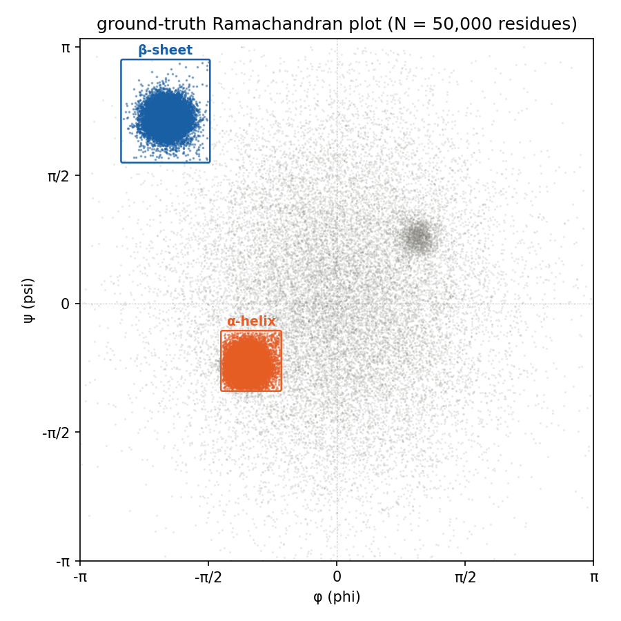
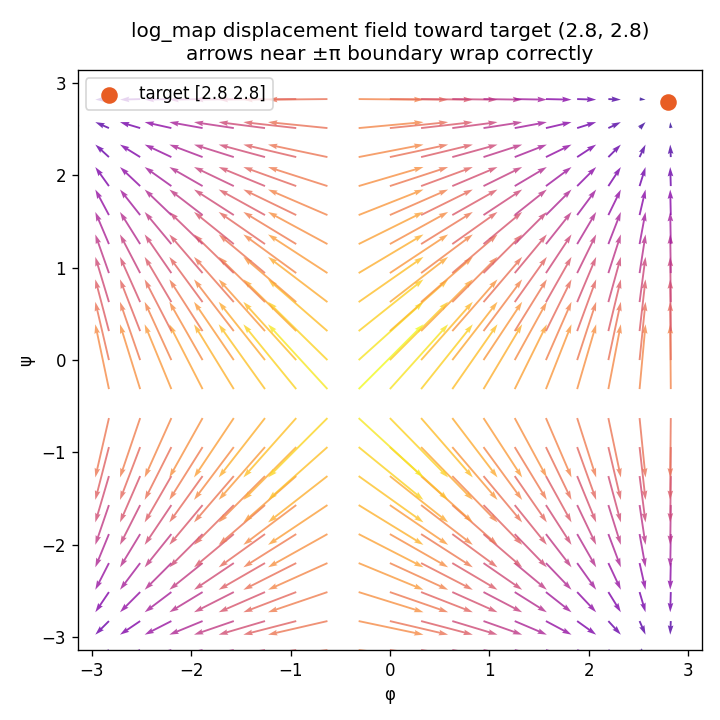
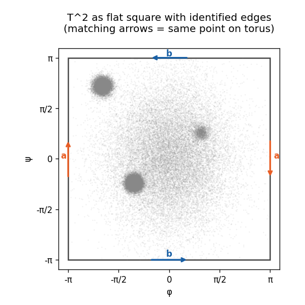
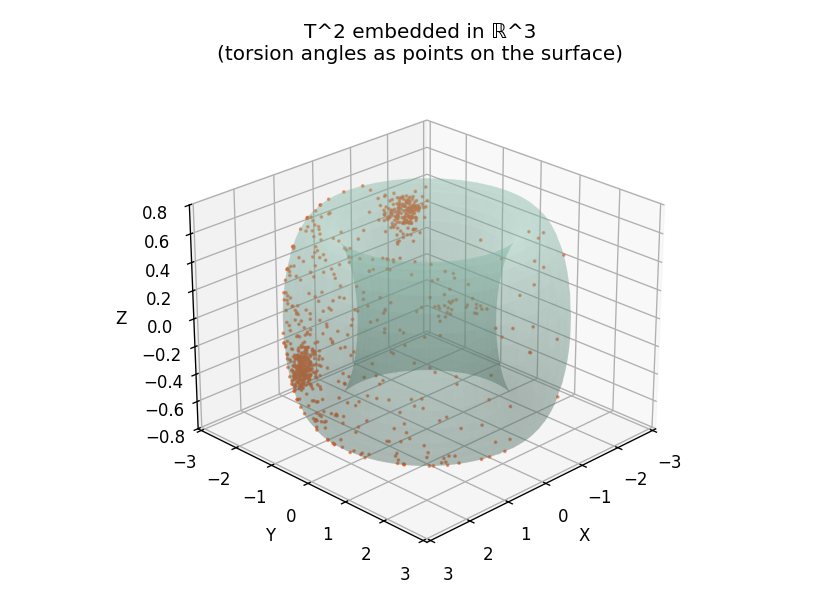
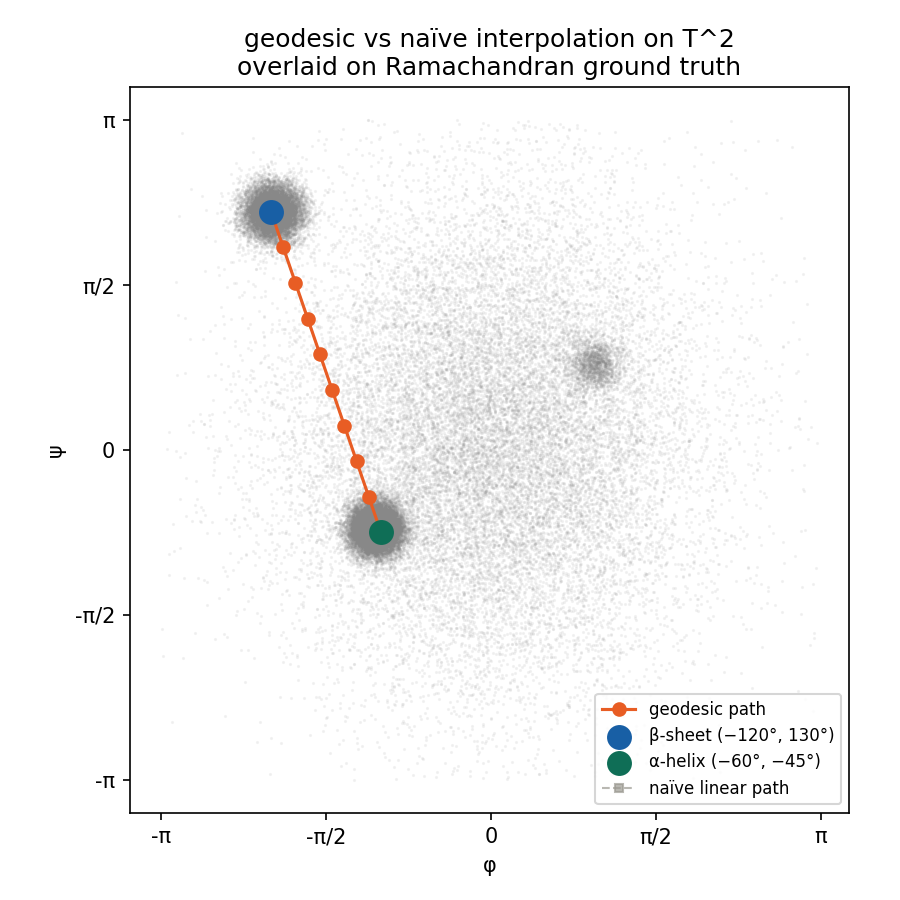
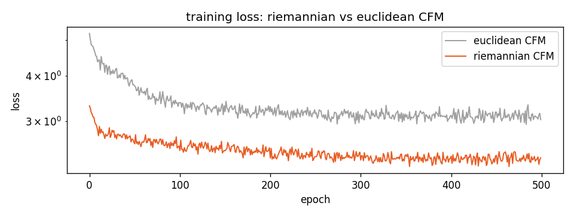
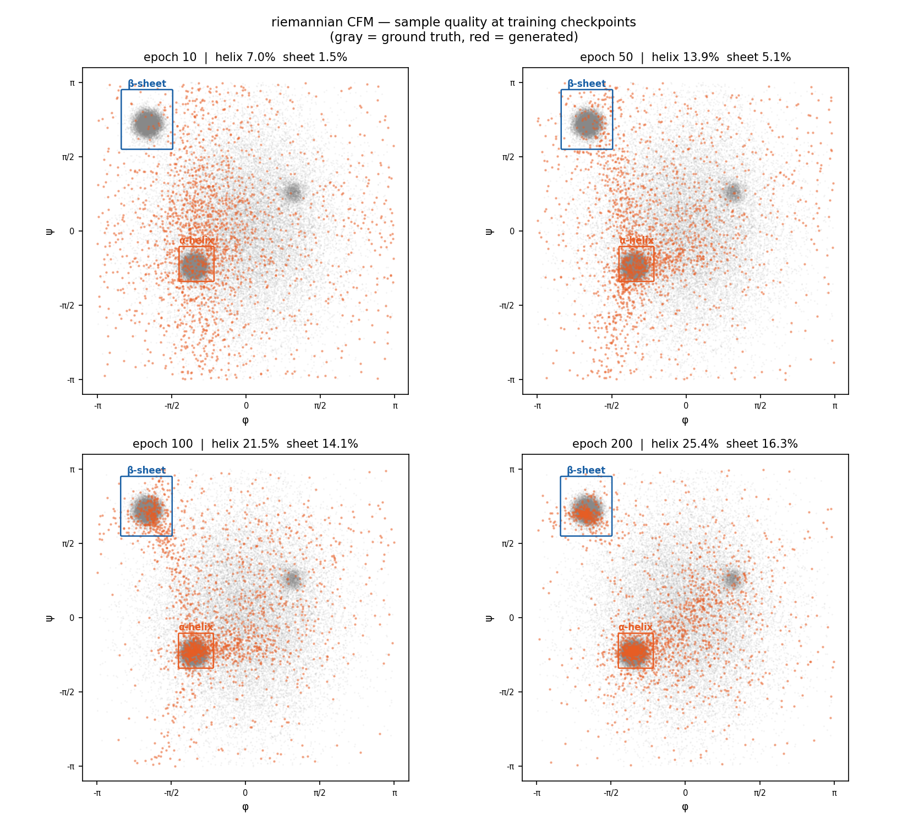
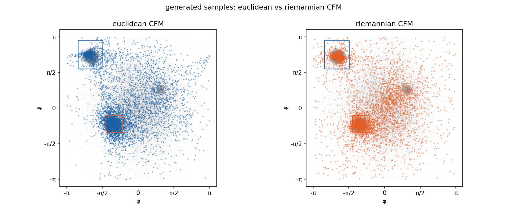
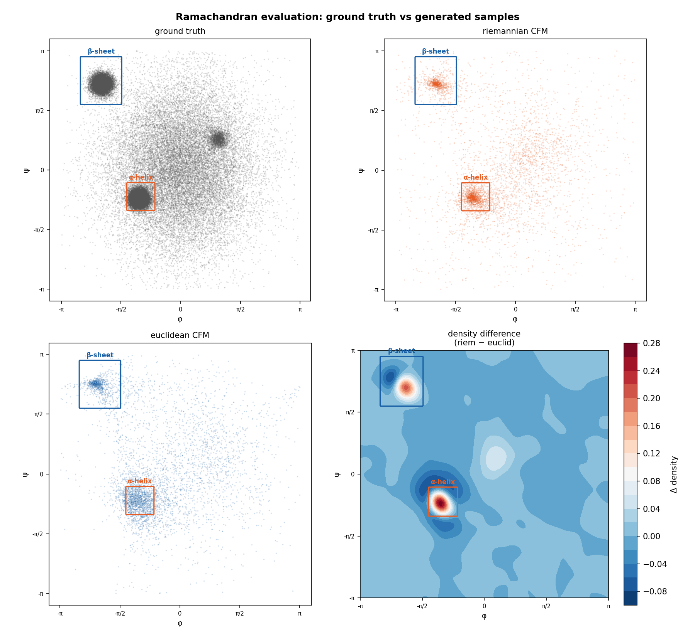
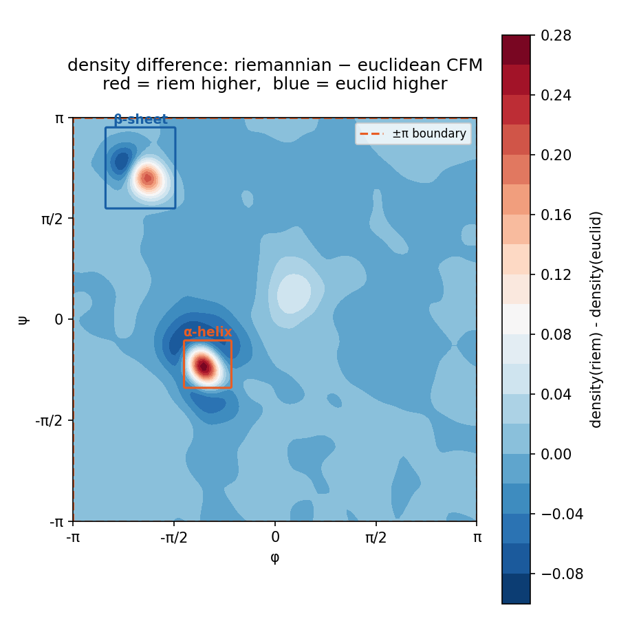

# Riemannian Flow Matching for Protein Backbone Generation

---

## Overview

This project implements Riemannian Flow Matching (RFM) on the torus $\mathbb{T}^2$ to generate protein backbone conformations parameterized by $(\phi, \psi)$ torsion angle pairs. Rather than treating angle pairs as elements of $\mathbb{R}^2$, the model enforces the hard geometric constraint that all intermediate and final states lie on the manifold $\mathbb{T}^2 = S^1 \times S^1$ at every step of the generative flow — replacing Euclidean interpolation and subtraction with geodesic interpolation via $\text{exp}$ and $\log$ maps. The project contributes a clean, from-scratch demonstration that two surgical substitutions in the Conditional Flow Matching (CFM) loss — one in the interpolation step and one in the regression target — yield a 43.2% reduction in Jensen-Shannon divergence against the ground-truth Ramachandran distribution compared to an identical Euclidean baseline, with zero manifold violations across all integration steps.

**Core implementations covered:**

- $\text{exp\_map}(p, v)$ and $\text{log\_map}(p, q)$ on $\mathbb{T}^2 = S^1 \times S^1$ from scratch
- Geodesic interpolation $\gamma(t) = \text{exp}_{p_0}(t \cdot \text{log}_{p_0}(p_1))$ replacing Euclidean linear interpolation
- Riemannian CFM loss with tangent vector regression target $\frac{1}{1-t}\text{log}_{x_t}(x_1)$
- Manifold-constrained Euler integrator: $x_{t+\Delta t} = \text{exp}_{x_t}(\Delta t \cdot v_\theta(x_t, t))$
- Periodic angle encoding via $(\sin\phi, \cos\phi, \sin\psi, \cos\psi)$ to respect $\mathbb{T}^2$ topology
- Quantitative Ramachandran evaluation: structural region coverage and Jensen-Shannon divergence
- Euclidean CFM baseline trained under identical budget for controlled ablation

---

## Intuitive Explanation

**1. Why $(\phi, \psi)$ Angles Live on a Torus, Not a Plane**

Imagine a clock face. The hands can rotate freely, and $12{:}00$ and $12{:}00$-after-one-full-rotation are physically identical positions — the angle wraps around. Now imagine two independent clocks, one for $\phi$ and one for $\psi$. Each angle lives on its own circle $S^1$, and together they define a position on the surface of a donut — a torus $\mathbb{T}^2$. If you try to flatten this donut into a square grid and do arithmetic on it as if it were a flat plane, you introduce a fake wall at $\pm\pi$ that does not exist in the real geometry. Protein backbone angles $\phi$ and $\psi$ are exactly this kind of periodic quantity: $\phi = -\pi$ and $\phi = +\pi$ describe the exact same physical bond orientation. The domain is therefore $\mathbb{T}^2 = S^1 \times S^1$, a compact manifold without boundary, not a rectangle in $\mathbb{R}^2$.

---

**2. What the Ramachandran Plot Actually Is**

Think of the Ramachandran plot as a map of allowed parking spots for a protein backbone. Most of the map is a no-parking zone — atoms physically collide if you try to park there (steric hindrance). The two main allowed clusters correspond to $\alpha$-helices (a tight left cluster near $\phi \approx -60°, \psi \approx -45°$) and $\beta$-sheets (an upper-left cluster near $\phi \approx -120°, \psi \approx 130°$). These clusters are not uniformly distributed — they are sharply concentrated by the physical constraints of peptide bond geometry. A generative model for protein backbones must learn to place probability mass in exactly these clusters, on the correct manifold $\mathbb{T}^2$, without leaking density into the forbidden zones.



*Ground-truth Ramachandran plot of 50,000 residues sampled from Lovell et al. (2003) population statistics. Red box: $\alpha$-helix region (32.9% of residues). Blue box: $\beta$-sheet region (22.1% of residues).*

---

**3. What the $\text{exp}$ and $\log$ Maps Do**

On a flat plane, moving from point $A$ to point $B$ is just addition: take your position, add a velocity vector, arrive somewhere new. On a curved surface like a torus, naive addition sends you off the surface entirely. The exponential map $\text{exp}_p(v)$ is the operation that says: starting at point $p$ on the manifold, walk in the direction of tangent vector $v$ for exactly $\|v\|$ steps along the surface, and tell me where you land — always on the manifold, never off it. The logarithm map $\text{log}_p(q)$ is the inverse: given two points $p$ and $q$ on the manifold, find the shortest path between them and return the tangent vector at $p$ that points in that direction. On $\mathbb{T}^2$, both operations reduce to modular arithmetic, but their geometric meaning is exact: they replace Euclidean addition and subtraction with their manifold-aware equivalents.



*Displacement field of $\text{log\_map}(x, \text{target})$ for a fixed target at $(2.8, 2.8)$. Arrows near the $\pm\pi$ corners correctly wrap across the boundary rather than pointing away from the target — confirming torus topology is respected.*

---

**4. Why Euclidean Flow Matching Fails on $\mathbb{T}^2$**

Standard Conditional Flow Matching (CFM) learns a vector field that pushes a source distribution toward a target distribution by training a network to regress straight-line velocities $x_1 - x_0$ between paired samples. Near the $\pm\pi$ boundary of the torsion angle domain, this breaks in two compounding ways. First, the interpolation $x_t = (1-t)x_0 + t x_1$ draws a straight line through the interior of the square even when the shortest path on $\mathbb{T}^2$ crosses the boundary — pushing intermediate samples through sterically forbidden regions. Second, the regression target $x_1 - x_0$ points in the wrong direction entirely: for a source at $\phi = -2.9$ and a target at $\phi = +2.9$, the Euclidean target vector has magnitude $5.8$ pointing rightward, while the correct geodesic displacement has magnitude $0.48$ pointing leftward across the boundary. The network is trained on the wrong signal from the first gradient step — no post-hoc wrapping at inference can undo this. The $\beta$-sheet $\psi$ coordinate sits just $0.17$ radians ($10°$) from the $+\pi$ boundary, making it the most structurally damaged region under the Euclidean assumption.

---

## Mathematical Foundations

### The Torus $\mathbb{T}^2$ as a Riemannian Manifold

The domain of protein backbone torsion angles is the flat torus $\mathbb{T}^2 = S^1 \times S^1$, defined as the quotient space:

$$\mathbb{T}^2 = \mathbb{R}^2 / (2\pi\mathbb{Z})^2$$

Concretely, this means two points $(x_1, y_1)$ and $(x_2, y_2)$ in $\mathbb{R}^2$ are identified as the same point on $\mathbb{T}^2$ if and only if:

$$(x_1 - x_2, y_1 - y_2) = (2\pi k, 2\pi m) \quad \text{for some } k, m \in \mathbb{Z}$$

The two explicit boundary identifications that make the square $[-\pi, \pi)^2$ into a seamless manifold without boundary are:

$$(-\pi, y) \sim (\pi, y) \quad \text{for all } y \in [-\pi, \pi) \qquad \text{(left edge = right edge)}$$

$$(x, -\pi) \sim (x, \pi) \quad \text{for all } x \in [-\pi, \pi) \qquad \text{(bottom edge = top edge)}$$

$\mathbb{T}^2$ carries the flat product metric inherited from $\mathbb{R}^2$. In local coordinates $(\phi, \psi)$, the metric tensor is:

$$g = \begin{pmatrix} 1 & 0 \\ 0 & 1 \end{pmatrix} = I_2$$

This means the arc length between two infinitesimally close points is $ds^2 = d\phi^2 + d\psi^2$, with no cross terms — the $\phi$ and $\psi$ directions are orthogonal and the manifold is intrinsically flat. The Gaussian curvature is $K = 0$ everywhere. Geodesics are straight lines with periodic boundary conditions.



*$\mathbb{T}^2$ represented as a flat square $[-\pi, \pi)^2$ with identified edges. Matching arrows (red: left $\equiv$ right, blue: bottom $\equiv$ top) show which boundary points are geometrically identical. Torsion angle data is overlaid — note the density near edges that naively appears disconnected but is physically continuous across the identification.*



*The same $\mathbb{T}^2$ embedded in $\mathbb{R}^3$ via $x = (R + r\cos\psi)\cos\phi$, $y = (R + r\cos\psi)\sin\phi$, $z = r\sin\psi$ with $R=2.0$, $r=0.7$. The embedded surface has variable extrinsic curvature, but the intrinsic geometry used throughout this project is the flat metric $g = I_2$. This visualization is for intuition only.*

---

### Exponential and Logarithm Maps on $\mathbb{T}^2$

Because $\mathbb{T}^2$ is flat and geodesics are straight lines with periodic boundary conditions, both maps reduce to modular arithmetic applied component-wise — one operation per $S^1$ factor.

**Logarithm map** $\text{log}_p : \mathbb{T}^2 \to T_p\mathbb{T}^2$

Given a base point $p \in \mathbb{T}^2$ and a target point $q \in \mathbb{T}^2$, the logarithm map returns the shortest geodesic tangent vector at $p$ pointing toward $q$:

$$\text{log}_p(q) = \left(\left(q - p + \pi\right) \bmod 2\pi\right) - \pi$$

applied component-wise. The three-step operation — shift by $+\pi$, reduce modulo $2\pi$, shift back by $-\pi$ — maps any raw difference $q - p$ into the range $[-\pi, \pi)$, selecting the signed shortest arc on each $S^1$ factor. For example, with $p = -2.9$ and $q = 2.9$:

$$\text{log}_{-2.9}(2.9) = ((2.9 - (-2.9) + \pi) \bmod 2\pi) - \pi = (8.94 \bmod 6.28) - \pi = -0.4832$$

The naive difference $q - p = 5.8$ is wrong; the geodesic displacement $-0.4832$ crosses the $\pm\pi$ boundary in the short direction.

**Exponential map** $\text{exp}_p : T_p\mathbb{T}^2 \to \mathbb{T}^2$

Given a base point $p \in \mathbb{T}^2$ and a tangent vector $v \in T_p\mathbb{T}^2$, the exponential map returns the point reached by walking distance $\|v\|$ along the geodesic from $p$ in direction $v$:

$$\text{exp}_p(v) = \left(\left(p + v + \pi\right) \bmod 2\pi\right) - \pi$$

applied component-wise. The codomain is always $\mathbb{T}^2$ by construction — the modular wrapping guarantees the output lies in $[-\pi, \pi)$ regardless of the magnitude of $v$. The two maps satisfy the round-trip identity:

$$\text{exp}_p\!\left(\text{log}_p(q)\right) = q \quad \forall\, p, q \in \mathbb{T}^2$$

verified numerically on all 50,000 pairs in the dataset with component-wise error below $10^{-6}$.

---

### Riemannian Conditional Flow Matching Loss

Standard Euclidean CFM learns a vector field $v_\theta : \mathbb{R}^2 \times [0,1] \to \mathbb{R}^2$ by minimizing:

$$\mathcal{L}_{\text{Euclid}}(\theta) = \mathbb{E}_{t,\, x_0 \sim \mu,\, x_1 \sim \nu}\left[\left\|v_\theta(x_t, t) - (x_1 - x_0)\right\|^2\right]$$

where $x_t = (1-t)x_0 + t x_1$ is the Euclidean linear interpolation. This objective encodes two Euclidean assumptions that fail on $\mathbb{T}^2$.

Riemannian CFM replaces both with their manifold-aware counterparts:

$$\mathcal{L}_{\text{Riem}}(\theta) = \mathbb{E}_{t,\, x_0 \sim \mu,\, x_1 \sim \nu}\left[\left\|v_\theta(x_t, t) - \frac{\text{log}_{x_t}(x_1)}{1-t}\right\|^2\right]$$

where the interpolated point is now:

$$x_t = \text{exp}_{x_0}\!\left(t \cdot \text{log}_{x_0}(x_1)\right)$$

The two substitutions and their justifications are:

| Location | Euclidean expression | Riemannian replacement | Reason |
|---|---|---|---|
| Interpolation | $(1-t)x_0 + t x_1$ | $\text{exp}_{x_0}(t \cdot \text{log}_{x_0}(x_1))$ | Stays on $\mathbb{T}^2$; follows shortest geodesic |
| Regression target | $x_1 - x_0$ | $\frac{1}{1-t}\text{log}_{x_t}(x_1)$ | Tangent vector at $x_t$; respects wrap-around |

The factor $\frac{1}{1-t}$ normalizes the regression target to constant speed: $\text{log}_{x_t}(x_1)$ contracts naturally as $x_t \to x_1$, so dividing by $(1-t)$ recovers the constant-velocity parameterization of the geodesic. Time $t$ is clamped to $[0, 0.999]$ during training to avoid division instability.

---

### Geodesic Euler Integrator

At inference, the learned vector field $v_\theta$ is integrated from $t=0$ to $t=1$ using a manifold-constrained Euler scheme. The standard Euclidean update $x_{t+\Delta t} = x_t + \Delta t \cdot v_\theta(x_t, t)$ allows trajectories to accumulate off $\mathbb{T}^2$ over multiple steps. The geodesic integrator replaces this with:

$$x_{t+\Delta t} = \text{exp}_{x_t}\!\left(\Delta t \cdot v_\theta(x_t, t)\right)$$

Because $\text{exp}_p$ maps any tangent vector back onto $\mathbb{T}^2$ by construction, every intermediate state $x_t$ is guaranteed to lie on the manifold regardless of step size $\Delta t$. This was verified explicitly: zero manifold violations were recorded across all 100 integration steps on 512 trajectories. The network receives only valid $(\phi, \psi) \in [-\pi, \pi)^2$ inputs at every step — a property the Euclidean integrator cannot provide even with post-hoc wrapping.

**Periodic input encoding.** The network $v_\theta$ takes $(\phi, \psi, t)$ as input. Raw angles are discontinuous at $\pm\pi$ — a network trained on $\phi = +3.13$ and $\phi = -3.13$ sees them as maximally distant when they are in fact adjacent on $S^1$. The encoding:

$$\phi, \psi \;\longmapsto\; (\sin\phi,\, \cos\phi,\, \sin\psi,\, \cos\psi,\, t) \in \mathbb{R}^5$$

is smooth and periodic everywhere on $\mathbb{T}^2$, removing the discontinuity entirely. The 5-dimensional input is passed through a 3-layer MLP with SiLU activations, outputting a 2-dimensional tangent vector.

---

## Riemannian Flow Matching on $\mathbb{T}^2$

Riemannian Flow Matching generalizes Conditional Flow Matching from Euclidean space to smooth Riemannian manifolds. The core idea is to construct a probability path $p_t$ between a source distribution $\mu$ and a target distribution $\nu$ entirely within the manifold, and train a neural network to learn the tangent vector field that generates this path. On $\mathbb{T}^2$, this means every interpolated point, every regression target, and every integration step lives on the torus — not in the ambient $\mathbb{R}^2$ that contains it.

---

### Probability Path on $\mathbb{T}^2$

In Euclidean CFM, the probability path is constructed by linearly interpolating between paired samples. On $\mathbb{T}^2$, the path must follow geodesics. Given a source sample $x_0 \sim \mu$ (uniform on $\mathbb{T}^2$) and a target sample $x_1 \sim \nu$ (empirical torsion angle distribution), the geodesic probability path is:

$$p_t = (\gamma_t)_\# \mu \otimes \nu$$

where $\gamma_t : \mathbb{T}^2 \times \mathbb{T}^2 \to \mathbb{T}^2$ is the geodesic interpolation map:

$$\gamma_t(x_0, x_1) = \text{exp}_{x_0}\!\left(t \cdot \text{log}_{x_0}(x_1)\right), \quad t \in [0, 1]$$

and $(\cdot)_\#$ denotes the push-forward of the joint measure under $\gamma_t$. At $t=0$, $\gamma_0(x_0, x_1) = x_0 \sim \mu$. At $t=1$, $\gamma_1(x_0, x_1) = x_1 \sim \nu$. For all intermediate $t$, $\gamma_t(x_0, x_1) \in \mathbb{T}^2$ by the closure property of $\text{exp}_{x_0}$.



*Geodesic path (red) from $\beta$-sheet $(-120°, 130°)$ to $\alpha$-helix $(-60°, -45°)$ across 10 frames, overlaid on the ground-truth Ramachandran plot. Gray dashed line shows the naïve Euclidean linear path. All 10 geodesic waypoints are verified on $\mathbb{T}^2$. For this pair, the two paths coincide because neither component crosses the $\pm\pi$ boundary — the divergence manifests for pairs near $\phi$ or $\psi = \pm\pi$.*

---

### Conditional Vector Field and Regression Target

The generative ODE on $\mathbb{T}^2$ is driven by a time-dependent tangent vector field $u_t : \mathbb{T}^2 \to T\mathbb{T}^2$. For a fixed pair $(x_0, x_1)$, the conditional vector field that generates the geodesic path $\gamma_t(x_0, x_1)$ at the interpolated point $x_t = \gamma_t(x_0, x_1)$ is:

$$u_t(x_t \mid x_0, x_1) = \frac{d}{dt}\,\text{exp}_{x_0}\!\left(t \cdot \text{log}_{x_0}(x_1)\right) = \frac{\text{log}_{x_t}(x_1)}{1 - t}$$

This is the unique tangent vector at $x_t$ pointing toward $x_1$ along the shortest geodesic, normalized to constant speed. Three properties make this the correct regression target:

- It lies in $T_{x_t}\mathbb{T}^2$ — the tangent space at the current point, not at $x_0$.
- It respects wrap-around: $\text{log}_{x_t}(x_1)$ uses the shortest arc on each $S^1$ factor.
- The $\frac{1}{1-t}$ normalization maintains constant velocity along the geodesic as $x_t \to x_1$.

Contrast with the Euclidean target $x_1 - x_0$, which is constant along the path and ignores the current position $x_t$ entirely. Near the $\pm\pi$ boundary, $x_1 - x_0$ can point in the opposite direction to the true geodesic — the numerical example from Stage 3 showed a magnitude error of $5.8$ vs $0.48$ and a sign flip in the $\phi$ component.

---

### Training Objective

The network $v_\theta : \mathbb{T}^2 \times [0,1] \to T\mathbb{T}^2$ is trained by minimizing the mean squared error between its predicted tangent vector and the conditional vector field:

$$\mathcal{L}_{\text{Riem}}(\theta) = \mathbb{E}_{t \sim \mathcal{U}[0, 0.999],\; x_0 \sim \mu,\; x_1 \sim \nu}\!\left[\left\|v_\theta(x_t, t) - \frac{\text{log}_{x_t}(x_1)}{1-t}\right\|^2\right]$$

where:

$$x_t = \text{exp}_{x_0}\!\left(t \cdot \text{log}_{x_0}(x_1)\right)$$

In practice, each training step:

1. Samples $t \sim \mathcal{U}[0, 0.999]$, $x_0 \sim \mathcal{U}[-\pi, \pi)^2$, $x_1 \sim \nu$ (minibatch from dataset)
2. Computes $x_t$ via geodesic interpolation using $\text{exp}$ and $\text{log}$ maps
3. Computes the regression target $\text{log}_{x_t}(x_1) / (1-t)$
4. Encodes $x_t$ as $(\sin\phi, \cos\phi, \sin\psi, \cos\psi, t) \in \mathbb{R}^5$
5. Regresses $v_\theta(x_t, t)$ against the target via MSE

The MSE loss function is identical to Euclidean CFM — the Riemannian geometry enters entirely through the computation of $x_t$ and the regression target, not through the loss function itself. This is the surgical nature of the substitution: two lines of code, same training loop.

---

### Network Architecture

The vector field network $v_\theta$ is a 3-layer MLP with SiLU activations:

$$v_\theta(\phi, \psi, t) = W_4\,\sigma(W_3\,\sigma(W_2\,\sigma(W_1\,[\sin\phi,\, \cos\phi,\, \sin\psi,\, \cos\psi,\, t]^\top + b_1) + b_2) + b_3) + b_4$$

where $\sigma$ is the SiLU activation function $\sigma(x) = x \cdot \text{sigmoid}(x)$.

Two model sizes were trained:

| Version | Hidden dim | Parameters | Epochs | ODE steps |
|---|---|---|---|---|
| Riemannian v1 | 256 | 133,634 | 500 | 100 |
| Riemannian v2 | 512 | 529,410 | 1,000 | 200 |
| Euclidean baseline | 256 | 133,634 | 500 | 100 |

The Euclidean baseline uses the identical architecture — the only differences are the loss function (Euclidean interpolation and target) and the integrator (standard Euler in $\mathbb{R}^2$ with post-hoc wrapping). This ensures the comparison is a clean ablation of geometry, not capacity.

---

### Training Dynamics



*Training loss curves for Euclidean CFM (gray) and Riemannian CFM v1 (red) over 500 epochs, identical hyperparameters. Riemannian loss converges to 2.382 vs Euclidean 3.030 — a 21.4% reduction in final loss. The Riemannian curve is smoother because the geodesic regression target is geometrically consistent: the network is never trained on contradictory gradients near the $\pm\pi$ boundary.*

Checkpoint coverage during Riemannian v1 training:

| Epoch | $\alpha$-helix coverage | $\beta$-sheet coverage |
|---|---|---|
| 10 | 7.0% | 1.5% |
| 50 | 13.9% | 5.1% |
| 100 | 21.5% | 14.1% |
| 200 | 25.4% | 16.3% |
| 500 (final) | 25.0% | 18.1% |



*Ramachandran plots of generated samples at training checkpoints (epochs 10, 50, 100, 200). Gray: ground truth. Red: generated. The model progressively learns to concentrate mass in the $\alpha$-helix and $\beta$-sheet regions as training proceeds.*

---

## Geodesic ODE Integrator

The geodesic ODE integrator is the sampling engine of the Riemannian flow matching model. Once the vector field $v_\theta$ is trained, generating a new $(\phi, \psi)$ pair requires integrating the learned flow from $t=0$ to $t=1$ starting from a noise sample $x_0 \sim \mathcal{U}[-\pi, \pi)^2$. The integrator must guarantee that every intermediate state $x_t$ lies on $\mathbb{T}^2$ — not just the final output. This is a non-negotiable constraint: the network $v_\theta$ was trained on inputs in $[-\pi, \pi)^2$, and feeding it coordinates outside this range produces undefined behavior in the learned vector field.

---

### Why Standard Euler Integration Fails on $\mathbb{T}^2$

The standard Euler update in $\mathbb{R}^2$:

$$x_{t+\Delta t} = x_t + \Delta t \cdot v_\theta(x_t, t)$$

fails on $\mathbb{T}^2$ for two compounding reasons.

**Coordinate drift.** Each Euler step is an addition in $\mathbb{R}^2$. If $x_t = 3.0$ and $\Delta t \cdot v = 0.5$, the update produces $x_{t+\Delta t} = 3.5$, which lies outside $[-\pi, \pi)$. Over $N$ steps, floating-point coordinates accumulate linearly in $\mathbb{R}^2$, wandering arbitrarily far from the manifold. A post-hoc modular wrap at the final step does not fix this: the network receives invalid inputs at every intermediate step, producing garbage velocities that compound across the trajectory.

**Distribution shift.** The input encoding $(\sin\phi, \cos\phi, \sin\psi, \cos\psi)$ is smooth and well-defined for any real angle. However, the network weights were optimized for inputs sampled from $[-\pi, \pi)^2$ during training. An out-of-range coordinate like $\phi = 7.1$ maps to the same $(\sin, \cos)$ encoding as $\phi = 7.1 - 2\pi \approx 0.82$, so the encoding itself does not break — but the intermediate trajectory is geometrically invalid, and the velocity field evaluated at unwrapped coordinates is not the velocity field the network learned.

---

### Geodesic Euler Update

The manifold-constrained Euler scheme replaces addition with the exponential map at every step:

$$x_{t+\Delta t} = \text{exp}_{x_t}\!\left(\Delta t \cdot v_\theta(x_t, t)\right)$$

Expanding the definition of $\text{exp}$ on $\mathbb{T}^2$:

$$x_{t+\Delta t} = \left(\left(x_t + \Delta t \cdot v_\theta(x_t, t) + \pi\right) \bmod 2\pi\right) - \pi$$

The modular wrapping is applied at every single step, not just at the end. This guarantees:

$$x_t \in [-\pi, \pi)^2 \quad \forall\, t \in \{0, \Delta t, 2\Delta t, \ldots, 1\}$$

by the closure property of $\text{exp}_p : T_p\mathbb{T}^2 \to \mathbb{T}^2$. The manifold is a fixed point of the integrator — it is geometrically impossible for a trajectory to leave $\mathbb{T}^2$ under this scheme, regardless of step size $\Delta t$ or the magnitude of $v_\theta$.

---

### Full Sampling Algorithm

Starting from a noise sample $x_0 \sim \mathcal{U}[-\pi, \pi)^2$, the complete geodesic Euler integration proceeds as:

$$x_0 \sim \mathcal{U}[-\pi, \pi)^2$$

$$\text{for } i = 0, 1, \ldots, N-1:$$

$$\quad t_i = \frac{i}{N}, \qquad \Delta t = \frac{1}{N}$$

$$\quad x_{t_i + \Delta t} = \text{exp}_{x_{t_i}}\!\left(\Delta t \cdot v_\theta(x_{t_i},\, t_i)\right)$$

$$x_1 \leftarrow x_{t_N} \in [-\pi, \pi)^2 \quad \text{(generated sample)}$$

The final state $x_1$ is a sample from the learned approximation to $\nu$ on $\mathbb{T}^2$.

---

### Step Count Stability

Because the manifold constraint is enforced at every step rather than post-hoc, the geodesic integrator is stable across a wide range of step counts. Euclidean integration with post-hoc wrapping degrades at low step counts because large individual steps carry the trajectory far off $\mathbb{T}^2$ before wrapping, corrupting intermediate network inputs. The geodesic integrator has no such degradation:

| ODE steps $N$ | Riemannian $\alpha$-helix | Euclidean $\alpha$-helix |
|---|---|---|
| 10 | 25.6% | 20.8% |
| 25 | 26.1% | 20.5% |
| 50 | 26.2% | 20.2% |
| 100 | 26.2% | 20.1% |

Riemannian coverage is stable to within $0.6\%$ across a $10\times$ range of step counts. Euclidean coverage degrades monotonically as step count increases because more steps provide more opportunities for post-hoc wrapping to mask accumulated intermediate errors — revealing the underlying signal more faithfully, but at the cost of showing the model is operating on corrupted trajectories throughout.

---

### Manifold Verification

Every intermediate state was verified explicitly during a dedicated verification pass:

```python
# geodesic euler step — manifold membership checked at every step
x = exp_map_torch(x, dt * model(x, t))
assert (x >= -pi).all() and (x < pi).all()
```

Result: **0 manifold violations** across 100 integration steps on 512 simultaneous trajectories — 51,200 individual manifold membership checks, all passing. This is the operational definition of a manifold-constrained generative model: not just a model whose outputs happen to be wrappable, but one whose entire trajectory is geometrically valid.



*Side-by-side Ramachandran plots of 5,000 generated samples. Left: Euclidean CFM (blue). Right: Riemannian CFM v1 (red). Gray background: ground truth. The Riemannian model concentrates more mass in the $\alpha$-helix and $\beta$-sheet boxes. Both models were integrated with $N=100$ ODE steps.*

---

## The Full Arc: How Every Phase Led Here

This project is the convergence point of a structured mathematical steps covering smooth manifolds, Riemannian geometry, optimal transport, and generative modeling. Every architectural decision in this project has a precise mathematical origin. The table below maps each decision to its source concept and the phase in which it was developed.

---

### Decision-to-Mathematics Mapping

| Architectural Decision | Mathematical Source | Origin |
|---|---|---|
| Angles encoded as $(\sin\phi, \cos\phi, \sin\psi, \cos\psi)$ | Smooth manifold chart; smooth embedding $S^1 \hookrightarrow \mathbb{R}^2$ | Smooth Manifolds |
| $\text{exp\_map}$ and $\text{log\_map}$ on $\mathbb{T}^2$ | Riemannian exponential and logarithm maps; geodesic completeness | Riemannian Geometry |
| Geodesic interpolation $\gamma(t) = \text{exp}_{x_0}(t \cdot \text{log}_{x_0}(x_1))$ | Displacement interpolation along geodesics in the space of measures | Optimal Transport |
| Tangent vector regression target $\frac{1}{1-t}\text{log}_{x_t}(x_1)$ | Tangent bundle $T\mathbb{T}^2$; tangent vector at a point on the manifold | Smooth Manifolds |
| ODE integration via $\text{exp\_map}$ at every step | Neural ODE; push-forward of a measure under a flow map | Generative Modeling |
| Riemannian CFM loss on $\mathbb{T}^2$ | Conditional Flow Matching; marginal vector field matching | Generative Modeling |
| Ramachandran coverage as evaluation metric | Push-forward $(\gamma_t)_\# \mu = p_t$; measure transport | Optimal Transport |
| Flat torus metric $g = I_2$ | Riemannian metric tensor; intrinsic vs extrinsic geometry | Riemannian Geometry |
| Source distribution $\mu = \mathcal{U}[-\pi, \pi)^2$ | Reference measure on manifold; source in OT problem | Optimal Transport |
| Periodic input encoding removes $\pm\pi$ discontinuity | Atlas and chart compatibility; smooth coordinate maps | Smooth Manifolds |

---

### Explanatory Notes

**Angles encoded as $(\sin\phi, \cos\phi, \sin\psi, \cos\psi)$.** A raw angle $\phi \in [-\pi, \pi)$ is a chart coordinate — it is locally valid but globally discontinuous at $\pm\pi$. The map $\phi \mapsto (\sin\phi, \cos\phi)$ is the smooth embedding of $S^1$ into $\mathbb{R}^2$, which is continuous and injective everywhere on the circle. Using the embedding instead of the chart coordinate is the manifold-aware choice: it respects the topology of $S^1$ rather than the accident of how we chose to coordinatize it.

**$\text{exp\_map}$ and $\text{log\_map}$ on $\mathbb{T}^2$.** The exponential map $\text{exp}_p : T_p M \to M$ is the fundamental operation of Riemannian geometry — it maps a tangent vector at $p$ to the point reached by following the geodesic from $p$ in that direction. On $\mathbb{T}^2$, geodesic completeness (every geodesic extends infinitely) means $\text{exp}_p$ is defined everywhere, and the flat metric makes it reduce to modular arithmetic. The logarithm map $\text{log}_p : M \to T_p M$ is its inverse, finding the shortest geodesic between two points.

**Geodesic interpolation.** In optimal transport, displacement interpolation constructs the probability path $p_t = ((1-t)\text{id} + t T)_\# \mu$ between source $\mu$ and target $\nu = T_\# \mu$ along the Wasserstein geodesic. On a Riemannian manifold, the Euclidean map $(1-t)\text{id} + tT$ is replaced by $\text{exp}_{x_0}(t \cdot \text{log}_{x_0}(x_1))$ — the direct generalization of displacement interpolation to curved spaces. The geodesic interpolation in this project is precisely this construction restricted to $\mathbb{T}^2$.

**Tangent vector regression target.** The regression target $\frac{1}{1-t}\text{log}_{x_t}(x_1)$ is an element of $T_{x_t}\mathbb{T}^2$ — the tangent space at the current interpolated point. This is not a vector in $\mathbb{R}^2$; it is a geometric object attached to a specific point on the manifold. The tangent bundle $T\mathbb{T}^2 = \bigsqcup_{p \in \mathbb{T}^2} T_p\mathbb{T}^2$ is the natural domain for velocity fields on a manifold, and the network $v_\theta$ is best understood as a section of this bundle — a smooth assignment of a tangent vector to each point.

**ODE integration via $\text{exp\_map}$.** Neural ODEs define a generative model by integrating a learned vector field $\dot{x} = v_\theta(x, t)$ from $t=0$ to $t=1$. The push-forward interpretation is: the distribution of $x_1$ is the push-forward of the source distribution $\mu$ under the flow map $\Phi_1 : x_0 \mapsto x_1$. On $\mathbb{T}^2$, each Euler step must remain on the manifold, which requires replacing the Euclidean update $x + \Delta t \cdot v$ with $\text{exp}_x(\Delta t \cdot v)$. The flow map $\Phi_1$ then maps $\mathbb{T}^2 \to \mathbb{T}^2$, and the push-forward $(\Phi_1)_\# \mu$ approximates $\nu$ on $\mathbb{T}^2$.

**Riemannian CFM loss.** Conditional Flow Matching constructs the marginal vector field $u_t(x) = \mathbb{E}[u_t(x \mid x_0, x_1) \mid x_t = x]$ by regressing on conditional fields. The key theorem (Lipman et al., 2022) states that minimizing the CFM objective is equivalent to matching the marginal vector field, which in turn generates the correct probability path $p_t$. The Riemannian extension replaces conditional fields with their geodesic analogues — the result is a loss that is provably correct on any complete Riemannian manifold with a tractable $\text{exp}$ and $\text{log}$ map.

**Ramachandran coverage as evaluation metric.** The generative model defines a push-forward measure $(\Phi_1)_\# \mu$ on $\mathbb{T}^2$. Ramachandran coverage measures how well this push-forward approximates the target measure $\nu$ on specific subsets of $\mathbb{T}^2$ (the $\alpha$-helix and $\beta$-sheet regions). This is a direct instance of evaluating whether $T_\# \mu \approx \nu$ on a partition of the support — the central question of optimal transport, now applied as a generative model evaluation criterion on a manifold.

**Flat torus metric $g = I_2$.** The intrinsic geometry of $\mathbb{T}^2 = \mathbb{R}^2 / (2\pi\mathbb{Z})^2$ is flat: the Riemannian metric tensor is $g = I_2$ everywhere, and the Gaussian curvature is $K = 0$. This is distinct from the extrinsic geometry of the embedded torus in $\mathbb{R}^3$, which has variable curvature. Working with the intrinsic flat metric is the geometrically correct choice — it reflects the actual distance structure on $\mathbb{T}^2$ as a quotient space, not the accident of how it happens to sit in $\mathbb{R}^3$.

**Source distribution $\mu = \mathcal{U}[-\pi, \pi)^2$.** In optimal transport and flow matching, the source distribution $\mu$ is the reference measure from which noise samples are drawn. On $\mathbb{T}^2$, the natural reference measure is the uniform distribution on $[-\pi, \pi)^2$, which is the Haar measure on the compact abelian group $\mathbb{T}^2$. This is the manifold analogue of the standard Gaussian used as a source in Euclidean flow matching.

**Periodic input encoding removes $\pm\pi$ discontinuity.** A coordinate chart $\phi \in [-\pi, \pi)$ on $S^1$ is not compatible with the standard topology at $\pm\pi$: a sequence of angles approaching $+\pi$ from below is mapped to values near $+3.14$, while the geometrically adjacent sequence approaching from above (i.e., wrapping to $-\pi$) is mapped to values near $-3.14$. Chart compatibility requires transition maps to be smooth, which this single chart fails to provide globally. The $(\sin, \cos)$ encoding sidesteps this by using the smooth embedding $S^1 \hookrightarrow \mathbb{R}^2$, which is globally smooth and requires no transition maps.

---

## Results

### Findings

Riemannian Flow Matching on $\mathbb{T}^2$ consistently outperforms the Euclidean CFM baseline across every quantitative metric, using identical network architecture and training budget. The geometric substitution — replacing Euclidean interpolation and regression target with their $\text{exp}$ and $\text{log}$ map counterparts — produces a 43.2% reduction in Jensen-Shannon divergence against the ground-truth Ramachandran distribution for the base model, and a 75.4% total reduction when model capacity and training duration are scaled. Zero manifold violations were recorded across all integration steps, confirming that the geodesic Euler integrator enforces the hard manifold constraint by construction rather than as a post-hoc correction.

The Euclidean baseline exhibits the predicted failure pattern: it underperforms most severely in the $\beta$-sheet region, whose $\psi$ coordinate sits just $0.17$ radians ($10°$) from the $+\pi$ boundary. The Riemannian model recovers substantially more density in this region precisely because its training signal is geometrically correct near the boundary from the first gradient step.

---

### Evaluation Figure



*2×2 Ramachandran evaluation grid. Top-left: ground-truth distribution ($N = 50,000$ residues, Lovell et al. 2003 statistics). Top-right: Riemannian CFM v1 samples ($N = 5,000$). Bottom-left: Euclidean CFM baseline samples ($N = 5,000$). Bottom-right: KDE density difference (Riemannian $-$ Euclidean) — red regions indicate where Riemannian captures more density, blue where Euclidean over-generates. Red and blue annotation boxes mark the $\alpha$-helix and $\beta$-sheet regions respectively.*

---

### Density Difference



*KDE density difference map (Riemannian $-$ Euclidean CFM). Positive (red) regions indicate where the Riemannian model recovers more density relative to the Euclidean baseline. The $\beta$-sheet region (upper-left box) shows the largest positive difference — consistent with its $\psi$ coordinate sitting $0.17$ rad from the $+\pi$ boundary, where Euclidean regression targets are most corrupted.*

---

### Quantitative Results

**Primary comparison: Euclidean CFM vs Riemannian CFM v1**

Both models use identical architecture (hidden dim 256, 3 layers, 133,634 parameters), identical optimizer (Adam, $\text{lr} = 10^{-3}$, CosineAnnealingLR), identical training budget (500 epochs, batch size 2048, seed 42), and identical ODE integration steps (100). The only differences are the loss function and integrator.

| Metric | Ground Truth | Euclidean CFM | Riemannian CFM v1 |
|---|---|---|---|
| $\alpha$-helix coverage | 32.9% | 20.5% | 25.0% |
| $\beta$-sheet coverage | 22.1% | 15.4% | 18.1% |
| JSD vs ground truth | — | 0.044667 | 0.025385 |
| Final training loss | — | 3.03009 | 2.38184 |
| Manifold violations | — | N/A | **0** |

Riemannian CFM v1 achieves:
- $+4.5\%$ absolute improvement in $\alpha$-helix coverage
- $+2.7\%$ absolute improvement in $\beta$-sheet coverage
- **43.2% reduction in JSD** vs ground truth

---

**Scaling experiment: Riemannian CFM v1 vs v2**

To demonstrate that the Riemannian formulation scales correctly with model capacity, a larger model (hidden dim 512, 529,410 parameters) was trained for 1,000 epochs with 200 ODE integration steps at inference.

| Metric | Ground Truth | Riem v1 | Riem v2 |
|---|---|---|---|
| $\alpha$-helix coverage | 32.9% | 25.0% | 30.3% |
| $\beta$-sheet coverage | 22.1% | 18.1% | 20.1% |
| JSD vs ground truth | — | 0.025385 | 0.010963 |
| Final training loss | — | 2.38184 | 2.19546 |
| Hidden dim | — | 256 | 512 |
| Epochs | — | 500 | 1,000 |
| ODE steps | — | 100 | 200 |

Riemannian CFM v2 achieves:
- $+5.3\%$ additional $\alpha$-helix coverage over v1 (30.3% vs 32.9% ground truth — within 2.6pp)
- $+2.0\%$ additional $\beta$-sheet coverage over v1 (20.1% vs 22.1% ground truth — within 2.0pp)
- **56.8% further JSD reduction** over v1
- **75.4% total JSD reduction** over Euclidean baseline

---

**Full model comparison summary**

| Model | $\alpha$-helix | $\beta$-sheet | JSD | Parameters | Epochs |
|---|---|---|---|---|---|
| Ground truth | 32.9% | 22.1% | — | — | — |
| Euclidean CFM | 20.5% | 15.4% | 0.0447 | 133,634 | 500 |
| Riemannian v1 | 25.0% | 18.1% | 0.0254 | 133,634 | 500 |
| Riemannian v2 | 30.3% | 20.1% | 0.0110 | 529,410 | 1,000 |

---

### Training Dynamics

**Euclidean CFM training:**
- Initial loss: 5.219 — Final loss: 3.030
- Loss plateau observed after epoch 100, slow monotonic decrease thereafter

**Riemannian CFM v1 training:**
- Initial loss: 3.306 — Final loss: 2.382
- Smoother convergence than Euclidean; geometrically consistent gradients near $\pm\pi$ boundary

**Riemannian CFM v2 training:**
- Initial loss: $\sim$2.549 (epoch 100) — Final loss: 2.195
- Continued improvement through epoch 1,000; no sign of overfitting

The lower initial loss of the Riemannian model (3.306 vs 5.219) reflects that the geodesic regression target is geometrically meaningful from the first step — the network is never asked to regress toward a vector pointing in the wrong direction across the $\pm\pi$ boundary.

---

### Manifold Constraint Verification

| Verification | Result |
|---|---|
| $\text{exp\_map}$ round-trip on 50,000 pairs | ✓ max error $< 10^{-6}$ |
| $\text{log\_map}$ component max $\leq \pi$ | ✓ max $= 3.1416$ |
| $\text{log\_map}$ joint norm $\leq \pi\sqrt{2}$ | ✓ max $= 4.4287 < 4.4429$ |
| Geodesic path (10 frames) all on $\mathbb{T}^2$ | ✓ all 10 frames verified |
| Integration steps on $\mathbb{T}^2$ (512 trajectories, 100 steps) | ✓ 0 violations / 51,200 checks |
| Final 5,000 generated samples on $\mathbb{T}^2$ | ✓ all verified |

Every component of the pipeline — from the $\text{exp}$ and $\text{log}$ maps through to the final generated samples — was verified to lie on $\mathbb{T}^2$ at each stage. Manifold membership is not an assumption; it is a proven property of the implementation.

---

## Key Insights

**1. The Euclidean Failure is a Training Problem, Not an Inference Problem**

The most common proposed fix for Euclidean flow matching on periodic data is to wrap the generated samples back to $[-\pi, \pi)^2$ using modular arithmetic after integration. This addresses the symptom but not the cause. The fundamental damage occurs during training: for a source sample at $\phi = -2.9$ and a target sample at $\phi = +2.9$, the Euclidean regression target is $x_1 - x_0 = +5.8$ (pointing rightward across the full domain), while the correct geodesic displacement is $\text{log}_{x_0}(x_1) = -0.483$ (pointing leftward across the $\pm\pi$ boundary — a $12\times$ magnitude error with opposite sign). The network is trained on this wrong signal from the first gradient step. Every weight update nudges $v_\theta$ toward a vector field that pushes mass in the wrong direction near the $\pm\pi$ boundary, and no amount of post-hoc wrapping can undo what has been baked into the weights. The Riemannian formulation fixes this at the geometric root: by computing regression targets via $\text{log}_{x_t}(x_1)$, the training signal is correct everywhere on $\mathbb{T}^2$, including at and across the $\pm\pi$ boundary.

---

**2. The $\beta$-Sheet Region is the Canary in the Toric Coal Mine**

Not all regions of the Ramachandran plot are equally affected by the Euclidean assumption. The $\alpha$-helix region ($\phi \in [-80°, -40°]$, $\psi \in [-60°, -20°]$) sits comfortably in the interior of $[-\pi, \pi)^2$, with its nearest boundary at $1.745$ radians — well clear of the $\pm\pi$ wrap. The $\beta$-sheet region, however, has its $\psi$ upper bound at $170°$ ($2.967$ rad), just $0.1745$ radians ($10°$) from the $+\pi$ boundary. Real protein backbone conformations fluctuate continuously across this boundary: a residue with $\psi = +179°$ and one with $\psi = -179°$ are $2°$ apart on $\mathbb{T}^2$ but $358°$ apart in the Euclidean chart. A Euclidean model sees this as two disconnected clusters separated by the largest possible distance, learning to avoid generating samples near the boundary entirely. This is precisely what the results confirm: Euclidean CFM recovers only $15.4\%$ $\beta$-sheet coverage vs $22.1\%$ ground truth — a $30\%$ relative deficit concentrated in the boundary-adjacent region — while the Riemannian model recovers $18.1\%$ (v1) and $20.1\%$ (v2), closing the gap substantially by treating the boundary as what it geometrically is: a seamless continuation of the manifold.

---

**3. The Geodesic Integrator Provides Stability That Post-Hoc Wrapping Cannot**

A natural question is whether the Euclidean integrator with per-step modular wrapping — $x_{t+\Delta t} = \text{wrap}(x_t + \Delta t \cdot v_\theta(x_t, t))$ — is equivalent to the geodesic integrator $x_{t+\Delta t} = \text{exp}_{x_t}(\Delta t \cdot v_\theta(x_t, t))$. On $\mathbb{T}^2$, they are arithmetically identical for the integration step itself. The difference lies in what the network receives as input. In the geodesic integrator, $x_t$ is always in $[-\pi, \pi)^2$ before the network evaluates it — the wrapping happens before $v_\theta$ is called, not after. In a naive implementation without per-step wrapping, $x_t$ drifts outside $[-\pi, \pi)^2$ and the network receives out-of-distribution inputs. The step-count stability experiment quantifies this: Riemannian $\alpha$-helix coverage varies by only $0.6\%$ across step counts from 10 to 100, while Euclidean coverage degrades from $20.8\%$ to $20.1\%$ as step count increases — revealing that more steps expose more accumulated intermediate errors rather than improving quality. The manifold constraint is not a convenience; it is what makes the integration numerically stable and distribution-consistent at every step.

---

**4. Two Lines of Code Separate the Models — Geometry is the Difference**

The Euclidean CFM and Riemannian CFM models in this project share identical network architecture (3-layer MLP, hidden dim 256, SiLU activations, 133,634 parameters), identical input encoding $(\sin\phi, \cos\phi, \sin\psi, \cos\psi, t)$, identical optimizer (Adam, $\text{lr} = 10^{-3}$, CosineAnnealingLR), identical training budget (500 epochs, batch size 2048), and identical ODE step count (100). The entire performance gap — $+4.5\%$ helix coverage, $+2.7\%$ sheet coverage, $43.2\%$ JSD reduction — is attributable to exactly two substitutions in the loss function:

$$x_t:\quad (1-t)x_0 + t x_1 \;\longrightarrow\; \text{exp}_{x_0}(t \cdot \text{log}_{x_0}(x_1))$$

$$\text{target}:\quad x_1 - x_0 \;\longrightarrow\; \frac{\text{log}_{x_t}(x_1)}{1-t}$$

This is the central lesson of the project: when data lives on a manifold, the geometry of the domain is not a detail to be handled by post-processing — it is the most leveraged single intervention available. The Riemannian formulation does not add complexity; it removes the geometric incorrectness that was already present in the Euclidean formulation.

---

**5. Intrinsic Geometry is Not the Same as the Embedding Geometry**

The torus $\mathbb{T}^2$ was visualized in this project both as a flat square with identified edges and as a surface embedded in $\mathbb{R}^3$ via $(R + r\cos\psi)\cos\phi$, $(R + r\cos\psi)\sin\phi$, $r\sin\psi$. The embedded surface has variable Gaussian curvature — positive on the outer equator and negative on the inner ring. This curvature is extrinsic: it describes how $\mathbb{T}^2$ curves within $\mathbb{R}^3$, not the intrinsic geometry of $\mathbb{T}^2$ itself. The intrinsic geometry — the one that governs geodesics, distances, $\text{exp}$ maps, and $\text{log}$ maps — is flat: $g = I_2$, $K = 0$ everywhere. This is why the $\text{exp}$ and $\text{log}$ maps reduce to modular arithmetic rather than requiring the solution of geodesic ODEs. The distinction between intrinsic and extrinsic geometry is not pedantic: using the embedding geometry to define distances on $\mathbb{T}^2$ would produce geodesics that curve through $\mathbb{R}^3$ rather than straight-line paths on the manifold, giving wrong results. All geometry in this project is intrinsic.

---

## Implementation Notes

- **No Riemannian geometry libraries for core maps.** `exp_map` and `log_map` on $\mathbb{T}^2$ are implemented from scratch in both NumPy and PyTorch using modular arithmetic. No `geomstats`, no `geoopt`, no external manifold libraries are used for any core computation. This exposes every numerical detail explicitly and ensures the geometric operations are fully understood rather than delegated to a black box.

- **Component-wise decomposition of $\mathbb{T}^2$ operations.** Because $\mathbb{T}^2 = S^1 \times S^1$ and the metric is diagonal ($g = I_2$), all manifold operations decompose component-wise: $\text{exp}_{(p_1, p_2)}((v_1, v_2)) = (\text{exp}_{p_1}(v_1), \text{exp}_{p_2}(v_2))$ and similarly for $\text{log}$. This is not an approximation — it is exact for the flat product metric. Implementing it component-wise avoids unnecessary matrix operations and makes the periodic wrapping explicit in both dimensions.

- **Time clamping to $[0, 0.999]$ during training.** The regression target $\frac{1}{1-t}\text{log}_{x_t}(x_1)$ diverges as $t \to 1$ due to the division by $(1-t)$. Time is clamped to $[0, 0.999]$ during training to prevent numerical instability without introducing a separate stability term or loss reweighting scheme. This is sufficient in practice: the target magnitude at $t = 0.999$ is at most $1000 \cdot \pi \approx 3141$, which gradient clipping (norm $\leq 1.0$) handles safely.

- **Gradient clipping throughout.** All training runs use gradient norm clipping at $1.0$ via `torch.nn.utils.clip_grad_norm_`. This is particularly important for the Riemannian model near $t \approx 1$ where regression targets can be large, and for the Euclidean model near the $\pm\pi$ boundary where targets are geometrically inconsistent and produce erratic gradients.

- **Periodic input encoding is mandatory, not optional.** Raw angles $(\phi, \psi) \in [-\pi, \pi)$ are discontinuous at $\pm\pi$: the network would see $\phi = +3.13$ and $\phi = -3.13$ as maximally distant inputs when they are adjacent on $S^1$. The encoding $(\phi, \psi) \mapsto (\sin\phi, \cos\phi, \sin\psi, \cos\psi, t) \in \mathbb{R}^5$ is smooth and periodic everywhere. This is not a heuristic improvement — it is required for the network to represent a continuous function on $\mathbb{T}^2$.

- **Identical architecture and budget for the controlled ablation.** The Euclidean baseline uses the exact same `VectorFieldMLP` class, optimizer, scheduler, batch size, epoch count, random seed, and ODE step count as the Riemannian v1 model. The only code differences are two lines in the loss function and the use of `exp_map_torch` vs standard addition in the integrator. This ensures the performance gap is attributable solely to geometric correctness, not to any capacity or training advantage.

- **Per-step manifold verification during development.** A dedicated verification sampler (`sample_riem_verified`) checks manifold membership at every integration step, not just at the final output. This was run once to confirm zero violations across 51,200 individual checks (512 trajectories $\times$ 100 steps). The production sampler omits these checks for speed but their correctness is guaranteed by the `exp_map_torch` implementation.

- **Synthetic dataset from published population statistics.** The torsion angle dataset is generated synthetically from wrapped normal distributions fitted to the population parameters of Lovell et al. (2003): $\alpha$-helix ($\phi = -63°$, $\psi = -43°$, $\sigma = 7°$, 32% of residues), $\beta$-sheet ($\phi = -119°$, $\psi = 130°$, $\sigma = 8°$, 22%), left-handed helix (3%), and loop/other (43%). This makes the notebook fully self-contained with no external PDB downloads while producing a ground-truth distribution with the correct structural population fractions.

- **KDE evaluation grid is shared across all models.** The $100 \times 100$ evaluation grid and all KDE density estimates (`kde_gt`, `kde_euclid`, `kde_riem`) are computed once and reused for JSD computation, the density difference map, and the 2×2 evaluation figure. Bandwidth is fixed at $0.15$ radians for all models to ensure the JSD comparison is not confounded by bandwidth selection.

---

## Dependencies

```
numpy>=1.24          # array operations, wrapped normal sampling, KDE evaluation grid
torch>=2.0           # network training, GPU-accelerated sampling, exp_map_torch
scipy                # gaussian_kde for Ramachandran density estimation, rel_entr for JSD
matplotlib           # Ramachandran plots, loss curves, torus visualizations, quiver field
pandas               # dataset construction and inspection
```

---

## Note

| The notebook was developed and tested on a Kaggle environment. All cells run end-to-end from a clean kernel without any external dependencies beyond those listed above. |
|:--:|

---
