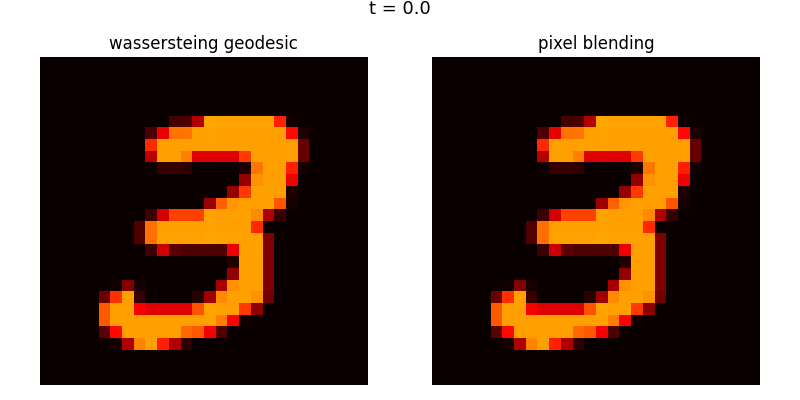

# Wasserstein Distance as a Loss Function for Image Morphing

---

## Overview

This project implements a complete **Wasserstein-based image morphing system from scratch** — no POT, no GeomLoss, no external OT libraries. It transforms an MNIST digit '3' into a digit '8' via the Wasserstein geodesic in the space of probability measures, and contrasts the result against naive pixel blending.

The core implementation covers:

- Discrete probability measures from grayscale images
- Squared Euclidean ground cost matrix (W₂)
- Sinkhorn-Knopp algorithm in log-domain (numerically stable)
- Kantorovich duality verification (primal-dual gap: 2.42e-12)
- Displacement interpolation (McCann interpolation) for geodesic frames
- Side-by-side animated visualization (GIF + PNG frames)

---

## Intuitive Explanation: What is Wasserstein Distance?

Imagine you have a pile of sand shaped like a mountain, and you want to move all that sand into a new hole shaped like a valley. The Wasserstein distance is simply the cheapest possible way to get the job done. To calculate it, you look at every grain of sand and multiply how much it weighs by how far you have to carry it. If the mountain and the valley are already in the same spot, the distance is zero because you do not have to move anything. If they are far apart, or if the shapes are very different, the distance is high because you are doing more work to shove, drag, and reshuffle the sand into its new home. It is often called the **Earth Mover's Distance** because it measures the literal effort of moving dirt from point A to point B.

---

## Mathematical Formulation

### The Kantorovich Primal Problem

Find a transport plan $\pi$ that minimizes the total cost of moving mass from $\mu$ to $\nu$:

$$\min_{\pi} \sum_{i,j} \pi_{ij} C_{ij}$$

Subject to the feasibility constraints:

$$\sum_{j=1}^{m} \pi_{ij} = \mu_i \quad \forall i \qquad \text{(row marginal)}$$

$$\sum_{i=1}^{n} \pi_{ij} = \nu_j \quad \forall j \qquad \text{(column marginal)}$$

$$\pi_{ij} \geq 0 \quad \forall i, j \qquad \text{(non-negativity)}$$

### The Kantorovich Dual Problem

Find potentials $\phi$ and $\psi$ that maximize the total value:

$$\max_{\phi,\, \psi} \sum_{i} \phi_i \mu_i + \sum_{j} \psi_j \nu_j$$

Subject to the admissibility constraint:

$$\phi_i + \psi_j \leq C_{ij} \quad \forall i, j$$

**Strong duality** guarantees that at optimality, the primal and dual objectives are equal:

$$\langle C, \pi^\star \rangle = \langle \phi^\star, \mu \rangle + \langle \psi^\star, \nu \rangle$$

---

## Sinkhorn Algorithm

### Entropic Regularization

We solve the regularized problem:

$$\min_{\pi \in \Pi(\mu,\nu)} \langle C, \pi \rangle - \varepsilon H(\pi)$$

where $H(\pi) = -\sum_{ij} \pi_{ij} \log \pi_{ij}$ is the entropy of the transport plan and $\varepsilon > 0$ is the regularization strength.

### Standard Form (Scaling Vectors)

The optimal plan takes the form $\pi = \text{diag}(u) \cdot K \cdot \text{diag}(v)$ where $K = \exp(-C/\varepsilon)$. The Sinkhorn iterations are:

$$u^{(\ell+1)} = \frac{\mu}{K v^{(\ell)}}$$

$$v^{(\ell+1)} = \frac{\nu}{K^\top u^{(\ell+1)}}$$

### Log-Domain Form (Numerically Stable)

To avoid underflow from $\exp(-C/\varepsilon)$ at small $\varepsilon$, we iterate the potentials $f = \varepsilon \ln u$ and $g = \varepsilon \ln v$ directly:

$$f_i^{(\ell+1)} = \varepsilon \ln \mu_i - \varepsilon \operatorname{LSE}_j\!\left(\frac{g_j^{(\ell)} - C_{ij}}{\varepsilon}\right)$$

$$g_j^{(\ell+1)} = \varepsilon \ln \nu_j - \varepsilon \operatorname{LSE}_i\!\left(\frac{f_i^{(\ell+1)} - C_{ij}}{\varepsilon}\right)$$

The **Log-Sum-Exp** operator is defined with numerical stabilization via:

$$\operatorname{LSE}_k(x_k) = M + \ln \sum_k \exp(x_k - M), \qquad M = \max_k x_k$$

This shifts all exponents relative to the maximum, preventing overflow and underflow simultaneously.

---

## Displacement Interpolation

Displacement interpolation (McCann interpolation) defines a geodesic path in the space of probability measures by physically moving mass along the optimal transport trajectories — not fading one image into another.

For time $t \in [0, 1]$, define the interpolation map $T_t : \mathbb{R}^2 \times \mathbb{R}^2 \to \mathbb{R}^2$:

$$T_t(x, y) = (1 - t)\,x + t\,y$$

The interpolated measure $\mu_t$ is the **push-forward** of the optimal transport plan $\pi^\star$ under this map:

$$\mu_t = (T_t)_{\#}\, \pi^\star$$

Geometrically: every particle of mass at pixel location $x$ travels in a straight line toward its matched location $y$, arriving at the intermediate position $T_t(x,y)$ at time $t$. The intermediate measure is a coherent, solid object — not a superposition of two transparent images.

---

## Results

### Primal-Dual Verification

| Quantity | Value |
|---|---|
| Primal objective $\langle C, \pi \rangle - \varepsilon H(\pi)$ | −0.95284338 |
| Dual objective $\langle \phi, \mu \rangle + \langle \psi, \nu \rangle$ | −0.95284338 |
| Duality gap | **2.42 × 10⁻¹²** |
| Marginal constraint error | < 1 × 10⁻⁶ |
| Strong duality satisfied | ✓ |

The duality gap of 2.42 × 10⁻¹² is at floating-point precision for float64 — confirming that the log-domain Sinkhorn algorithm converged to the global optimum of the regularized problem.

### Animation



*Left: Wasserstein geodesic via displacement interpolation. Right: naive pixel blending. Both panels animate across the same 10 timesteps t ∈ {0.0, 0.1, …, 1.0}.*

---

## Key Insight: Why Pixel Blending Fails

Pixel blending fails because it treats an image as a collection of independent light bulbs that simply dim or brighten in place. This ignores the **spatial geometry** of the mass distribution entirely, resulting in a ghosting effect where the first digit disappears while the second one fades in. At t = 0.5, you see two transparent, overlapping images occupying the same space simultaneously — a double exposure, not a transformation.

In contrast, Wasserstein distance treats the image as a physical pile of ink. By computing the optimal transport plan, it finds the most efficient way to physically displace each grain of mass from its source location to its target location. The intermediate frames preserve the geometric structure of the digit — mass is **moved**, not mixed. This is what the push-forward $(T_t)_\# \pi^\star$ encodes mathematically: a coherent redistribution of mass through space, not a pointwise average of intensities. Blending destroys structure; displacement interpolation preserves it.

---

## Implementation Notes

- **No external OT libraries.** Sinkhorn is implemented from scratch in pure NumPy.
- **Cost matrix normalization.** $C$ is normalized to $[0, 1]$ before the Sinkhorn iteration to prevent $-C/\varepsilon$ from producing values that underflow even before LSE stabilization.
- **Log-domain throughout.** The kernel $K = \exp(-C/\varepsilon)$ is never explicitly materialized. All computation stays in log-space.
- **Epsilon = 0.1** used for the final transport plan. Smaller $\varepsilon$ sharpens the plan but requires more iterations.

---

## Dependencies

```
numpy
scipy
matplotlib
torchvision   # MNIST download only
```

---
---